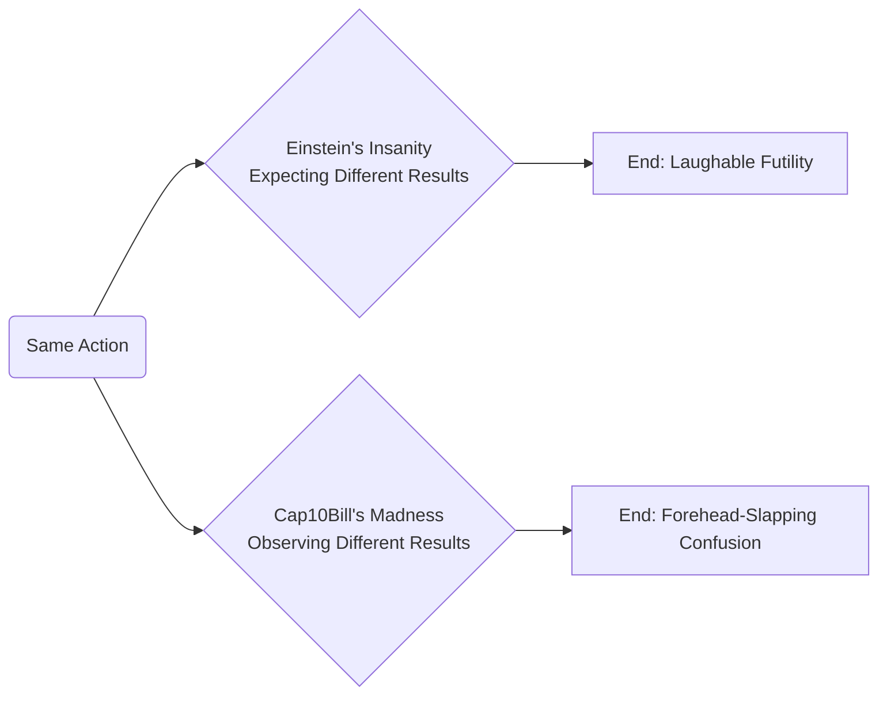

Ahoy, you bold adventurer of circuits and code. Let’s set sail on a journey through the twisted seas of digital behavior where reality sometimes warps in your hands.

• **Einstein’s Insanity**  
The legendary phrase often attributed to Einstein says: *“Insanity is doing the same thing over and over and expecting different results.”* In most of life—like tossing a rope or brewing coffee—consistency is the norm. Do the same thing, get the same outcome. If you repeat it expecting something magical, you’re teetering on the edge of Insanity.

• **Madness**  
Software, though, is an entirely different ocean. As I, Cap10Bill, proclaim: *“I call computer systems madness: Doing the same thing and getting a **different** result!”* That’s the heartbreak and hilarity of modern technology. You run the exact same build, or click the same button that worked yesterday, and—boom—new meltdown.

• **Why This Happens**  
Even though we won’t dwell too deeply on every cause, let’s cast a net for a few reasons:
- The digital environment can shift under your feet with each server update, job scheduling quirk, or data synchronization.
- Third-party services might hiccup like a sea monster just woke up for lunch.
- Code paths previously dormant can awaken, triggered by a seemingly unaltered routine.
- You might discover quantum gremlins (or so we joke) lurking in your hardware.

• **A Glimpse Through a Diagram**  
Picture it like this:



• **Why It Matters**
- Our logs become the only reliable chronicle in these stormy seas. *The Pragmatic Programmer* taught us the power of tracking everything, because patterns—no matter how weird—always leave footprints.
- *Clean Code* and *Refactoring* show we must keep systems tidy. But even pristine code can encounter cosmic glitches that defy logic.
- Like a determined ship’s captain, stoic resilience keeps us from going under when re-running the same build spawns a fresh brand of chaos.
- Memetic desire—those rallying calls we all share—spurs the crew to keep forging ahead, no matter how many times the logs read like cryptic riddles.

• **Embracing the Madness**
- Keep *“Log or lose it”* as your anchor. Document each storm, each meltdown, each random triumph. That’s how you eventually find a pattern.
- Accept that in the realm of servers, networks, and code, the very laws of cause and effect can change at dawn. That’s not a bug in your logic. That’s the wondrous madness of computing.
- Resolve to approach your pipeline or application with a sense of curiosity. Sometimes, it’s not about expecting or wanting a different result—it’s about being ready for one.

Raise your mug to a world where consistency isn’t guaranteed and unexpected outcomes can be your greatest teachers. Ride the waves of these digital seas with composure, record each anomaly like the prized relic it is, and remember: madness may be the status quo in computing, but it doesn’t have to break your spirit.  


---

**ARTICLE SERIES: “AN ODYSSEY INTO IT INFRASTRUCTURE & THE MADNESS WITHIN”**  
A comedic, yet practical exploration of normal operations versus moments that defy reason.

---

• **ARTICLE 1: “The Infrastructure Odyssey”**  
A look at a typical IT infrastructure: stable on the surface, but always on the brink of some inexplicable meltdown.

> “We believed our architecture was a calm sea; the code had other plans…”

**Normal Layout**
```mermaid
# diagrams/normal_infrastructure.mermaid
flowchart LR
    A[Load Balancer] --> B[App Server Cluster]
    B --> C[Database]
    B --> D[Cache Layer]
    A --> E[Static Content / CDN]
    C --> F[Backup & Storage]
```
• The Load Balancer gracefully distributes traffic.  
• The App Server Cluster processes business logic with near-mythic reliability.  
• The Database stands as the fortress of precious data.  
• The Cache Layer speeds up responses like a swift messenger.  
• A CDN delivers static content globally.  
• Backups ensure we can restore any lost treasure.

Everything sails smoothly… until it doesn’t.

**Madness Layout**
```mermaid
# diagrams/madness_infrastructure.mermaid
flowchart LR
    A[Load Balancer: Looks Innocent] --> B[App Server Cluster: Occasionally Possessed]
    B --> C[Database: Select * FROM Chaos]
    B --> D[Cache Layer: Vanishes Mondays]
    A --> E[CDN: Hiccuping at 3am]
    C --> F[Backups: Last Good Snapshot from 2012]
```
• Load Balancer morphs into a traffic troll at the most inconvenient hour.  
• App Servers become “occasionally possessed” by cosmic rays.  
• The Database decides to break foreign key constraints for no mortal reason.  
• The Cache Layer forgets everything every Monday morning.  
• The CDN insists on re-routing requests to the Twilight Zone.  
• Backups? They’re from an era before we were even born.

Sometimes you do the same deployment you’ve done a million times, only to awaken an eldritch horror in your logs. Welcome to the grand paradox of expecting normalcy in a realm that thrives on unpredictability.

---

• **ARTICLE 2: “The Development Pipeline Twister”**  
Dev to Staging to Prod: the hero’s journey or the nightmare loop?

> “We run the same build script. Yesterday: success. Today: it spawns a swarm of cryptic red errors.”

**Normal Pipeline**
```mermaid
# diagrams/normal_pipeline.mermaid
flowchart LR
    A[Developer Commits Code] --> B[CI Server Builds & Tests]
    B --> C[Artifact Repository]
    C --> D[Staging Deploy]
    D --> E[Production Deploy]
    E --> F[Monitoring & Logs]
```
• Code commits trigger automated builds and tests.  
• Artifacts are stored and validated.  
• Deployments unfold in staging, then roll out to production.  
• Monitoring keeps watch on possible anomalies.

**Madness Pipeline**
```mermaid
# diagrams/madness_pipeline.mermaid
flowchart LR
    A[Dev Commits "No Changes"] --> B[CI Server: Summons Poltergeist Errors]
    B --> C[Artifact Repo: Mysteriously Corrupted]
    C --> D[Staging: Green Light Anyway?]
    D --> E[Production: Crash & Burn]
    E --> F[Logs: Jumbled Hieroglyphics]
```
• The “unchanged” commit triggers fresh poltergeist errors.  
• The artifact is hopelessly corrupted in transit for no plausible reason.  
• Staging claims everything’s fine, probably as a prank.  
• Production release unleashes an instant meltdown.  
• Logs read like an ancient, indecipherable text describing the apocalypse.

**Why does it happen?**  
Sometimes it’s an ephemeral network glitch. Or an overlooked dependency. Or cosmic karma. The best remedy is keeping detailed logs, implementing robust rollback strategies, and having a sense of humor (and a stiff drink) at the ready.

---

• **ARTICLE 3: “The Production Warzone”**  
Nothing tests your resilience like actual users clicking every possible button—sometimes simultaneously.

> “We thought production was stable until a user discovered the single hidden path that crashes everything.”

**Normal Production Setup**
```mermaid
# diagrams/normal_production.mermaid
flowchart TB
    A[Users] --> B[Web Tier/Load Balancers]
    B --> C[App Cluster with Autoscaling]
    C --> D[Primary Database]
    D --> E[Failover/Replica DB]
    C --> F[Monitoring & Alerting Stack]
```
• Users happily interact with your site/app.  
• Traffic load is balanced and scaled horizontally.  
• Database cluster is carefully replicated.  
• Monitoring stands guard, raising flags if something goes off-script.

**Madness Production Setup**
```mermaid
# diagrams/madness_production.mermaid
flowchart TB
    A[Users: Click Frenzy] --> B[Load Balancer: Random Dropouts]
    B --> C[App Cluster: Overworked & Under-Caffeinated]
    C --> D[Primary DB: Sporadic Write Failures]
    D --> E[Failover DB: Actually Offline]
    C --> F[Monitoring: Lost Its Glasses]
```
• Users discover a bizarre, hidden corner of the app that triggers an endless loop.  
• The load balancer develops dropouts, ignoring half the requests.  
• The app servers get overrun by sudden CPU spikes.  
• The DB occasionally says, “Nope!” and discards queries.  
• The replica database? They forgot to mention it’s not really replicating.  
• Monitoring is ironically down, so no one sees the meltdown in real-time.

In these moments, facepalm, regroup, and remember that “log or lose it” remains your guiding light through the chaos.

---

• **ARTICLE 4: “The Observability Circus”**  
Instrumentation, logging, and metrics: the trifecta that can turn cryptic madness into actionable insights… or multiply the confusion if set up poorly.

> “When everything logs at once, you can’t hear the single scream for help in the noise.”

**Normal Observability**
```mermaid
# diagrams/normal_observability.mermaid
flowchart LR
    A[Application Logs] --> B[Log Aggregator]
    B --> C[Metrics & Dashboards]
    C --> D[Alerting System]
    A --> E[Tracing System]
    E --> F[Debugging & Profiling Tools]
```
• Logs get centralized.  
• Metrics feed user-friendly dashboards.  
• Alerts trigger on suspicious thresholds.  
• Traces help you see the journey of each request through the system.

**Madness Observability**
```mermaid
# diagrams/madness_observability.mermaid
flowchart LR
    A[Over-logging Everything] --> B[Unsorted Log Swamp]
    B --> C[Metrics Show Flat Lines, Or Random Spikes]
    C --> D[Alerts Trigger 2AM Panic With No Clues]
    A --> E[Traces? Incomprehensible Scribbles]
    E --> F[Debug Tools Crash Attempting to Parse Data]
```
• Logs flood in so quickly you drown in them.  
• Metrics vacillate between zero and cosmic infinity without rhyme.  
• Alerts go off at 2AM, lacking any actual root cause.  
• Traces read like the ravings of a glitchy seer.  
• Debugging tools choke on the data overload.

When everything is a priority, nothing is. Fine-tune your signals, and keep your logs organized. Jokes aside, it’s your best shot at spotting real issues beneath the carnival noise.

---

• **EPILOGUE**  
There’s an old line about “insanity is doing the same thing and expecting a different result,” but in the world of IT, “madness is doing the same thing and somehow **getting** a different result.”

Whether it’s your pipeline, your production cluster, or your logs, the chaos can strike at any moment. Embrace it. Accept that unpredictability is as much a feature of distributed systems as high availability is. Document everything, keep your sense of humor, and never forget that each meltdown is a stepping stone toward deeper understanding—or a bigger facepalm—depending on your perspective.

> “We are all mad here, but we’re also well-documented.”

Raise a cup (or a chunk of code) to the shared madness we call modern tech. Onward, fellow adventurer—your next misadventure awaits!