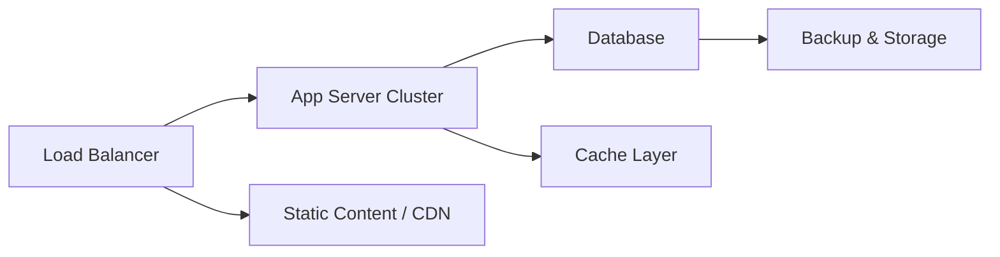
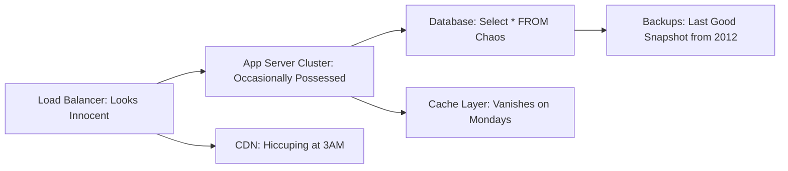
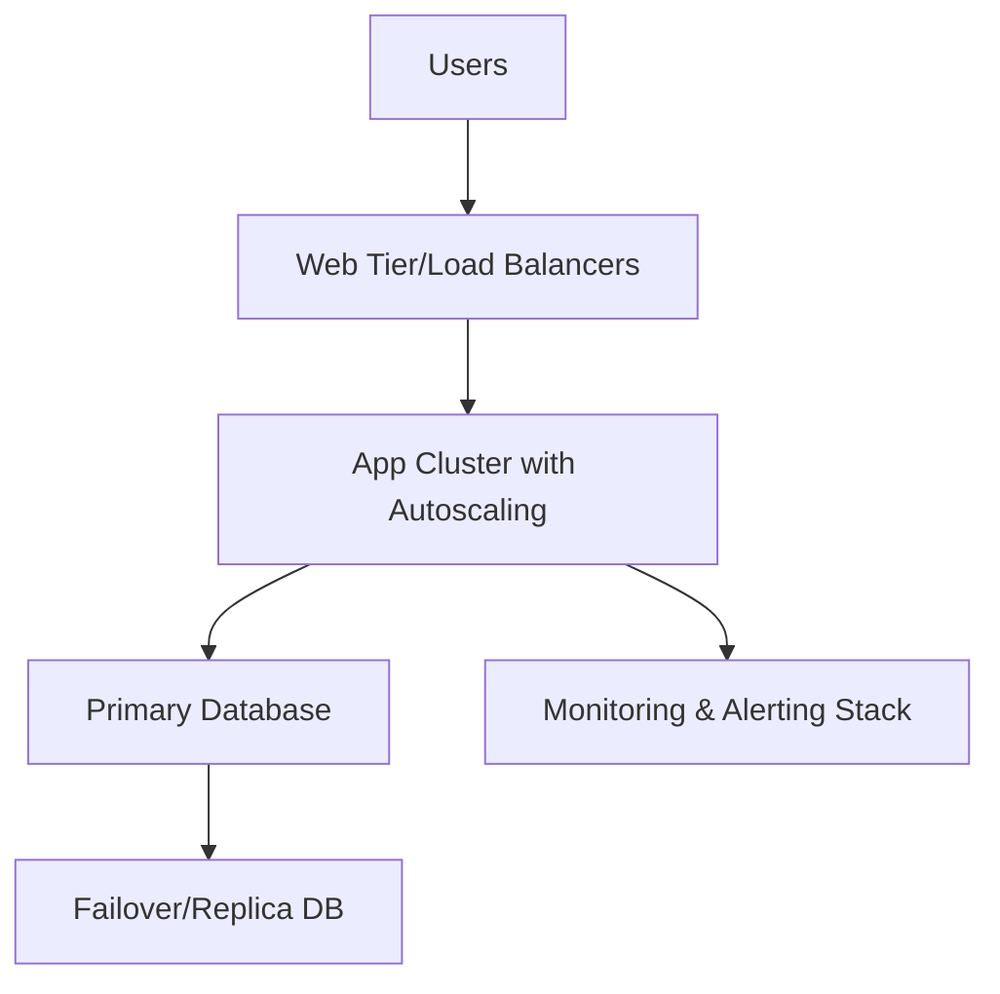
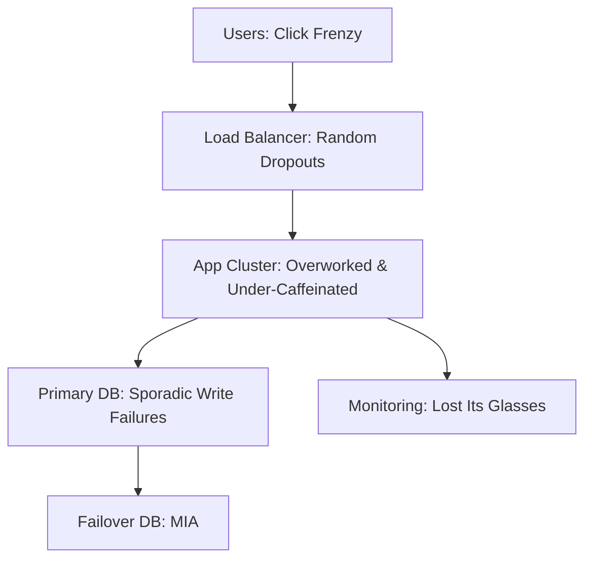
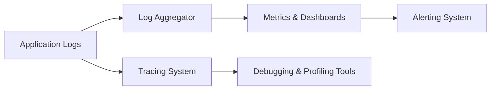
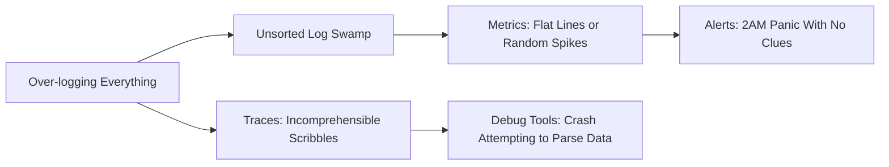

### ARTICLE 1: “The Infrastructure Odyssey”

A look at a typical IT infrastructure: calm on the surface, but with hidden quirks ready to strike.

**Normal Layout**

- The Load Balancer gracefully distributes traffic.
- The App Server Cluster processes business logic like clockwork.
- The Database stands as the fortress of precious data.
- The Cache Layer speeds up responses.
- The CDN delivers static content worldwide.
- Backups secure your treasure.

**Madness Layout**

- The Load Balancer sometimes behaves like a traffic troll.
- App Servers get “possessed” by inexplicable cosmic glitches.
- The Database randomly breaks foreign key rules.
- The Cache Layer forgets its purpose when the week starts.
- The CDN reroutes requests into the Twilight Zone.
- Backups? They’re from a long-forgotten era.

---

### ARTICLE 2: “The Development Pipeline Twister”

From commit to production, the journey is often straightforward—until the gremlins come out.

**Normal Pipeline**

- Code commits trigger automated builds and tests.
- Artifacts are safely stored.
- Deployments flow from staging to production.
- Monitoring keeps a watchful eye on anomalies.

**Madness Pipeline**

- An unchanged commit spawns new, inexplicable errors.
- Artifacts get corrupted as if by magic.
- Staging seems fine—until production shows its true colors.
- Logs turn into indecipherable, chaotic hieroglyphs.

---

### ARTICLE 3: “The Production Warzone”

Nothing tests your mettle like users clicking every button, sometimes triggering chaos.

**Normal Production Setup**

- Users interact with your app in a stable environment.
- Load Balancers and autoscaling keep the traffic smooth.
- Database replication is your safety net.
- Monitoring alerts you before things go haywire.

**Madness Production Setup**

- A sudden user click-frenzy triggers random dropouts.
- App servers appear overworked and seemingly under-caffeinated.
- The primary database randomly fails to write data.
- Failover systems go missing when you need them most.
- Monitoring? It’s as if it’s lost its glasses in the chaos.

---

### ARTICLE 4: “The Observability Circus”

When everything logs at once, discerning the one crucial alert can feel like finding a needle in a haystack.

**Normal Observability**

- Logs are centralized for clarity.
- Metrics feed user-friendly dashboards.
- Alerts trigger when thresholds are exceeded.
- Traces help follow the path of each request.
- Debugging tools provide insight into issues.

**Madness Observability**

- Over-logging creates an unsorted swamp of data.
- Metrics swing wildly between zero and chaos.
- Alerts ring at 2AM, leaving you puzzled.
- Traces become cryptic scribbles rather than clear paths.
- Debugging tools buckle under the data overload.

---

### EPILOGUE

There’s an old adage about “insanity is doing the same thing over and over and expecting different results,” yet in IT, we see a twist:  
**Madness is doing the same thing and somehow getting a different result.**

Whether it’s your infrastructure, your development pipeline, your production environment, or your observability tools, the unexpected is always lurking just around the corner. Embrace the chaos—document every anomaly, learn from every meltdown, and keep a hearty laugh along the way. After all, in the digital realm, each facepalm-worthy moment is a stepping stone toward deeper understanding (or at least a memorable log entry).

> “We are all mad here, but at least we log every bit of it.”

Raise your cup (or your commit) to the beautifully unpredictable, sometimes maddening world of IT!

In real life, you’d expect a repeat commit to go through the same rigorous process with the same results—until it doesn’t. Imagine this scenario:

- A developer commits code that hasn’t changed, expecting the same smooth pipeline run as before. Yet, on the CI server, something inexplicable happens: a series of errors emerges, as if the system decided to throw a curveball.
- The artifact repository, which usually safely stores your builds, now holds a corrupted version, almost as if it’s been tampered with by digital gremlins.
- The staging environment, usually your safe testing ground, shows a suspicious green light—a false promise that everything’s fine.
- But when the build finally reaches production, it crashes spectacularly.
- And then come the logs: instead of neat, readable entries, you’re met with a jumble of cryptic messages that make debugging feel like deciphering ancient hieroglyphs.

Below is a diagram representing this “madness” in the development pipeline:

**What’s really going on?**

- **Ephemeral Bugs & Environmental Changes:** Even when your code doesn’t change, the environment might. Think dependency updates, server configuration tweaks, or even network hiccups. These can trigger unforeseen errors on your CI server.
- **Artifact Corruption:** Artifacts are snapshots of your build. If there's a minor glitch during packaging, or if a dependency behaves unpredictably, the artifact might become corrupted without any visible change in your source code.
- **Staging’s False Sense of Security:** Staging often mirrors production but isn’t a perfect replica. A green light in staging might hide issues that only emerge under the load and complexity of production.
- **Production Meltdowns:** Production systems are complex and have many moving parts. A minor error in one module can cascade into a full-blown crash, especially when all components are interconnected.
- **Log Chaos:** Finally, the logs—your only window into what went wrong—can become a mess of conflicting messages. With so many sources of information, finding the root cause can be like searching for a needle in a haystack.

This madness isn’t just about bad luck—it’s a reminder that our digital environments are living, breathing systems that can surprise us at any moment. Embracing this chaos means documenting everything, learning from each failure, and, above all, keeping a sense of humor as you navigate the unpredictable seas of modern IT.