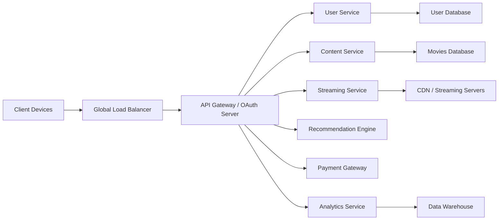
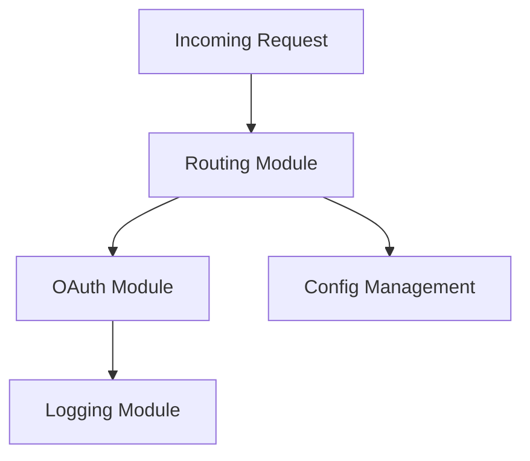
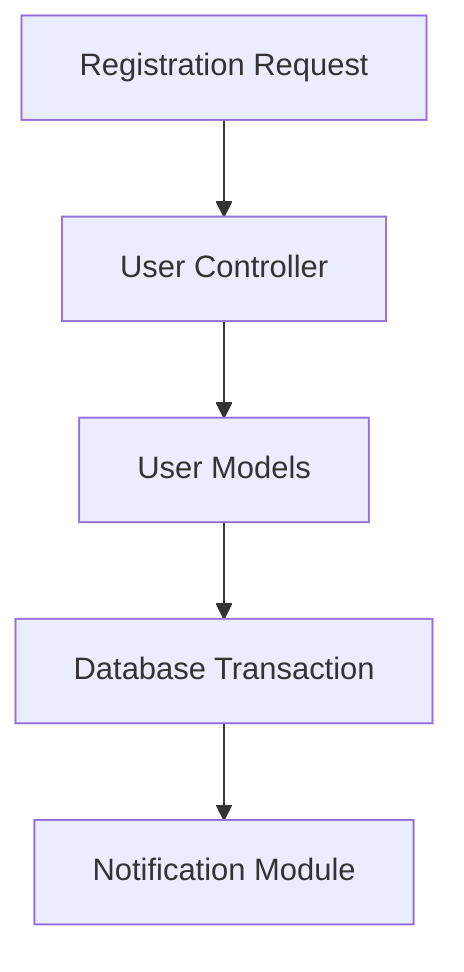
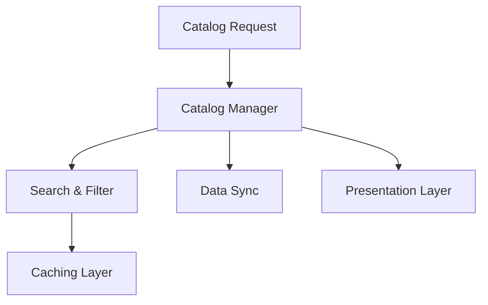
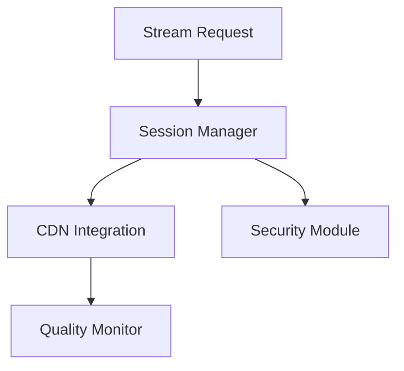
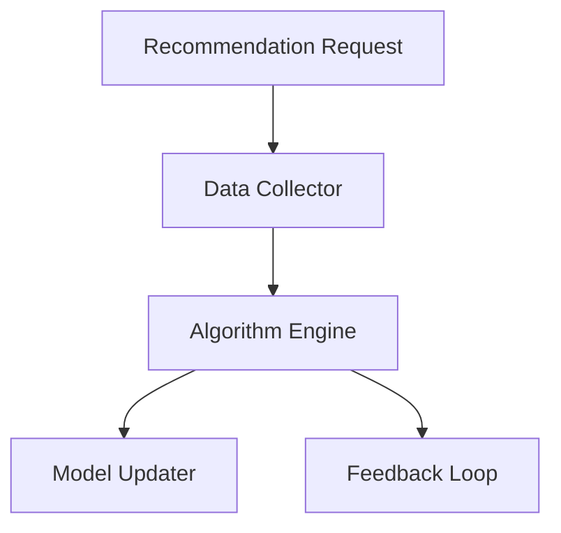
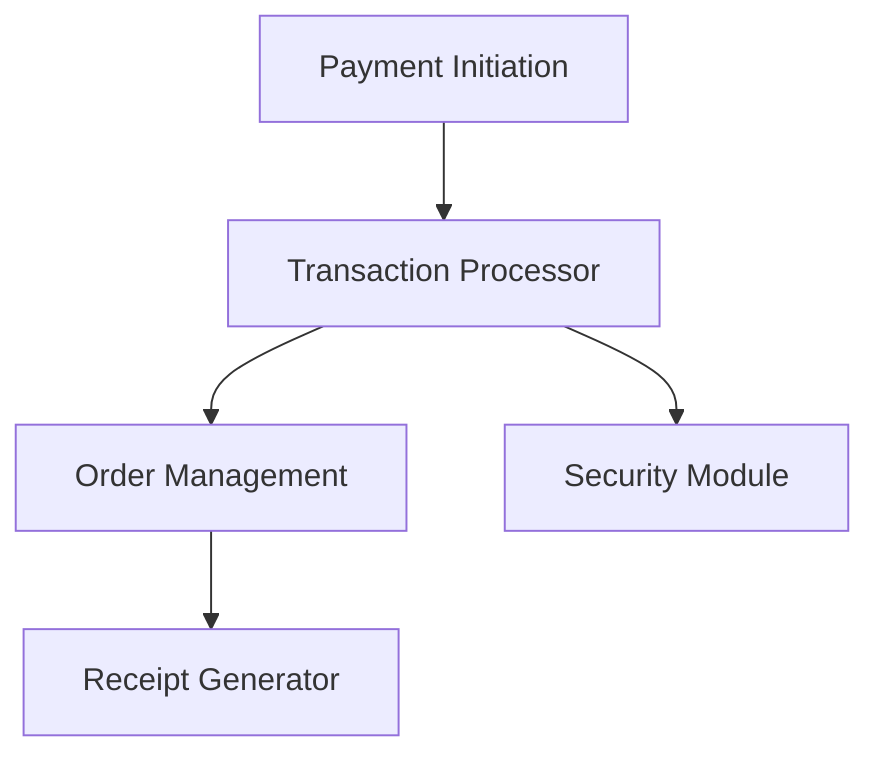
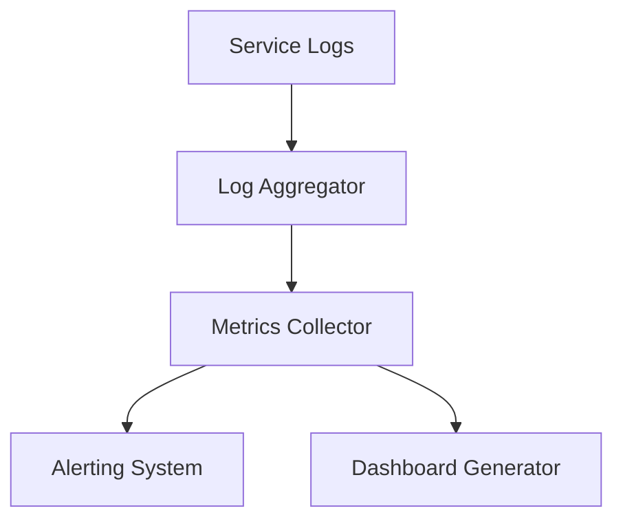
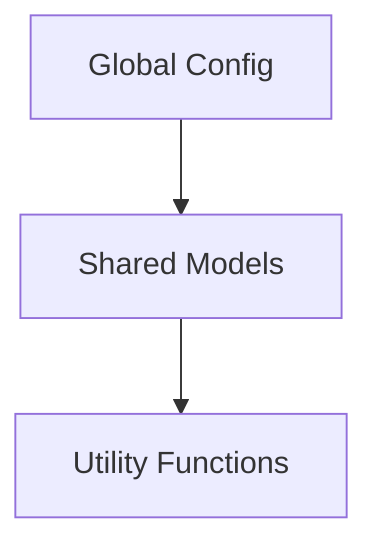

## Overview & Infrastructure

Imagine a global streaming service where countless movie buffs set sail to enjoy cinematic treasures. At its core, FlaskFlix is a sophisticated fleet of microservices working in harmony. A global load balancer evenly distributes incoming requests to a central API gateway (that doubles as our OAuth server), which then directs tasks to specialized services responsible for user management, content handling, streaming, recommendations, payments, and analytics.

### High-Level Infrastructure Diagram



Each element in this diagram plays a vital role—from the initial request by a user to the secure delivery of a movie stream, all the while ensuring robust authentication and detailed logging.

---

## Component Breakdown & Technical Insights

### API Gateway / OAuth Server

- **Function:** Serves as the front door—handling login requests, managing OAuth flows (using libraries like Authlib), and issuing secure tokens.
- **Key Tools:**
  - *OAuth2Provider* classes
  - Flask Blueprints for routes like `/login`, `/token`, and `/callback`
- **Captain’s Tip:** Log every authentication attempt. Detailed error logs are your lifeline when tokens misfire or credentials go astray.

---

### User Service

- **Function:** Manages user profiles and sensitive data.
- **Key Tools:**
  - SQLAlchemy models (e.g., a `User` model with attributes such as `username`, `email`, and `password_hash`)
  - Flask Blueprints for endpoints like `/users/register` and `/users/profile`
- **Captain’s Tip:** Always hash passwords (think bcrypt) and log CRUD operations to keep the user deck shipshape.

---

### Content Service (Movie Catalog)

- **Function:** Hosts movie metadata and offers search/filter functionalities.
- **Key Tools:**
  - SQLAlchemy models for movies, genres, and directors
  - Flask Blueprints for endpoints like `/movies` and `/movies/search`
- **Captain’s Tip:** Cache high-demand data (with Redis, for instance) and log search queries to fine-tune indexing—preventing foggy search results on your cinematic horizon.

---

### Streaming Service

- **Function:** Orchestrates the delivery of movie streams by interfacing with a Content Delivery Network (CDN).
- **Key Tools:**
  - A `StreamHandler` class to manage streaming sessions
  - Flask endpoints to start, pause, or resume streams
- **Captain’s Tip:** Integrate robust error handling and log every CDN call. Monitor latency and streaming quality to keep your viewers on an even keel.

---

### Recommendation Engine

- **Function:** Suggests movies based on user behavior, using algorithms such as collaborative filtering.
- **Key Tools:**
  - A `RecommendationEngine` class for processing user data
  - Flask endpoints like `/recommendations` to serve tailored suggestions
- **Captain’s Tip:** Log algorithm performance and feedback continuously. Regular data refreshes and model retraining keep recommendations on target.

---

### Payment Gateway

- **Function:** Processes subscriptions and transactions securely by interfacing with external payment APIs (e.g., Stripe, PayPal).
- **Key Tools:**
  - A `PaymentProcessor` class wrapping the external APIs
  - Flask Blueprints for endpoints such as `/payments/checkout`
- **Captain’s Tip:** Secure every transaction with HTTPS and maintain detailed logs. Use idempotency keys to prevent duplicate charges—a must when every coin counts.

---

### Analytics Service

- **Function:** Aggregates logs and metrics from all services, funneling data into a centralized data warehouse.
- **Key Tools:**
  - An `AnalyticsCollector` class for log aggregation
  - Flask endpoints to update real-time dashboards
- **Captain’s Tip:** Use structured logging (think ELK Stack or Prometheus) and set up alerts to catch anomalies early. Your logs should transform chaos into actionable insights.

---

## Preparing for Stormy Seas

Even the best captains face turbulence. Here’s how you ensure smooth sailing:
- **CI/CD Pipelines:** Build and deploy each microservice independently.
- **Containerization & Orchestration:** Use Docker and Kubernetes to manage scaling and resilience.
- **Comprehensive Logging:** Detailed logs at every service boundary help pinpoint issues as soon as they surface.

---

## Directory Architecture: The Ship’s Blueprint

A well-organized codebase is as vital as a well-manned deck. Below is the directory structure for FlaskFlix—a map that keeps every file in its rightful berth:

```plaintext
FlaskFlix/
├── api_gateway/
│   ├── app.py
│   ├── oauth.py
│   ├── config.py
│   ├── requirements.txt
│   ├── templates/
│   │   └── login.html
│   └── static/
│       └── css/
│           └── style.css
├── user_service/
│   ├── app.py
│   ├── models.py
│   ├── views.py
│   ├── config.py
│   ├── requirements.txt
│   └── migrations/
├── content_service/
│   ├── app.py
│   ├── models.py
│   ├── views.py
│   ├── config.py
│   ├── requirements.txt
│   └── templates/
│       └── movie_details.html
├── streaming_service/
│   ├── app.py
│   ├── stream_handler.py
│   ├── config.py
│   ├── requirements.txt
│   └── utils/
│       └── cdn_integration.py
├── recommendation_engine/
│   ├── app.py
│   ├── recommendation.py
│   ├── config.py
│   ├── requirements.txt
│   └── data/
│       └── sample_data.json
├── payment_gateway/
│   ├── app.py
│   ├── payment_processor.py
│   ├── config.py
│   ├── requirements.txt
│   └── templates/
│       └── checkout.html
├── analytics_service/
│   ├── app.py
│   ├── analytics_collector.py
│   ├── config.py
│   ├── requirements.txt
│   └── logs/
│       └── sample.log
├── common/
│   ├── utils.py
│   ├── models.py
│   └── config.py
├── docker-compose.yml
├── README.md
└── .gitignore
```

Every directory is a critical compartment ensuring our vessel remains operational, scalable, and battle-ready.

---

## Service Subsystems: The Inner Decks

Each major service further breaks down into smaller, focused modules—each one ensuring smooth collaboration among the parts.

### API Gateway / OAuth Server Subsystems
- **Routing Module:** Uses Flask Blueprints to direct incoming requests.
- **OAuth Module:** Manages token issuance and validation.
- **Logging & Error Handling:** Captures every credential and misfire.
- **Configuration Management:** Houses secrets and API keys.



*Hint:* Instrument every step with detailed logs to catch token misfires early.

---

### User Service Subsystems
- **User Models:** SQLAlchemy-based data definitions.
- **Controller:** Routes for registration and authentication.
- **Transaction Safety:** Implements idempotency to avoid duplicates.
- **Notification System:** Optionally alerts on user changes.



*Hint:* Ensure duplicate entries are prevented by enforcing transactional integrity.

---

### Content Service Subsystems
- **Catalog Manager:** Organizes and retrieves movie metadata.
- **Search & Filter Engine:** Powers fast queries and filtering.
- **Data Synchronization:** Updates external feeds.
- **Presentation Layer:** Renders views via Flask templates.



*Hint:* Robust caching and logging are key to keeping movie data fresh and accurate.

---

### Streaming Service Subsystems
- **Session Manager:** Initiates and monitors streaming sessions.
- **CDN Integration:** Handles API calls to external CDNs.
- **Quality Monitor:** Keeps tabs on streaming performance.
- **Security Module:** Signs URLs and enforces access.



*Hint:* Implement retries and fallback strategies when dealing with CDN timeouts.

---

### Recommendation Engine Subsystems
- **History Data Collector:** Gathers user viewing histories.
- **Algorithm Engine:** Processes data using recommendation algorithms.
- **Model Updater:** Refreshes and re-trains models.
- **Feedback Loop:** Incorporates user ratings for refinement.



*Hint:* Logging every recommendation helps fine-tune your algorithm’s accuracy.

---

### Payment Gateway Subsystems
- **Transaction Processor:** Manages third-party payment API interactions.
- **Order Management:** Ensures atomicity in transactions.
- **Receipt Generator:** Creates confirmations for every payment.
- **Security Module:** Enforces HTTPS and logs transactions.



*Hint:* Secure, encrypted logging is critical when every coin counts.

---

### Analytics Service Subsystems
- **Log Aggregator:** Normalizes logs from all services.
- **Metrics Collector:** Gathers real-time performance data.
- **Alerting System:** Sets off alarms on anomalies.
- **Dashboard Generator:** Visualizes key performance indicators.



*Hint:* Structured logging and timely alerts keep the ship on course even in turbulent times.

---

### Common Utilities Subsystems
- **Configuration Management:** Global settings with local overrides.
- **Shared Models:** Centralized data definitions.
- **Utility Functions:** Helper methods for common tasks.



*Hint:* Centralizing shared code ensures consistency and easier troubleshooting.

---

## Final Reflections

Every module, every endpoint, and every log in FlaskFlix is designed to help you navigate the complex waters of modern streaming technology. Detailed documentation and rigorous logging ensure that, whether in calm or storm, every captain knows exactly what’s happening on deck.

Remember, fellow captains: **"Log or lose it!"**

---

## Code Implementation: The Heart of FlaskFlix

Below is a full, clean implementation of the key Python files. Each file is crafted in the bold, irreverent style of Cap10Bill—a constant reminder that every log entry is a treasure map leading you to smooth sailing.

---

### api_gateway

#### # api_gateway/app.py
```python
from flask import Flask, jsonify
from oauth import oauth_blueprint
from config import Config

app = Flask(__name__)
app.config.from_object(Config)
app.register_blueprint(oauth_blueprint, url_prefix='/auth')

@app.route('/')
def index():
    return jsonify({
        "message": "Welcome aboard the FlaskFlix API Gateway! All systems are go. Log or lose it!"
    })

if __name__ == '__main__':
    app.run(debug=True)
```

#### # api_gateway/oauth.py
```python
from flask import Blueprint, request, jsonify
from datetime import datetime
import uuid

oauth_blueprint = Blueprint('oauth', __name__)

# Simple in-memory token store
TOKENS = {}

@oauth_blueprint.route('/login', methods=['GET', 'POST'])
def login():
    if request.method == 'POST':
        username = request.form.get('username')
        if username:
            token = str(uuid.uuid4())
            TOKENS[token] = {
                "username": username,
                "issued_at": datetime.utcnow(),
                "expires_in": 3600  # 1 hour lifespan
            }
            return jsonify({
                "token": token,
                "message": f"Ahoy, Captain {username}! Welcome aboard."
            })
        return jsonify({"error": "Username is required."}), 400
    return '''
    <form method="post">
        <input type="text" name="username" placeholder="Enter your captain name"/>
        <input type="submit" value="Set Sail!"/>
    </form>
    '''

@oauth_blueprint.route('/validate', methods=['GET'])
def validate_token():
    token = request.args.get('token')
    token_data = TOKENS.get(token)
    if token_data and (datetime.utcnow() - token_data["issued_at"]).seconds < token_data["expires_in"]:
        return jsonify({"valid": True, "username": token_data["username"]})
    return jsonify({"valid": False}), 401
```

#### # api_gateway/config.py
```python
class Config:
    SECRET_KEY = "flaskflix_super_secret"
    OAUTH_PROVIDER_URL = "https://dummy-oauth-provider.com"
```

---

### user_service

#### # user_service/app.py
```python
from flask import Flask, jsonify
from views import user_blueprint
from config import Config

app = Flask(__name__)
app.config.from_object(Config)
app.register_blueprint(user_blueprint, url_prefix='/users')

@app.route('/')
def index():
    return jsonify({
        "message": "Welcome to the FlaskFlix User Service! Secure your spot on deck."
    })

if __name__ == '__main__':
    app.run(debug=True)
```

#### # user_service/models.py
```python
from flask_sqlalchemy import SQLAlchemy

db = SQLAlchemy()

class User(db.Model):
    __tablename__ = 'users'
    id = db.Column(db.Integer, primary_key=True)
    username = db.Column(db.String(80), unique=True, nullable=False)
    email = db.Column(db.String(120), unique=True, nullable=False)
    password_hash = db.Column(db.String(128), nullable=False)

    def __repr__(self):
        return f"<User {self.username}>"
```

#### # user_service/views.py
```python
from flask import Blueprint, request, jsonify
from models import User, db

user_blueprint = Blueprint('users', __name__)

@user_blueprint.route('/register', methods=['POST'])
def register():
    data = request.get_json()
    username = data.get("username")
    email = data.get("email")
    password = data.get("password")  # Reminder: hash passwords for production!
    
    if not all([username, email, password]):
        return jsonify({"error": "All fields are required."}), 400
    
    if User.query.filter_by(username=username).first():
        return jsonify({"error": "User already exists."}), 409
    
    new_user = User(username=username, email=email, password_hash=password)
    db.session.add(new_user)
    db.session.commit()
    return jsonify({
        "message": f"User {username} successfully registered! Welcome aboard."
    }), 201
```

#### # user_service/config.py
```python
class Config:
    SQLALCHEMY_DATABASE_URI = 'sqlite:///flaskflix_users.db'
    SQLALCHEMY_TRACK_MODIFICATIONS = False
    SECRET_KEY = "user_service_secret"
```

---

### content_service

#### # content_service/app.py
```python
from flask import Flask, jsonify
from views import content_blueprint
from config import Config

app = Flask(__name__)
app.config.from_object(Config)
app.register_blueprint(content_blueprint, url_prefix='/content')

@app.route('/')
def index():
    return jsonify({
        "message": "Welcome to FlaskFlix Content Service! Explore our treasure trove of movies."
    })

if __name__ == '__main__':
    app.run(debug=True)
```

#### # content_service/models.py
```python
from flask_sqlalchemy import SQLAlchemy

db = SQLAlchemy()

class Movie(db.Model):
    __tablename__ = 'movies'
    id = db.Column(db.Integer, primary_key=True)
    title = db.Column(db.String(200), nullable=False)
    genre = db.Column(db.String(100))
    director = db.Column(db.String(100))
    release_year = db.Column(db.Integer)

    def __repr__(self):
        return f"<Movie {self.title}>"
```

#### # content_service/views.py
```python
from flask import Blueprint, request, jsonify
from models import Movie, db

content_blueprint = Blueprint('content', __name__)

@content_blueprint.route('/movies', methods=['GET'])
def get_movies():
    movies = Movie.query.all()
    movies_list = [{
        "id": m.id,
        "title": m.title,
        "genre": m.genre,
        "director": m.director,
        "release_year": m.release_year
    } for m in movies]
    return jsonify({"movies": movies_list})

@content_blueprint.route('/movies/<int:movie_id>', methods=['GET'])
def get_movie_details(movie_id):
    movie = Movie.query.get(movie_id)
    if movie:
        return jsonify({
            "id": movie.id,
            "title": movie.title,
            "genre": movie.genre,
            "director": movie.director,
            "release_year": movie.release_year
        })
    return jsonify({"error": "Movie not found"}), 404
```

#### # content_service/config.py
```python
class Config:
    SQLALCHEMY_DATABASE_URI = 'sqlite:///flaskflix_movies.db'
    SQLALCHEMY_TRACK_MODIFICATIONS = False
    SECRET_KEY = "content_service_secret"
```

---

### streaming_service

#### # streaming_service/app.py
```python
from flask import Flask, jsonify, request
from stream_handler import StreamHandler
from config import Config

app = Flask(__name__)
app.config.from_object(Config)
stream_handler = StreamHandler()

@app.route('/')
def index():
    return jsonify({
        "message": "Welcome to FlaskFlix Streaming Service! Ready to roll the film?"
    })

@app.route('/stream', methods=['GET'])
def stream_movie():
    movie_id = request.args.get('movie_id')
    if not movie_id:
        return jsonify({"error": "Missing movie_id parameter"}), 400
    stream_url = stream_handler.get_stream_url(movie_id)
    return jsonify({"stream_url": stream_url})

if __name__ == '__main__':
    app.run(debug=True)
```

#### # streaming_service/stream_handler.py
```python
import time
from utils.cdn_integration import get_cdn_url

class StreamHandler:
    def __init__(self):
        self.session_log = []

    def get_stream_url(self, movie_id):
        self.session_log.append(f"Stream request for movie {movie_id} at {time.ctime()}")
        cdn_url = get_cdn_url(movie_id)
        return cdn_url
```

#### # streaming_service/config.py
```python
class Config:
    SECRET_KEY = "streaming_service_secret"
    CDN_API_ENDPOINT = "https://dummy-cdn.example.com"
    STREAM_TIMEOUT = 30  # seconds
```

#### # streaming_service/utils/cdn_integration.py
```python
def get_cdn_url(movie_id):
    return f"https://cdn.flaskflix.com/stream/{movie_id}?token=abcdef123456"
```

---

### recommendation_engine

#### # recommendation_engine/app.py
```python
from flask import Flask, jsonify, request
from recommendation import RecommendationEngine
from config import Config

app = Flask(__name__)
app.config.from_object(Config)
engine = RecommendationEngine()

@app.route('/')
def index():
    return jsonify({
        "message": "Welcome to FlaskFlix Recommendation Engine! Let the movies choose you."
    })

@app.route('/recommendations', methods=['GET'])
def get_recommendations():
    user_id = request.args.get('user_id')
    if not user_id:
        return jsonify({"error": "Missing user_id parameter"}), 400
    recs = engine.get_recommendations(user_id)
    return jsonify({"recommendations": recs})

if __name__ == '__main__':
    app.run(debug=True)
```

#### # recommendation_engine/recommendation.py
```python
class RecommendationEngine:
    def __init__(self):
        self.sample_recs = {
            "1": ["Movie A", "Movie B", "Movie C"],
            "2": ["Movie D", "Movie E", "Movie F"]
        }

    def get_recommendations(self, user_id):
        return self.sample_recs.get(user_id, ["Default Movie 1", "Default Movie 2", "Default Movie 3"])
```

#### # recommendation_engine/config.py
```python
class Config:
    SECRET_KEY = "recommendation_engine_secret"
    RECOMMENDATION_MODEL_PATH = "/models/recommendation_model.pkl"
```

---

### payment_gateway

#### # payment_gateway/app.py
```python
from flask import Flask, jsonify, request
from payment_processor import PaymentProcessor
from config import Config

app = Flask(__name__)
app.config.from_object(Config)
processor = PaymentProcessor()

@app.route('/')
def index():
    return jsonify({
        "message": "Welcome to FlaskFlix Payment Gateway! Every coin counts on this voyage."
    })

@app.route('/checkout', methods=['POST'])
def checkout():
    data = request.get_json()
    amount = data.get("amount")
    user_id = data.get("user_id")
    if not all([amount, user_id]):
        return jsonify({"error": "Missing payment details"}), 400
    result = processor.process_payment(user_id, amount)
    return jsonify(result)

if __name__ == '__main__':
    app.run(debug=True)
```

#### # payment_gateway/payment_processor.py
```python
import uuid
import random

class PaymentProcessor:
    def process_payment(self, user_id, amount):
        transaction_id = str(uuid.uuid4())
        success = random.choice([True, True, True, False])
        if success:
            return {
                "transaction_id": transaction_id,
                "status": "success",
                "message": "Payment processed successfully! Your treasure is secure."
            }
        return {
            "transaction_id": transaction_id,
            "status": "failure",
            "message": "Payment failed. The winds aren't in our favor—try again later."
        }
```

#### # payment_gateway/config.py
```python
class Config:
    SECRET_KEY = "payment_gateway_secret"
    PAYMENT_API_ENDPOINT = "https://dummy-payment-api.example.com"
    RETRY_LIMIT = 3
```

---

### analytics_service

#### # analytics_service/app.py
```python
from flask import Flask, jsonify
from analytics_collector import AnalyticsCollector
from config import Config

app = Flask(__name__)
app.config.from_object(Config)
collector = AnalyticsCollector()

@app.route('/')
def index():
    return jsonify({
        "message": "Welcome to FlaskFlix Analytics Service! We log every ripple in the sea."
    })

@app.route('/logs', methods=['GET'])
def get_logs():
    logs = collector.get_logs()
    return jsonify({"logs": logs})

if __name__ == '__main__':
    app.run(debug=True)
```

#### # analytics_service/analytics_collector.py
```python
class AnalyticsCollector:
    def __init__(self):
        self.logs = []

    def collect(self, log_entry):
        self.logs.append(log_entry)

    def get_logs(self):
        return self.logs
```

#### # analytics_service/config.py
```python
class Config:
    SECRET_KEY = "analytics_service_secret"
    LOG_STORAGE_PATH = "analytics_service/logs/"
```

---

### common

#### # common/utils.py
```python
import datetime

def current_timestamp():
    return datetime.datetime.utcnow().isoformat()

def sanitize_input(input_str):
    return input_str.strip()
```

#### # common/models.py
```python
from sqlalchemy.ext.declarative import declarative_base

Base = declarative_base()

class TimestampMixin:
    created_at = None
    updated_at = None
```

#### # common/config.py
```python
class Config:
    GLOBAL_SECRET = "flaskflix_global_secret"
    DEBUG = True
```

---

## Final Words

Every module, every endpoint, and every log in FlaskFlix is designed to help you navigate the turbulent digital seas with confidence and precision. Detailed documentation and rigorous logging ensure that, whether you're cruising in calm waters or weathering a storm, you always know where you stand.

So, fellow captains—**log every detail or risk losing it all!** May your code be clean, your logs be clear, and your journey legendary.

Happy coding and smooth sailing!

--- Now wait for prompt