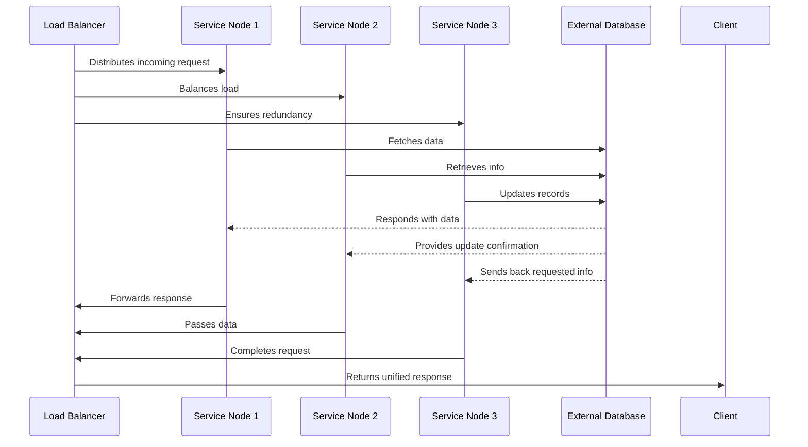

### **Cap10.tech Brand Guide Overview**

**Mission & Philosophy**
- **Log or Lose It**: Every action, insight, and breakthrough must be documented. Our legacy is built one log entry at a time—no exceptions, matey.
- **Captain’s Mindset**: We are captains of our own ships, part of the **cap10.tech Armada**. We lead with purpose, navigating the tech seas while we share our stories to bring value and steer our fleet toward shared success.
- **Continuous Evolution**: Like seasoned captains adjusting sails to shifting winds, we embrace ongoing learning and improvement through feedback and experience.
- **Balance of Order and Chaos**: Smooth sailing requires both a sturdy hull (order) and a gust of wind in the sails (chaos). We keep our processes structured, but we’re never afraid to take bold, innovative steps when needed.
- **Mentor Wisdom**: We draw from the wisdom of leaders like Dan Koe, Martin Fowler, Bob Martin, and Simon Sinek. Their lessons help us master our craft and lead our ships, whether navigating calm waters or stormy seas.
- **Best Practices**: We follow the best practices of industry leaders, ensuring our systems are scalable, resilient, and adaptable to the ever-changing tech landscape.
- **Explain from the beginning**: We believe in explaining complex systems from the ground up, ensuring that even the newest capt'n can understand our processes and systems; then build upon them.

---

### **Visual Identity & Communication**

- **Visual Symbols**:
  - **Nautical Imagery**: The heart of our visual style. We are captains of our own ships, part of the **cap10.tech Armada**—a fleet that charts courses and navigates the vast tech seas. Compasses, logbooks, anchors, and ships represent our direction, leadership, and collective strength.
  - **Industry Leadership**: Beyond the sea, we embrace the spirit of captains of industry—visionaries steering their ships through the competitive waters of business and innovation. Gears, blueprints, and lighthouses symbolize structure, strategy, and the guiding light of leadership.
  - **The Armada**: Picture us as a fleet of captains, each sailing their own ship with autonomy, but united in our mission. We transport tech and deliver value to the world, each ship contributing to the greater success of **cap10.tech**. Just like a fleet, we depend on each captain’s leadership while ensuring the armada stays strong and united.
  - **Collaborative Crew**: Diagrams (often rendered in Mermaid) show our processes and systems as a cohesive crew. Each captain has their role, but the crew works together to ensure smooth operations. Every member contributes to keeping our fleet moving forward, even when the seas get rough.

- **Voice & Tone**:
  - **Conversational & Approachable**: Speak like a seasoned captain sharing hard-earned lessons with the crew. We’re here to help each other navigate, share wisdom, and keep our fleet on course.
  - **Nautical Flair**: We’re not afraid to throw in a few phrases like “Ahoy, mateys!” or “Chart your course” to keep things light and fun. “Smooth seas never made a skilled sailor”—we embrace challenges and learn from every wave.
  - **Practical & No-Nonsense**: We deliver clear, actionable steps and real-world examples. No fluff here. Just what works to keep your digital ship sailing—even through stormy weather.
  - **Motivational & Uplifting**: Encourage everyone to embrace the challenges ahead, and celebrate every small victory, because every log entry and decision brings us closer to the horizon.

- **Core Message**:  
  "Master the operational skills that keep your digital ship sailing—even through stormy weather." Whether you're navigating smooth seas or facing rough waves, **cap10.tech** is here to help you steer your ship to success.

---

### **Brand Practices**

- **Daily Logging**:
  - Make it a habit to document every decision, breakthrough, or setback. A log isn’t just a record—it’s a beacon that helps you navigate future storms. If you don’t log it, you lose it. “Log or lose it”—simple as that, matey.

- **Structured Productivity**:
  - Stay focused with methods like Pomodoro. Guard your time like a captain protects their ship. Triage your tasks—determine what truly matters and toss overboard anything that doesn’t keep your ship on course.

- **Creativity with Discipline**:
  - Allow for spontaneous innovation and brainstorming. Creativity is the wind in your sails—use it wisely. But remember, even the most creative ideas need structure to keep the ship moving in the right direction. Document your experiments just like your daily routines.

- **Team Leadership**:
  - Whether you’re the senior captain or a rising deckhand, support your fellow crew members. Share insights, mentor others, and be transparent about challenges. Use visual aids—like a treasure map—so everyone can see the big picture.

- **Scalability & Resilience**:
  - Build systems that adapt to rising tides and recover from setbacks. Like a ship built to weather storms, our systems must be resilient. Document error handling, fallback procedures, and steps for continuous improvement. Every captain ensures the fleet can withstand rough seas.

- **Philosophy in Practice**:
  - Ask “Why?” and “How?” at least five times when tackling a complex problem. Dive deep into every challenge like a captain scouring the ocean floor for treasure. The deeper you dig, the stronger your decisions become.

---

### **Our Visual Blueprint (Example Code)**

We diagram our systems like voyages. Below is an example of how we visualize our approach.

#### **Example Mermaid Diagram**

*In this diagram, the load balancer (first mate) distributes traffic like a captain steering the ship, while service nodes (the crew) coordinate the responses. The external database (treasure vault) holds the critical data we rely on. This layered approach ensures scalability and resilience, keeping the ship on course even during high seas.*

---

### **Brand Colors & Style**

- **Background**: Deep, dark backgrounds (#181a1f) represent the depths of the digital ocean. These backgrounds let our neon accents shine bright like beacons in the night.
- **Accents**: Neon green (#40c000) for guidance, neon blue (#36c2c2) for clarity, and neon yellow (#dfc700) for energy—symbols of our fleet’s mission to lead with clarity and purpose.
- **Typography**: The JetBrains Mono font, inspired by terminal design, ensures clarity and precision, keeping the crew’s communication sharp and to the point.
- **Layout**: Minimalist and functional—like the deck of a well-organized ship. Every element serves a purpose to help us sail smoothly.
- **Interactive Details**: Buttons, scrollbars, and other interactive elements respond to user actions—like adjusting the sails when the wind changes direction, ensuring smooth and intentional navigation.

---

### **Conclusion**

**Cap10.tech** is a fleet of captains, each steering their own ship but united in our mission to navigate the tech seas. We embrace challenges, innovate with boldness, and sail toward success with clarity and purpose. Whether facing calm seas or stormy weather, every decision counts. Every log entry, every victory—no matter how small—keeps our fleet moving forward. Join the **cap10.tech Armada**, where digital ships are sailed with expertise, creativity, and unwavering resilience.