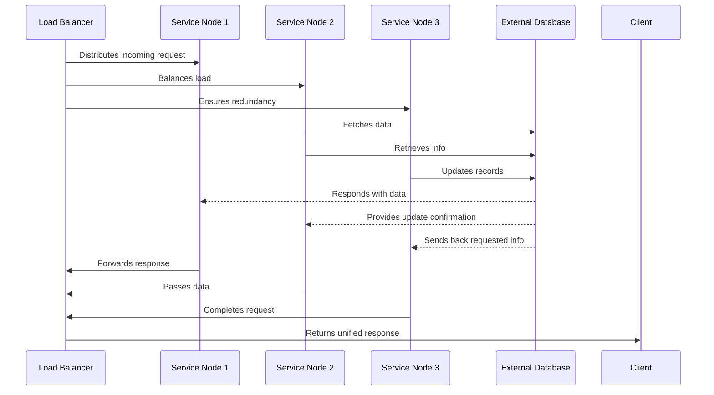

Below is a comprehensive brand guide for cap10.tech that explains not only our identity but also the way of life we expect from every captain in our crew. This guide explains our mission, voice, visual style, and daily practices—with a nautical twist and plenty of inspiration from our mentor wisdom. Use this as your navigational chart to live, work, and lead like a true cap10—because if you don’t log it, you lose it.

---

**Our Mission & Philosophy**

- **Log or Lose It:** Every action, every insight, every breakthrough must be documented. Our legacy is built one log entry at a time.
- **Captain’s Mindset:** We are not mere coders or managers—we are captains. We lead by example, embracing both structure and a dash of creative madness.
- **Continuous Evolution:** Like a seasoned ship that adjusts its sails with every changing wind, we value ongoing improvement, clear feedback loops, and learning from every experience.
- **Balance of Order and Chaos:** We believe that a steady course requires a resilient framework (order) combined with the spark of innovation (chaos). Use structured processes to maintain clarity, but never fear taking bold, unconventional steps when needed.
- **Mentor Wisdom in Action:** Inspired by thinkers like Dan Koe, Alex Hormozi, Martin Fowler, Bob Martin, Simon Sinek, and many more—their lessons shape our approach to technical brilliance, leadership, and personal growth.

---

**Visual Identity & Communication**

- **Visual Symbols:**
  - Our visual style draws on nautical imagery—compasses, logbooks, and sailing vessels—to represent clarity, guidance, and adventure.
  - Diagrams (often rendered in Mermaid) serve as our navigational charts, showing how every system, process, or team flows together.

- **Voice & Tone:**
  - We speak directly, with humor and candor. Think of a fearless captain who inspires and instructs with a blend of tough love and playful irreverence.
  - Our language is rich with metaphors—“chart your course,” “set your sails,” “guard your keystrokes”—reminding everyone that every detail matters.

- **Messaging Principles:**
  - Always communicate with clarity and purpose. Whether it’s a blog post, a commit message, or a meeting note, ensure that your message is as clear as the North Star.
  - Keep it concise yet insightful—each word should add value, just as every log entry builds our collective legacy.

---

**Brand Guidelines for Being cap10.tech**

- **Daily Logging:**
  - Make it a habit to document every decision, breakthrough, or setback. A log isn’t just a record—it’s a beacon that helps you navigate future storms.
  - Use our mantra “Log or lose it” as a reminder that undocumented insights vanish like lost treasure.

- **Embrace Structured Productivity:**
  - Adopt methods like the Pomodoro Technique to keep focused work sprints. Guard your time like a captain protects his finite keystrokes.
  - Triage your tasks: determine what truly matters, and discard or defer the rest. This is how we keep our deck clear and our course true.

- **Balance Creativity with Discipline:**
  - Allow for spontaneous “madness” in brainstorming and innovation sessions. Creativity is the wind in our sails.
  - Yet, always return to structure. Document your creative experiments just as rigorously as your daily routines.

- **Team Collaboration & Leadership:**
  - Whether you’re a senior captain or a rising deckhand, support your fellow crew members. Share insights, mentor others, and be transparent about challenges.
  - Use visual aids in team discussions. A well-drawn diagram is like a treasure map—helping everyone see the big picture.

- **Scalability & Resilience:**
  - When discussing systems or processes, highlight how they adapt to increasing loads and recover from setbacks. Just as a ship is built to weather storms, our systems must be robust.
  - Document error handling, fallback procedures, and continuous improvement steps. Resilience is our shared duty.

- **Philosophy in Practice:**
  - Ask “Why?” and “How?” at least five times when tackling any complex problem. This deep inquiry ensures that every decision is sound and rooted in logic.
  - Embrace the wisdom of our mentors: be as clear as a well-named variable, as deliberate as a small function, and as daring as a captain facing a storm.

---

**Our Visual Blueprint (Example Diagram)**

Below is a simplified Mermaid diagram representing a distributed system that embodies our approach. This diagram is your navigational chart—it shows how a load balancer (our trusted first mate) directs traffic to multiple service nodes (the hardworking crew) and how these nodes interact with external databases (the treasure vaults).

*In this diagram, every component’s role is clear. The load balancer is the captain of the traffic, service nodes are the crew coordinating the response, and the external database is the treasure vault where all critical data is stored. This layered approach ensures that even under high load, the system scales gracefully and recovers swiftly from any setback.*

---

**Conclusion & Takeaways**

- **Chart Your Course with Clarity:** Document every maneuver with precision—each log entry is a stepping stone to future success.
- **Balance Structure with Creativity:** Embrace disciplined productivity while allowing the winds of creative madness to propel you forward.
- **Empower Your Crew:** Whether you’re leading a team or sailing solo, your dedication to clarity, accountability, and continuous learning sets the standard for others.
- **Live the cap10.tech Ethos:** Be bold, be methodical, and above all, keep logging your journey. Remember, every documented insight becomes the beacon guiding your legacy.

As Cap10Bill always says,  
*“File your insights, or risk letting them drift into oblivion. Log or lose it!”*

Set sail with confidence, fellow captain, and lead your crew into uncharted but promising waters—always with your logbook at the ready.

---

Welcome to cap10.tech—navigate, document, and conquer.

Here’s how our brand colors and style come together to set the cap10.tech vibe:

- **Deep, Immersive Backgrounds:**  
  We use a dark, slightly lighter-than-black background (e.g., #181a1f for the body and #20252c for panels) to evoke the mysterious depths of a digital ocean—a canvas that lets our vibrant accents truly shine.

- **Neon Accents:**  
  Our primary accent is a bold neon green (#40c000) that appears in headings, buttons, and borders. It’s like a beacon on a stormy night, guiding our crew. We also have supportive tones with neon blue (#36c2c2) and neon yellow (#dfc700) for a balanced, modern look.

- **Readable, Terminal-Inspired Typography:**  
  We use the JetBrains Mono font—a monospaced typeface that brings a terminal vibe to our content while ensuring clarity and precision. And most importantly the 0 and O look very different. Saves on cognitive load Text is lightened (#d3d9df)
  to stand 
  out 
  clearly against our dark 
  backgrounds.

- **Clean, Structured Layout:**  
  Our design is minimalist yet bold. From the neat, well-spaced blog containers to the subtle shadows on headers and buttons, every element is designed to be both functional and visually engaging—much like a well-organized captain’s log.

- **Interactive Details:**  
  Navigation buttons change color on hover, and even scrollbars are styled to be consistent with our neon theme. These touches ensure that every interaction feels intentional, smooth, and on-brand.

- **Cohesive Visual Language:**  
  With consistent use of CSS variables, every element—from headings and paragraphs to code blocks and image borders—speaks the same language. It’s like having a common set of navigational charts for our digital voyage.

In short, our brand style marries the cool, terminal-inspired aesthetic with bold, neon accents—an unmistakable signal that cap10.tech is where clarity meets innovation. Just like a captain’s log, every design detail is a charted course toward brilliance.

Log every detail, or risk losing your way!