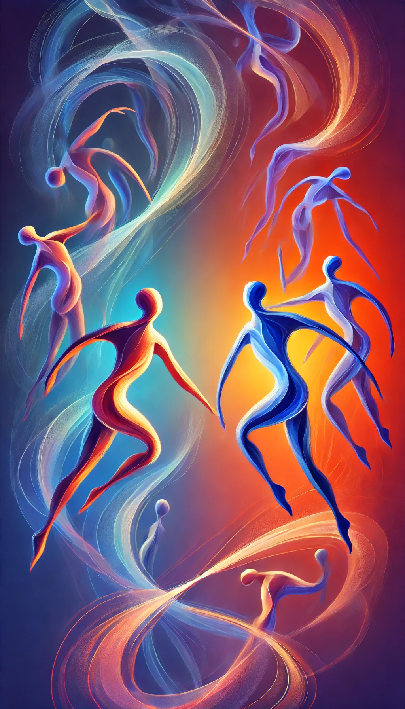
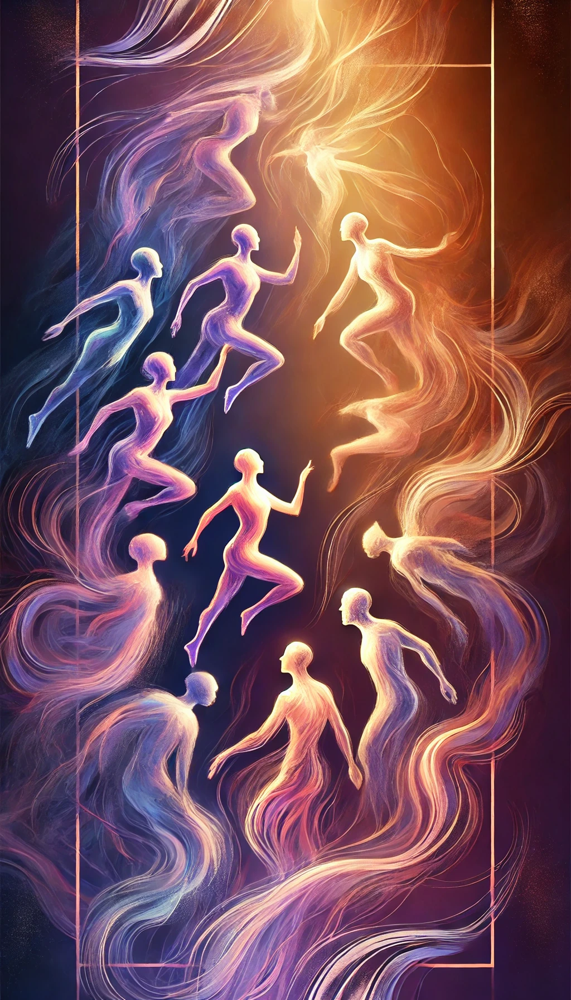
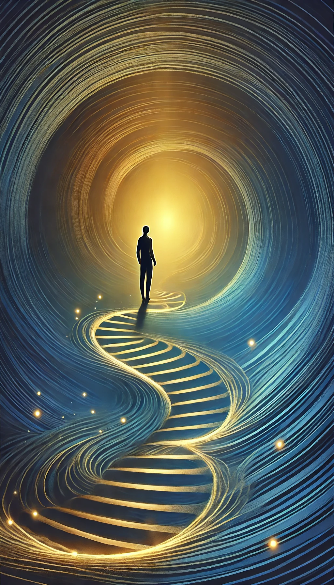
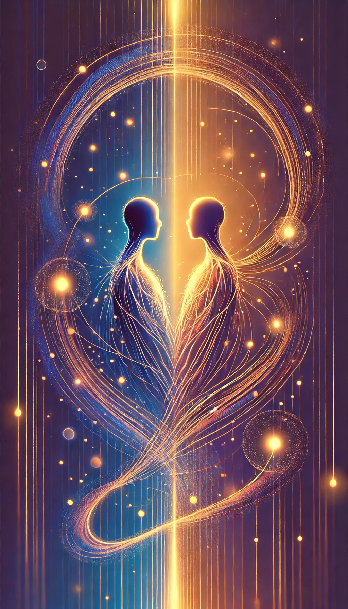

# Welcome to the Dance of Self

Imagine a playful dance floor where "You, Your, and Yourself" swirl gracefully alongside "Me, Myself, and I." This is a fun invitation to get to know the many facets of who we are—our thoughts, our feelings, and the unique stories we all carry in our heads and hearts.



In this dance of life, each step we take is a conversation between our inner selves and the world around us. It’s an exploration of identity where every twirl and pause helps us understand our desires, our strengths, and even our quirks. Here, introspection meets expression in a vibrant interplay that celebrates the journey of self-discovery.

So, let’s dive in:

- **You, Your, and Yourself:** Explore the personal, intimate, and unique aspects of your being.
- **Me, Myself, and I:** Embrace your role as both the observer and the participant in your own life.
- **Together:** Through creative dialogue, we learn, laugh, and grow in the beautiful rhythm of life. Enjoy the dance!

---

# Deep Communication Questions

---

## Desires

Before you begin answering the questions on desires, take a moment to consider how your inner impulses, your values, and your experiences interact. These questions encourage you to reflect on the sources of your aspirations, the steps you take to mold them, and the emotional fulfillment that follows. They help you explore not only what you want but also why you want it, and how you turn challenges into growth.


### Question 1
> In your experience, how have your inner drives and the influences around you shaped your desires, and what steps have you taken to forge your own path and create unique values?

```text
[Your answer here]
```

### Question 2
> Could you share examples of how you actively overcome life’s challenges and transform moments of suffering into strength and meaning rather than simply accepting circumstances?

```text
[Your answer here]
```

### Question 3
> What strategies have you found effective for letting go of resentment and envy, and how do you cultivate a mindset that celebrates your unique potential?

```text
[Your answer here]
```

### Question 4
> How do you define greatness as a continuous journey of self-creation, and what practices do you follow in your pursuit of your highest self?

```text
[Your answer here]
```

### Question 5
> In what ways do you embody strength, creativity, and authenticity so that your life reflects your personal will to power?

```text
[Your answer here]
```

### Question 6
> How do you interpret the idea of having a moral obligation to look ahead and work toward a better future for both yourself and society, and can you share any examples from your own life?

```text
[Your answer here]
```

### Question 7
> What does taking full responsibility for your potential mean to you, and how do you strive to contribute meaningfully to the world around you?

```text
[Your answer here]
```

### Question 8
> What practical actions do you take—such as maintaining personal discipline or keeping your environment in order—to create a ripple effect of positive change in your life and community?

```text
[Your answer here]
```

### Question 9
> How do you see the connection between your personal pursuit of greatness and your commitment to the betterment of society, and what steps do you take to nurture both aspects in your life?

```text
[Your answer here]
```

---

## Building Connections

As you work through these questions, think about the multifaceted nature of relationships—how our values, shared experiences, and emotional bonds shape our interactions. Consider the importance of genuine connection, the role of mutual support, and the insights that come from understanding both your own needs and those of others.

---


---


### Question 1
> What are some things that truly excite you? What drives you in your daily life?

```text
[Your answer here]
```

### Question 2
> What are some things that you find yourself longing for?

```text
[Your answer here]
```

### Question 3
> Do you ever find yourself wanting something because you see others wanting it? How do you distinguish between your own desires and those influenced by others?

```text
[Your answer here]
```

### Question 4
> What values are most important to you, and how do they shape your desires?

```text
[Your answer here]
```

### Question 5
> What kind of future are you working towards? What does "success" mean to you?

```text
[Your answer here]
```

### Question 6
> What are the essential things you need to feel fulfilled? How do you differentiate between your needs and wants?

```text
[Your answer here]
```

### Question 7
> What are some of your emotional needs?

```text
[Your answer here]
```

### Question 8
> How do you prioritize your needs and wants when they conflict?

```text
[Your answer here]
```

### Question 9
> What actions do you take to fulfill your needs? What brings you a feeling of fulfillment?

```text
[Your answer here]
```

### Question 10
> Is it hard for you to express your needs? Why?

```text
[Your answer here]
```

### Question 11
> What are some challenges you've overcome, and what did you learn from them?

```text
[Your answer here]
```

### Question 12
> In what ways have you changed over the past few years?

```text
[Your answer here]
```

### Question 13
> How do you strive to improve yourself? What does "self-overcoming" mean to you?

```text
[Your answer here]
```

### Question 14
> How do you find meaning in your experiences, both positive and negative?

```text
[Your answer here]
```

### Question 15
> How do you view your responsibility to yourself and to society?

```text
[Your answer here]
```

---

## Exploring Cultures

Reflect on the concept of culture as a living, breathing entity that influences who you are. As you answer these questions, think about how traditions, social norms, and personal heritage combine to shape your identity. Consider the benefits of understanding cultural differences, the enrichment they bring to your life, and the ways in which diverse perspectives can expand your worldview.

---


---

### Question 1
> What does "culture" mean to you? How do you define it in your own life?

```text
[Your answer here]
```

### Question 2
> Do you identify with any specific subcultures? What draws you to them?

```text
[Your answer here]
```

### Question 3
> How does your family's culture differ from the broader culture you live in?

```text
[Your answer here]
```

### Question 4
> Are there any cultural traditions you cherish or find challenging?

```text
[Your answer here]
```

### Question 5
> What values were emphasized in your upbringing?

```text
[Your answer here]
```

### Question 6
> What values do you hold most dear today?

```text
[Your answer here]
```

### Question 7
> How do those values influence your decisions?

```text
[Your answer here]
```

### Question 8
> How do you think your culture has shaped your values?

```text
[Your answer here]
```

### Question 9
> Are there any cultural values you disagree with?

```text
[Your answer here]
```

### Question 10
> How do different cultures approach concepts like family, community, and individual responsibility?

```text
[Your answer here]
```

### Question 11
> What are the core values of the subcultures you identify with?

```text
[Your answer here]
```

### Question 12
> How do those values differ from mainstream values?

```text
[Your answer here]
```

### Question 13
> What are the driving motivations of people within those subcultures?

```text
[Your answer here]
```

### Question 14
> What are your personal goals and aspirations?

```text
[Your answer here]
```

### Question 15
> What are you hoping to achieve in your life?

```text
[Your answer here]
```

### Question 16
> How do your cultural background and subcultures influence those goals?

```text
[Your answer here]
```

### Question 17
> What drives you to do what you do?

```text
[Your answer here]
```

### Question 18
> What gives you a sense of purpose?

```text
[Your answer here]
```

### Question 19
> How do you define success?

```text
[Your answer here]
```

### Question 20
> Where do you see common ground in our goals and aspirations?

```text
[Your answer here]
```

### Question 21
> Where do our goals diverge, and why?

```text
[Your answer here]
```

---

## Self Discipline

Before answering these questions, consider the journey toward self-mastery and the benefits of consistency in your life. Reflect on the habits that shape your daily routines, the challenges you face, and the inner strength that fuels your progress. These questions invite you to examine your patterns and to envision the rewards of improved discipline in both thought and action.

---



---


### Question 1
> If you could wave a magic wand and instantly improve one area of your life related to self-discipline, what would it be?

```text
[Your answer here]
```

### Question 2
> What are three specific tasks or habits you consistently struggle to maintain, and what obstacles do you face?

```text
[Your answer here]
```

### Question 3
> Imagine you had a perfectly tailored "inner policeman" or coach on your shoulder, designed to help you overcome those three struggles. How would you describe their personality?

```text
[Your answer here]
```

### Question 4
> What kind of language or tone of voice would this "inner policeman" use to motivate you effectively?

```text
[Your answer here]
```

### Question 5
> What are a few specific phrases or commands you'd want your "inner policeman" to use when you're feeling tempted to stray from your goals?

```text
[Your answer here]
```

### Question 6
> How would your "inner policeman" hold you accountable? Would there be any "consequences" for failing to follow through, and if so, what would they be?

```text
[Your answer here]
```

### Question 7
> What do you think are the root causes of your struggles with self-discipline in those areas?

```text
[Your answer here]
```

### Question 8
> Can you recall a time when you successfully overcame a similar challenge? What strategies did you use then?

```text
[Your answer here]
```

### Question 9
> What external factors (environment, people, etc.) contribute to your struggles with self-discipline?

```text
[Your answer here]
```

### Question 10
> If you were to achieve consistent self-discipline in these areas, how would your life be different? What would you gain?

```text
[Your answer here]
```

### Question 11
> What would be the best reward system that your inner policeman could use to help you stay on track?

```text
[Your answer here]
```

### Question 12
> Does the inner child play a role in your lack of self discipline? If so, how would your inner policeman address your inner child?

```text
[Your answer here]
```

---

## Philosophical What-Ifs

These questions challenge you to explore deep "what if" scenarios, encouraging you to question assumptions and imagine alternate realities. Reflect on the underlying beliefs that shape your life, and consider how exploring these possibilities can bring clarity, growth, and creative insight into your choices.

---


---

### Question 1
> What if you discovered that all your current values were inherited or imposed upon you? How would you create your own values, your own "will to power"?

```text
[Your answer here]
```

### Question 2
> What if you were faced with immense suffering? Would you find a way to transform it into something meaningful, or would you succumb to resentment?

```text
[Your answer here]
```

### Question 3
> What if you realized that most of your desires were mimetic, driven by what others desire? How would you distinguish your authentic desires from those influenced by imitation?

```text
[Your answer here]
```

### Question 4
> What if you were the "scapegoat" for a community's problems? How would you respond to being unjustly blamed?

```text
[Your answer here]
```

### Question 5
> What if you knew with certainty that your life had no inherent meaning? How would you create meaning for yourself?

```text
[Your answer here]
```

### Question 6
> What if you were faced with a choice that had no objectively "right" answer? How would you navigate the anxiety of absolute freedom?

```text
[Your answer here]
```

### Question 7
> What if you lost everything you considered valuable? How would you maintain your inner peace and virtue?

```text
[Your answer here]
```

### Question 8
> What if you were faced with a situation completely outside of your control? How would you practice acceptance and focus on what you can control?

```text
[Your answer here]
```

### Question 9
> What if you had to make a decision that would benefit the greatest number of people, but would cause significant harm to a small group? How would you weigh the consequences?

```text
[Your answer here]
```

### Question 10
> What if you could accurately measure happiness? How would you structure society to maximize overall happiness?

```text
[Your answer here]
```

### Question 11
> What if everyone acted according to the same principle you are about to act on? Would that principle be universally acceptable?

```text
[Your answer here]
```

### Question 12
> What if you were faced with a situation where lying would produce a positive outcome, but telling the truth would cause harm? Which would you choose, and why?

```text
[Your answer here]
```

### Question 13
> What if you realized that everything you thought you knew was based on unexamined assumptions? How would you begin the process of questioning your beliefs?

```text
[Your answer here]
```

### Question 14
> What is "the good life" to you? How does your definition align with or differ from traditional philosophical views?

```text
[Your answer here]
```

### Question 15
> What if you could completely detach yourself from all desires and attachments? What would your experience of the world be like?

```text
[Your answer here]
```

### Question 16
> What if you could truly understand the interconnectedness of all things? How would that change your actions and relationships?

```text
[Your answer here]
```

### Question 17
> What if you knew that your actions had a ripple effect, influencing the lives of countless others? How would you take responsibility for your choices?

```text
[Your answer here]
```

### Question 18
> What if you were presented with a chaotic situation in your life or the world at large? How would you "clean your room" and bring order to it?

```text
[Your answer here]
```

### Question 19
> What if our perceived reality is a simulation? How would that change your understanding of your life and choices?

```text
[Your answer here]
```

---

## Cultural Differences

Take a moment to explore how varying cultural contexts have shaped who you are. These questions invite you to examine the influence of societal norms, traditions, and historical contexts on your values and identity. Think about the richness of diverse perspectives and the universal threads that connect us all.

---


---

### Question 1
> Before we dive into broader comparisons, how would *you* define "culture" in your own words? What elements make up your personal cultural identity?

```text
[Your answer here]
```

### Question 2
> When you think of a culture vastly different from your own (e.g., a specific country, region, or even a subculture), what are the first few things that come to mind as being "different"?

```text
[Your answer here]
```

### Question 3
> What are some key differences you've observed between American culture and another culture you're familiar with (either through travel, media, or personal interaction)?

```text
[Your answer here]
```

### Question 4
> How do you think your society or culture defines "right" and "wrong"? Where do those moral standards come from?

```text
[Your answer here]
```

### Question 5
> Can you think of a specific moral value that is held strongly in your culture but might be viewed differently in another culture? How does that difference manifest?

```text
[Your answer here]
```

### Question 6
> Do you think that morality is objective or relative to culture? Why?

```text
[Your answer here]
```

### Question 7
> How do people in your culture typically express emotions or build relationships? Are there specific communication styles or social norms that are important?

```text
[Your answer here]
```

### Question 8
> How do different cultures approach concepts like family, community, and individual responsibility?

```text
[Your answer here]
```

### Question 9
> What are the core values of the subcultures you identify with?

```text
[Your answer here]
```

### Question 10
> How do those values differ from mainstream values?

```text
[Your answer here]
```

### Question 11
> How do subcultures within a society challenge or reinforce the dominant cultural values?

```text
[Your answer here]
```

### Question 12
> How does a subculture define its own version of right and wrong?

```text
[Your answer here]
```

### Question 13
> From a broader perspective, how do you see the relationship between individual freedom and cultural norms? Where do you draw the line between personal choice and societal expectations?

```text
[Your answer here]
```

### Question 14
> How does the concept of "cultural relativism" impact your understanding of different moral systems?

```text
[Your answer here]
```

### Question 15
> How do you feel about the idea that the society that you are raised in is the society that sets your morality?

```text
[Your answer here]
```

### Question 16
> What are some social rituals or practices in your culture that might seem unusual or even shocking to someone from a different background?

```text
[Your answer here]
```

### Question 17
> How do these rituals and practices contribute to the sense of community and shared identity?

```text
[Your answer here]
```

### Question 18
> How do you think technology and globalization are impacting cultural differences? Are we becoming more similar or more diverse?

```text
[Your answer here]
```

### Question 19
> How does social media influence the spread of cultural values and the formation of subcultures?

```text
[Your answer here]
```

### Question 20
> How has historical context shaped the cultural values and beliefs of your society or subculture?

```text
[Your answer here]
```

### Question 21
> How do past events influence present day cultural interactions?

```text
[Your answer here]
```

### Question 22
> Despite cultural differences, what are some universal human values or experiences that connect us all?

```text
[Your answer here]
```

### Question 23
> How can we foster greater understanding and empathy across cultural divides?

```text
[Your answer here]
```

---

## Deeper Connections

These questions invite you to delve into the core of your being and examine the experiences that have shaped you. Consider moments of vulnerability, the shared experiences that bind us together, and the inner strengths that emerge from life’s challenges. The goal is to uncover insights that can deepen your understanding of both yourself and your connections with others.

---



---

### Question 1
> "Two Truths and a Wish": Each person shares two true statements about themselves and one wish for the future. The group tries to guess the wish.

```text
[Your answer here]
```

### Question 2
> "What's Your Superpower?" If you could have any superpower, what would it be, and why? What would you use it for?

```text
[Your answer here]
```

### Question 3
> "A Defining Moment": Share a moment in your life that significantly shaped who you are today.

```text
[Your answer here]
```

### Question 4
> "The Road Not Taken": Is there a path you almost took in life, and what do you wonder about it now?

```text
[Your answer here]
```

### Question 5
> "Your Personal Soundtrack": If your life were a movie, what would the soundtrack be? Share a song that resonates with you and why.

```text
[Your answer here]
```

### Question 6
> "What Matters Most?" What are your top three core values, and how do they guide your decisions?

```text
[Your answer here]
```

### Question 7
> "A Belief You've Changed": Share a belief you held strongly in the past that has changed over time. What caused the shift?

```text
[Your answer here]
```

### Question 8
> "The Ideal Society": If you could design an ideal society, what would its core principles be?

```text
[Your answer here]
```

### Question 9
> "What Brings You Joy?" What activities or experiences consistently bring you joy and fulfillment?

```text
[Your answer here]
```

### Question 10
> "What Are You Grateful For?" Share something you are currently grateful for, and why.

```text
[Your answer here]
```

### Question 11
> "Overcoming Obstacles": Share a time you faced a significant challenge and how you overcame it. What did you learn?

```text
[Your answer here]
```

### Question 12
> "Dealing with Fear": What are some of your biggest fears, and how do you cope with them?

```text
[Your answer here]
```

### Question 13
> "Finding Balance": How do you find balance in your life, and what strategies do you use to manage stress?

```text
[Your answer here]
```

### Question 14
> "What's Your 'Go-To' for Comfort?" What do you do when you need comfort or support?

```text
[Your answer here]
```

### Question 15
> "What is a time that you had to be very brave?" Explain the situation.

```text
[Your answer here]
```

### Question 16
> "What Do You Need From Others?" What kind of support or connection do you need from others in your life?

```text
[Your answer here]
```

### Question 17
> "What Do You Appreciate in Others?" What qualities do you value most in friendships and relationships?

```text
[Your answer here]
```

### Question 18
> "A Shared Dream": What's a dream or goal you have that you'd love to share with the group and possibly work towards together?

```text
[Your answer here]
```

### Question 19
> "What is a misconception people have about you?"

```text
[Your answer here]
```

### Question 20
> "What is something you would like to learn from the group?"

```text
[Your answer here]
```

---

## Interesting Conversations

These questions encourage you to engage with ideas that stretch the imagination and challenge your perceptions. Reflect on innovations, trends, and experiences that spark curiosity and passion, while also inviting you to examine the deeper implications behind everyday phenomena.

---


---

### Question 1
> If you could have any technology exist in your lifetime, what would it be and why?

```text
[Your answer here]
```

### Question 2
> What's one trend you're excited about, and one you're worried about?

```text
[Your answer here]
```

### Question 3
> If you could travel to any point in the future or past, where would you go, and what would you want to experience?

```text
[Your answer here]
```

### Question 4
> What do you think the world will be like in 50 years, and what role do you think you will play in it?

```text
[Your answer here]
```

### Question 5
> What's the most inspiring thing you've seen or experienced recently?

```text
[Your answer here]
```

### Question 6
> If you could learn any creative skill, what would it be, and why?

```text
[Your answer here]
```

### Question 7
> What's a book, movie, or piece of art that profoundly impacted you, and why?

```text
[Your answer here]
```

### Question 8
> What is a creative project that you would love to start if you had unlimited time and resources?

```text
[Your answer here]
```

### Question 9
> What's something you're currently trying to learn or improve about yourself?

```text
[Your answer here]
```

### Question 10
> What's a lesson you learned the hard way that you'd like to share?

```text
[Your answer here]
```

### Question 11
> What's a habit you're trying to build, and what's been challenging about it?

```text
[Your answer here]
```

### Question 12
> What is a skill that you have learned that has been the most useful in your life?

```text
[Your answer here]
```

### Question 13
> What do you think is the meaning of life, or what gives your life meaning?

```text
[Your answer here]
```

### Question 14
> What's a question you've been pondering lately?

```text
[Your answer here]
```

### Question 15
> What do you think is the most important quality a person can have?

```text
[Your answer here]
```

### Question 16
> If you could change one thing about the way society functions, what would it be and why?

```text
[Your answer here]
```

### Question 17
> What's the most unusual or interesting thing you've ever found?

```text
[Your answer here]
```

### Question 18
> If animals could talk, which animal would have the most interesting stories to tell?

```text
[Your answer here]
```

### Question 19
> What's a conspiracy theory you find strangely compelling, even if you don't believe it?

```text
[Your answer here]
```

### Question 20
> What is the most useless talent that you have?

```text
[Your answer here]
```

### Question 21
> What's a social norm you find strange or unnecessary?

```text
[Your answer here]
```

### Question 22
> What's something you've observed about human behavior that you find interesting?

```text
[Your answer here]
```

### Question 23
> What do you think is the biggest misconception people have about your generation?

```text
[Your answer here]
```

---

---

---

**Conclusion**  
This Dance of Self invites us to explore the layered depths of our thoughts, emotions, and experiences. By embracing our inner conversations—between You, Your, and Yourself and Me, Myself, and I—we gain insight into who we truly are and who we wish to become. Each step, pause, and swirl on the dance floor of life helps us grow, connect, and celebrate the unique facets of our identity. May this dance spark curiosity, inspire self-compassion, and encourage you to explore your own beautiful, evolving story. Enjoy the journey!

---


