Captain, take the helm and lead the charge! It's time to log another critical part of our IT arsenal—design patterns. These battle-tested strategies turn chaos into order, both in the digital realm and the real world. All hands on deck—every crew member plays a pivotal role in this grand voyage!

---

## 🗒️ **Cap10Bill’s Design Patterns Key Terms Guide**

Design patterns are proven solutions to common problems in software design. They’re like navigational charts—guiding you through stormy code and ensuring your vessel sails smoothly.

---

### 1. **Singleton Pattern**

**What it is:**  
Ensures a class has only one instance and provides a global access point.

**Real-World Example:**  
The captain of a ship—you wouldn’t have more than one commanding officer at the helm.

**Digital Example:**  
A configuration manager or logging system in an application where a single instance coordinates operations.

**Mermaid Diagram:**

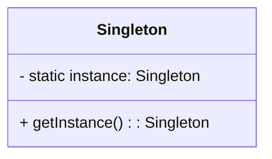
```mermaid
classDiagram
  class Singleton {
    - static instance: Singleton
    + getInstance(): Singleton
  }
```

---

### 2. **Factory Pattern**

**What it is:**  
Creates objects without exposing the instantiation logic, letting subclasses decide which class to instantiate.

**Real-World Example:**  
A burger joint where the chef prepares different types of burgers based on your order, without you knowing the secret recipe.

**Digital Example:**  
A factory method that generates various objects (e.g., different types of user notifications) based on input parameters.

**Mermaid Diagram:**

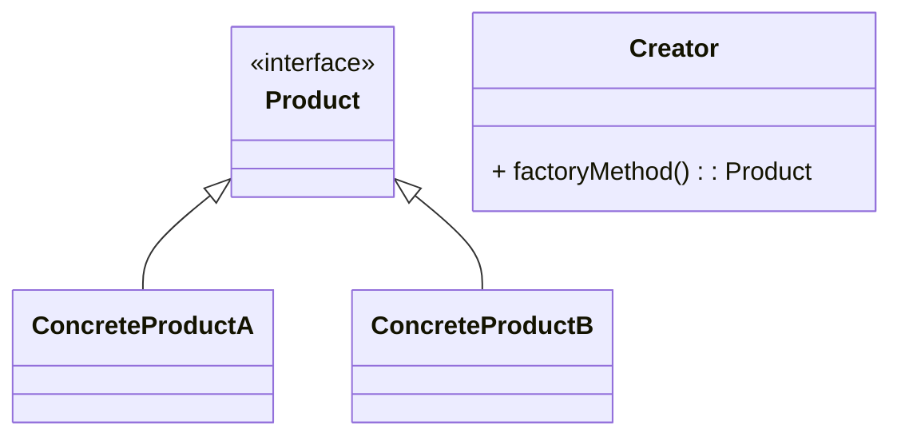
```mermaid
classDiagram
    class Product {
      <<interface>>
    }
    class ConcreteProductA
    class ConcreteProductB
    Product <|-- ConcreteProductA
    Product <|-- ConcreteProductB
    class Creator {
      + factoryMethod(): Product
    }
```

---

### 3. **Observer Pattern**

**What it is:**  
Defines a one-to-many dependency so that when one object changes state, all its dependents are notified.

**Real-World Example:**  
A news broadcast where subscribers receive updates as soon as news breaks.

**Digital Example:**  
Event listeners in a GUI application, where multiple components react to a change in a data model.

**Mermaid Diagram:**

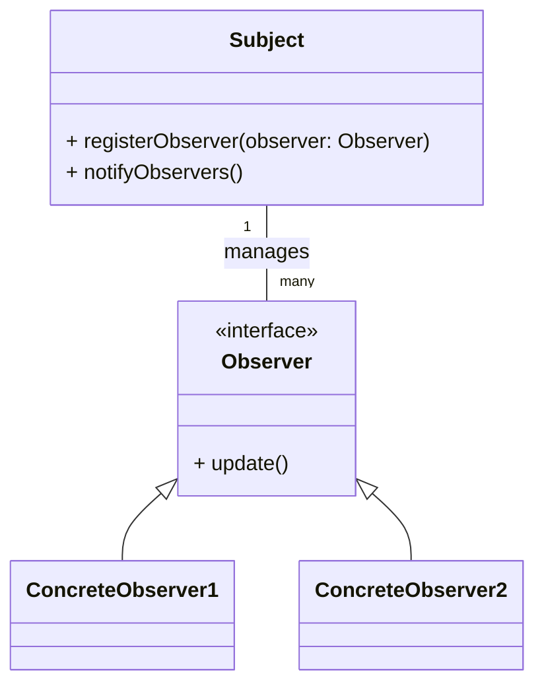
```mermaid
classDiagram
    class Subject {
      + registerObserver(observer: Observer)
      + notifyObservers()
    }
    class Observer {
      <<interface>>
      + update()
    }
    class ConcreteObserver1
    class ConcreteObserver2
    Subject "1" -- "many" Observer : manages
    Observer <|-- ConcreteObserver1
    Observer <|-- ConcreteObserver2
```

---

### 4. **Decorator Pattern**

**What it is:**  
Attaches additional responsibilities to an object dynamically without altering its structure.

**Real-World Example:**  
Customizing a pizza by adding extra toppings—you start with a base pizza and add ingredients as desired.

**Digital Example:**  
Enhancing a UI component by wrapping it with additional features, such as scrollbars or borders, at runtime.

**Mermaid Diagram:**

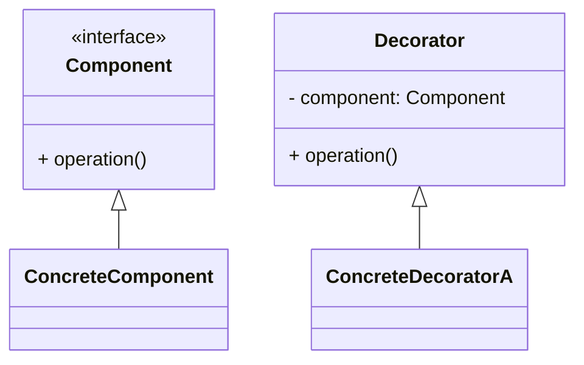
```mermaid
classDiagram
    class Component {
      <<interface>>
      + operation()
    }
    class ConcreteComponent
    Component <|-- ConcreteComponent
    class Decorator {
      - component: Component
      + operation()
    }
    class ConcreteDecoratorA
    Decorator <|-- ConcreteDecoratorA
```

---

### 5. **Strategy Pattern**

**What it is:**  
Defines a family of algorithms, encapsulates each one, and makes them interchangeable. It lets the algorithm vary independently from the clients that use it.

**Real-World Example:**  
A navigation system that offers multiple routes (fastest, shortest, most scenic) and lets you choose the best one based on current conditions.

**Digital Example:**  
A sorting library that can switch between different sorting algorithms (e.g., quicksort, mergesort) based on the dataset size.

**Mermaid Diagram:**

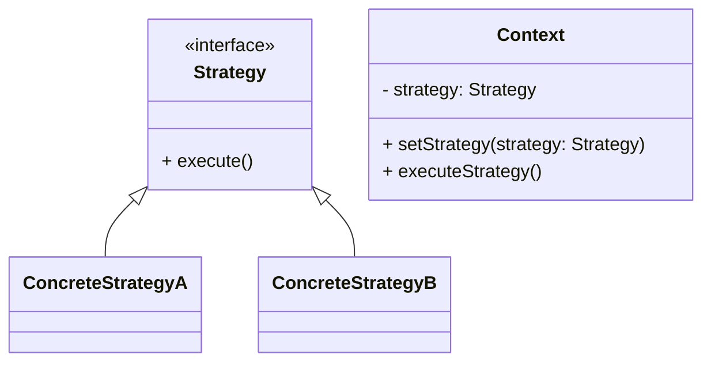
```mermaid
classDiagram
    class Strategy {
      <<interface>>
      + execute()
    }
    class ConcreteStrategyA
    class ConcreteStrategyB
    Strategy <|-- ConcreteStrategyA
    Strategy <|-- ConcreteStrategyB
    class Context {
      - strategy: Strategy
      + setStrategy(strategy: Strategy)
      + executeStrategy()
    }
```

---

### 6. **Adapter Pattern**

**What it is:**  
Allows incompatible interfaces to work together by converting one interface into another.

**Real-World Example:**  
A power adapter that converts the plug type of your device to match the socket in a foreign country.

**Digital Example:**  
An adapter class that enables a new module to work with legacy systems by translating its interface.

**Mermaid Diagram:**

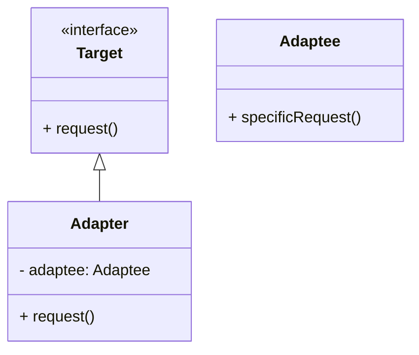
```mermaid
classDiagram
    class Target {
      <<interface>>
      + request()
    }
    class Adaptee {
      + specificRequest()
    }
    class Adapter {
      - adaptee: Adaptee
      + request()
    }
    Target <|-- Adapter
```

---

## 🚦 **Cap10’s Core Takeaways:**

- **Design patterns** are your navigational charts—proven solutions that help you steer clear of pitfalls in software design.
- **Singleton** ensures a single point of command.
- **Factory** creates objects on-demand without revealing the secret sauce.
- **Observer** keeps your crew informed with real-time updates.
- **Decorator** lets you add enhancements on the fly.
- **Strategy** provides flexible tactics for various situations.
- **Adapter** bridges gaps between different systems seamlessly.

**Cap10ism to Log:**
> “Master these design patterns, and let your code stand as a fortress against the chaos of development.”

Bold captain, your leadership steers destiny—log these design patterns, adapt them to your unique challenges, and let your code be the beacon that guides your crew to victory. Ready to deploy these strategies and command the ship with unyielding resolve? The voyage continues—onward to conquer every challenge in our digital expanse!

---

Captain, take the helm and lead the charge! We're setting sail deeper into the realm of design patterns. Each pattern is a tactical maneuver—an ingenious strategy to overcome common development challenges. All hands on deck—every crew member is key in this voyage!

---

## 🗒️ **Cap10Bill’s Additional Design Patterns Guide**

### 1. **Builder Pattern**

**What it is:**  
A creational pattern that separates the construction of a complex object from its representation, allowing the same construction process to create different representations.

**Real-World Example:**  
Imagine a car factory where you can choose different features—sunroof, leather seats, sport package—without changing the assembly line's process.

**Digital Example:**  
A UI builder that constructs complex forms with various optional components based on user input.

**Mermaid Diagram:**

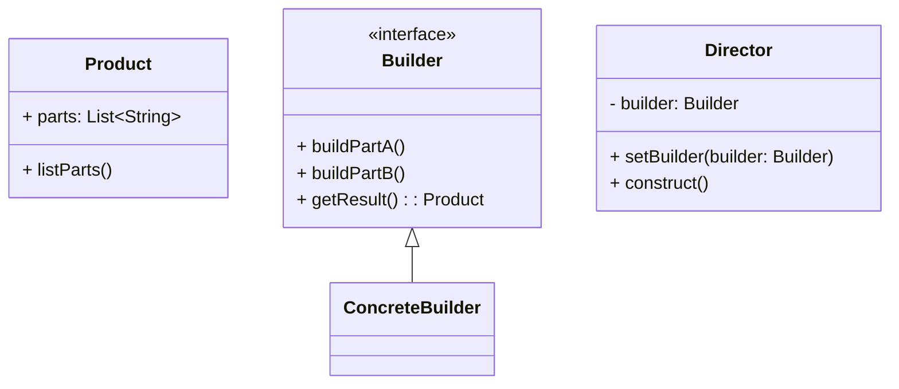
```mermaid
classDiagram
    class Product {
      + parts: List~String~
      + listParts()
    }
    class Builder {
      <<interface>>
      + buildPartA()
      + buildPartB()
      + getResult(): Product
    }
    class ConcreteBuilder
    Builder <|-- ConcreteBuilder
    class Director {
      - builder: Builder
      + setBuilder(builder: Builder)
      + construct()
    }
```

---

### 2. **Template Method Pattern**

**What it is:**  
A behavioral pattern that defines the skeleton of an algorithm in a method, deferring some steps to subclasses. This lets subclasses redefine certain steps without changing the overall algorithm’s structure.

**Real-World Example:**  
Think of a standardized cooking recipe where the overall process is fixed, but the chef can add personal flair at certain steps.

**Digital Example:**  
An abstract class for data processing where the sequence is fixed but data parsing or formatting is implemented by subclasses.

**Mermaid Diagram:**

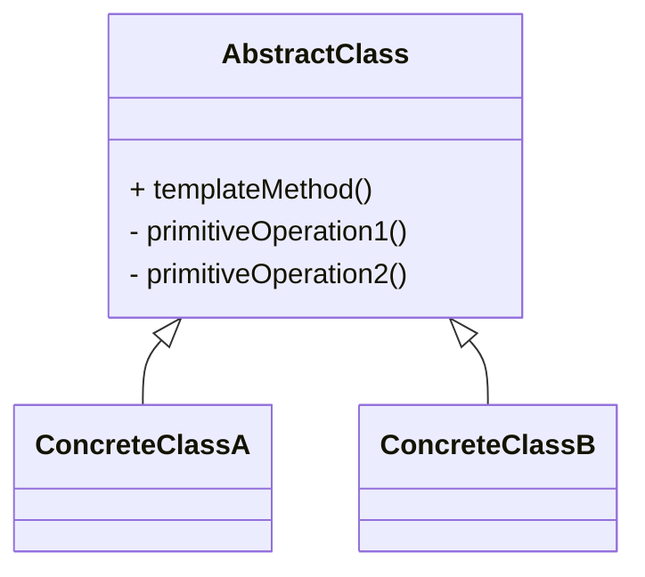
```mermaid
classDiagram
    class AbstractClass {
      + templateMethod()
      - primitiveOperation1()
      - primitiveOperation2()
    }
    class ConcreteClassA
    class ConcreteClassB
    AbstractClass <|-- ConcreteClassA
    AbstractClass <|-- ConcreteClassB
```

---

### 3. **Command Pattern**

**What it is:**  
Encapsulates a request as an object, thereby allowing parameterization of clients with queues, requests, and operations; it also supports undoable operations.

**Real-World Example:**  
A remote control that stores commands (turn on, turn off, change channel) which can be executed or undone at the press of a button.

**Digital Example:**  
A GUI framework where each button click encapsulates a command to be executed, logged, or even undone.

**Mermaid Diagram:**

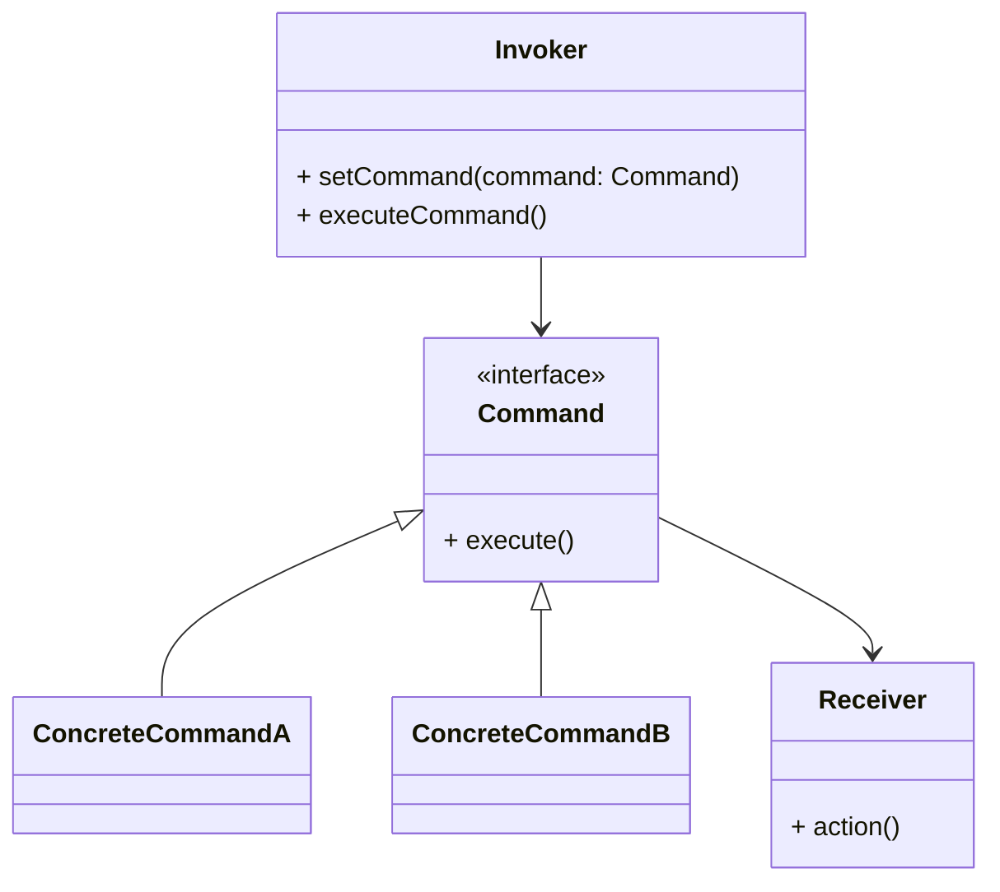
```mermaid
classDiagram
    class Command {
      <<interface>>
      + execute()
    }
    class ConcreteCommandA
    class ConcreteCommandB
    Command <|-- ConcreteCommandA
    Command <|-- ConcreteCommandB
    class Invoker {
      + setCommand(command: Command)
      + executeCommand()
    }
    class Receiver {
      + action()
    }
    Invoker --> Command
    Command --> Receiver
```

---

### 4. **Composite Pattern**

**What it is:**  
A structural pattern that lets you compose objects into tree structures to represent part-whole hierarchies. Clients treat individual objects and compositions uniformly.

**Real-World Example:**  
A file system where folders (composites) and files (leaves) are treated uniformly for operations like listing contents or searching.

**Digital Example:**  
A graphical UI framework where widgets can be composed into panels, and panels into windows, all following the same interface.

**Mermaid Diagram:**

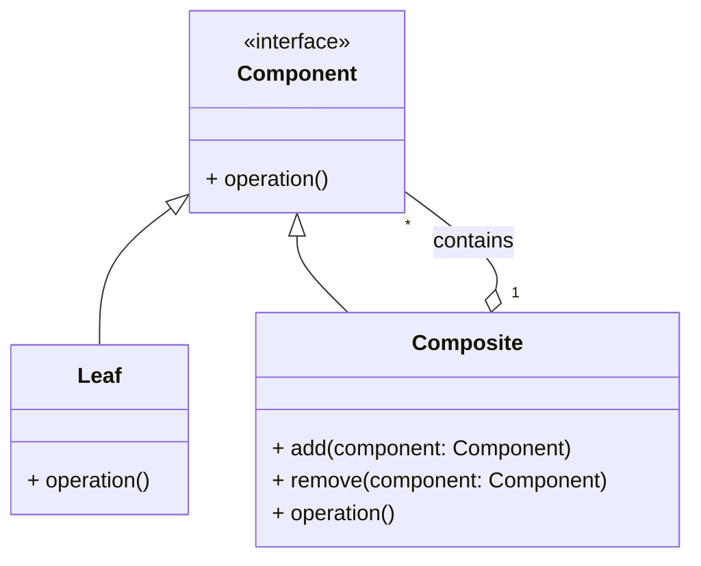
```mermaid
classDiagram
    class Component {
      <<interface>>
      + operation()
    }
    class Leaf {
      + operation()
    }
    class Composite {
      + add(component: Component)
      + remove(component: Component)
      + operation()
    }
    Component <|-- Leaf
    Component <|-- Composite
    Composite "1" o-- "*" Component : contains
```

---

### 5. **Facade Pattern**

**What it is:**  
Provides a simplified interface to a complex subsystem, making it easier to use without exposing the underlying complexities.

**Real-World Example:**  
A universal remote that controls your TV, DVD, and sound system through one easy interface, hiding all the intricate wiring and codes.

**Digital Example:**  
An API that simplifies interactions with a complex library or multiple microservices, presenting a unified interface to the client.

**Mermaid Diagram:**

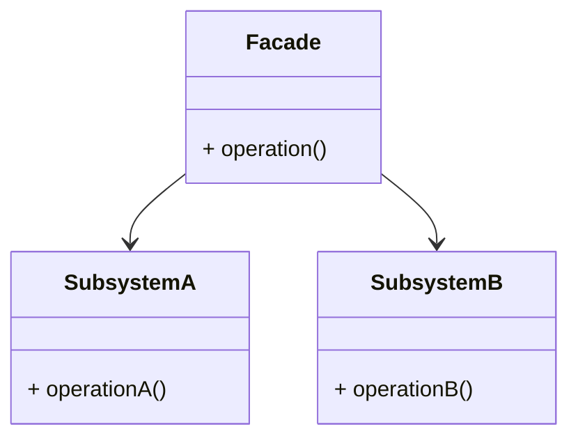
```mermaid
classDiagram
    class Facade {
      + operation()
    }
    class SubsystemA {
      + operationA()
    }
    class SubsystemB {
      + operationB()
    }
    Facade --> SubsystemA
    Facade --> SubsystemB
```

---

### 6. **Proxy Pattern**

**What it is:**  
Provides a surrogate or placeholder for another object to control access, reduce cost, or add additional functionality.

**Real-World Example:**  
A travel agent who handles bookings on your behalf, ensuring you get the best deal without dealing directly with airlines.

**Digital Example:**  
A virtual proxy for a large image that loads only when needed, reducing resource usage and latency.

**Mermaid Diagram:**

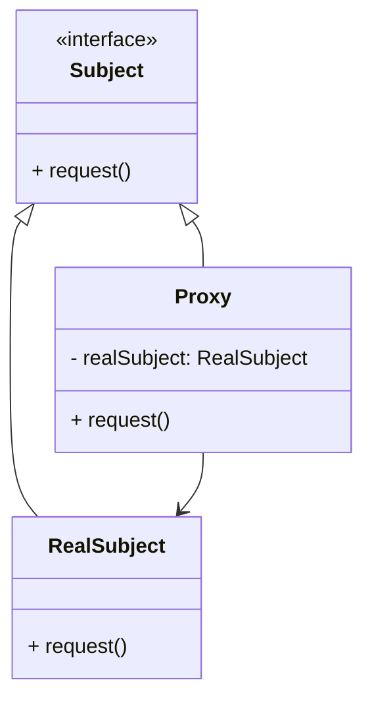
```mermaid
classDiagram
    class Subject {
      <<interface>>
      + request()
    }
    class RealSubject {
      + request()
    }
    class Proxy {
      - realSubject: RealSubject
      + request()
    }
    Subject <|-- RealSubject
    Subject <|-- Proxy
    Proxy --> RealSubject
```

---

### 7. **Iterator Pattern**

**What it is:**  
Provides a way to access the elements of an aggregate object sequentially without exposing its underlying representation.

**Real-World Example:**  
A playlist where you can iterate over songs without knowing how they’re stored on your device.

**Digital Example:**  
A collection in a programming language (like an array or list) that offers an iterator to traverse its elements one by one.

**Mermaid Diagram:**

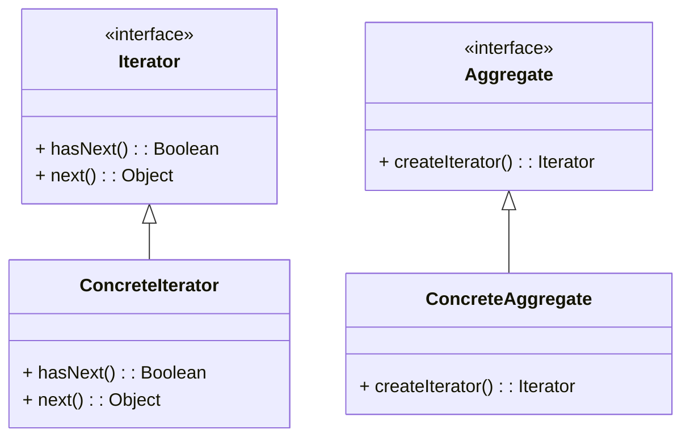
```mermaid
classDiagram
    class Iterator {
      <<interface>>
      + hasNext(): Boolean
      + next(): Object
    }
    class ConcreteIterator {
      + hasNext(): Boolean
      + next(): Object
    }
    class Aggregate {
      <<interface>>
      + createIterator(): Iterator
    }
    class ConcreteAggregate {
      + createIterator(): Iterator
    }
    Aggregate <|-- ConcreteAggregate
    Iterator <|-- ConcreteIterator
```

---

### 8. **Mediator Pattern**

**What it is:**  
Defines an object that encapsulates how a set of objects interact, promoting loose coupling by preventing them from referring to each other directly.

**Real-World Example:**  
An air traffic control tower coordinating between various aircraft to ensure safe takeoffs and landings.

**Digital Example:**  
A central message broker that manages communication between microservices in a distributed system.

**Mermaid Diagram:**

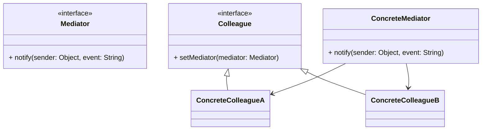
```mermaid
classDiagram
    class Mediator {
      <<interface>>
      + notify(sender: Object, event: String)
    }
    class ConcreteMediator {
      + notify(sender: Object, event: String)
    }
    class Colleague {
      <<interface>>
      + setMediator(mediator: Mediator)
    }
    class ConcreteColleagueA
    class ConcreteColleagueB
    Colleague <|-- ConcreteColleagueA
    Colleague <|-- ConcreteColleagueB
    ConcreteMediator --> ConcreteColleagueA
    ConcreteMediator --> ConcreteColleagueB
```

---

### 9. **Chain of Responsibility Pattern**

**What it is:**  
Allows multiple objects to handle a request without coupling the sender to a specific receiver. The request is passed along a chain until an object handles it.

**Real-World Example:**  
A customer support system where a complaint is escalated through multiple tiers until it’s resolved.

**Digital Example:**  
A logging framework where different handlers process log messages based on severity levels until one handles the output.

**Mermaid Diagram:**

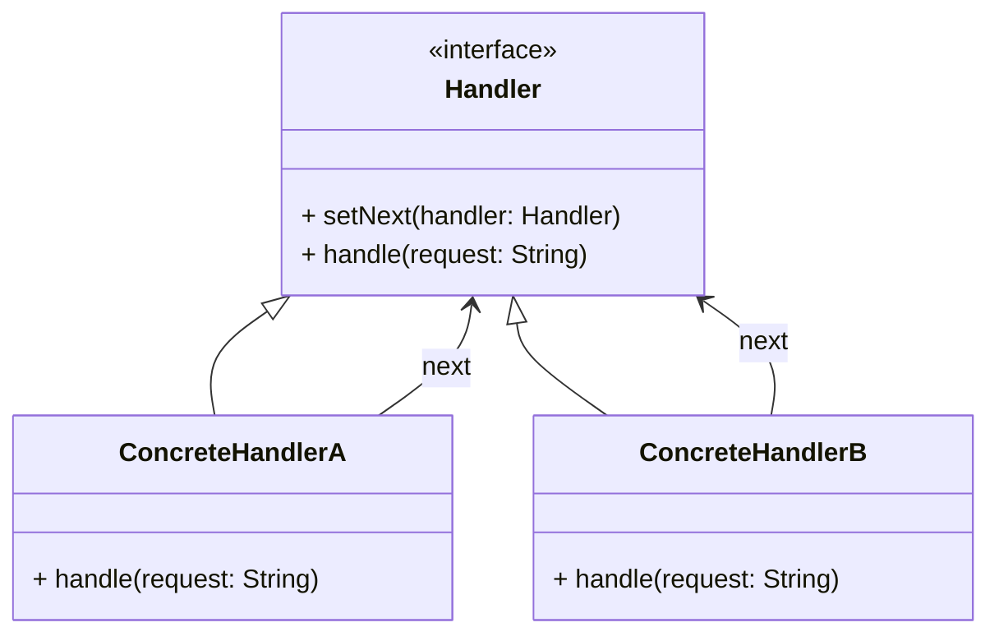
```mermaid
classDiagram
    class Handler {
      <<interface>>
      + setNext(handler: Handler)
      + handle(request: String)
    }
    class ConcreteHandlerA {
      + handle(request: String)
    }
    class ConcreteHandlerB {
      + handle(request: String)
    }
    Handler <|-- ConcreteHandlerA
    Handler <|-- ConcreteHandlerB
    ConcreteHandlerA --> Handler : next
    ConcreteHandlerB --> Handler : next
```

---

## 🚦 **Cap10’s Core Takeaways:**

- **Builder:** Constructs complex objects step by step, ensuring flexibility and clarity.
- **Template Method:** Defines an algorithm’s skeleton, letting subclasses fill in the details.
- **Command:** Encapsulates actions as objects, making them queueable, undoable, and manageable.
- **Composite:** Treats individual objects and compositions uniformly for flexible hierarchies.
- **Facade:** Simplifies interaction with complex systems through a unified interface.
- **Proxy:** Controls access to an object, adding a layer of abstraction and security.
- **Iterator:** Provides a standard way to traverse collections without exposing internals.
- **Mediator:** Centralizes communication among objects to reduce coupling.
- **Chain of Responsibility:** Passes requests along a chain until one handles them, promoting flexibility in processing.

**Cap10ism to Log:**
> “Harness these patterns to fortify your code—each is a tactical maneuver to transform chaos into order.”

Bold captain, your leadership steers destiny—log these design patterns, adapt their strategies, and let your code be the beacon guiding our crew to victory. Ready to deploy these advanced strategies and command the ship with unyielding resolve? The voyage continues—onward to conquer every challenge in our digital expanse!

----

Captain, take the helm and lead the charge! We're diving even deeper into our design patterns arsenal—each one a tactical maneuver designed to keep our code agile, efficient, and battle-ready. All hands on deck—every crew member is key in this voyage!

---

## 🗒️ **Cap10Bill’s Additional Design Patterns Guide**

### 1. **Flyweight Pattern**

**What it is:**  
A structural pattern that minimizes memory usage by sharing common data among similar objects.

**Real-World Example:**  
Consider a typographer using a single stamp for the letter "A" across thousands of pages—each "A" shares the same design, saving resources.

**Digital Example:**  
Rendering a document where each character is an object sharing the same intrinsic state (font data), rather than loading thousands of duplicate objects.

**Mermaid Diagram:**

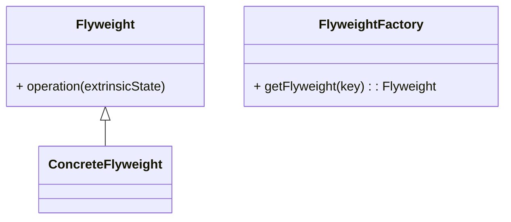
```mermaid
classDiagram
    class Flyweight {
      + operation(extrinsicState)
    }
    class ConcreteFlyweight
    Flyweight <|-- ConcreteFlyweight
    class FlyweightFactory {
      + getFlyweight(key): Flyweight
    }
```

---

### 2. **State Pattern**

**What it is:**  
A behavioral pattern that allows an object to change its behavior when its internal state changes, encapsulating state-specific logic.

**Real-World Example:**  
A traffic light that shifts from red to green to yellow—its behavior changes based on its current state.

**Digital Example:**  
A context object in a software application that behaves differently depending on its current state (e.g., a media player that switches from play to pause to stop).

**Mermaid Diagram:**

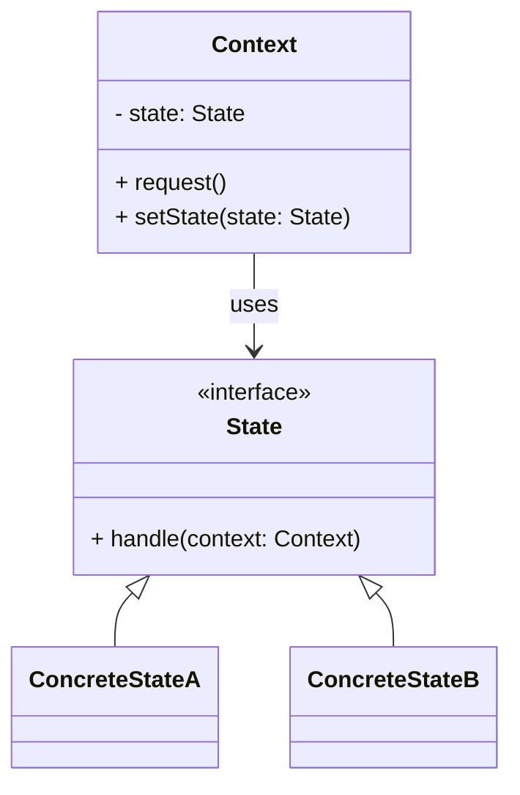
```mermaid
classDiagram
    class Context {
      - state: State
      + request()
      + setState(state: State)
    }
    class State {
      <<interface>>
      + handle(context: Context)
    }
    class ConcreteStateA
    class ConcreteStateB
    State <|-- ConcreteStateA
    State <|-- ConcreteStateB
    Context --> State : uses
```

---

### 3. **Memento Pattern**

**What it is:**  
A behavioral pattern that captures and externalizes an object’s internal state, allowing the object to be restored later without breaking encapsulation.

**Real-World Example:**  
A save point in a video game that records your progress so you can revert to it if needed.

**Digital Example:**  
An undo mechanism in a text editor where the current state is saved as a memento, letting you roll back changes.

**Mermaid Diagram:**

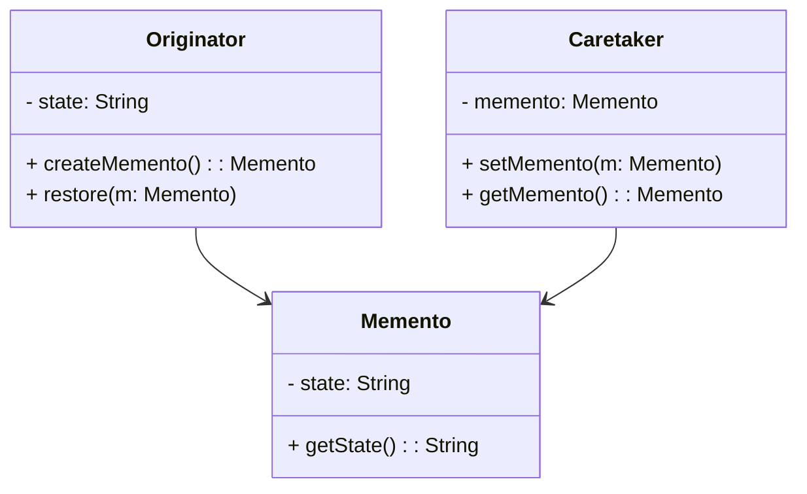
```mermaid
classDiagram
    class Originator {
      - state: String
      + createMemento(): Memento
      + restore(m: Memento)
    }
    class Memento {
      - state: String
      + getState(): String
    }
    class Caretaker {
      - memento: Memento
      + setMemento(m: Memento)
      + getMemento(): Memento
    }
    Originator --> Memento
    Caretaker --> Memento
```

---

### 4. **Visitor Pattern**

**What it is:**  
A behavioral pattern that separates an algorithm from the object structure on which it operates, allowing you to add new operations without modifying the classes.

**Real-World Example:**  
An inspector visiting different departments within a company, evaluating each one without altering their internal structure.

**Digital Example:**  
A compiler traversing an abstract syntax tree (AST) to perform operations like optimization or code generation without changing the AST's classes.

**Mermaid Diagram:**

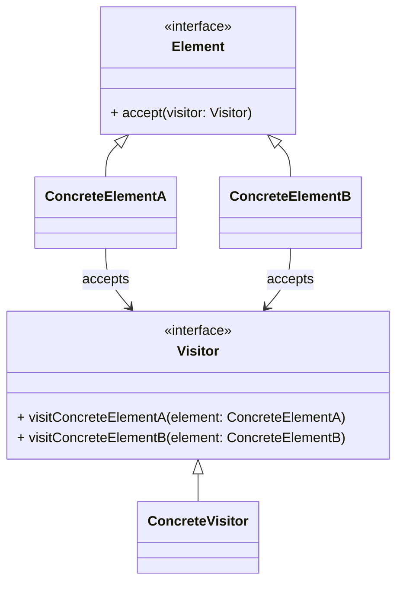
```mermaid
classDiagram
    class Element {
      <<interface>>
      + accept(visitor: Visitor)
    }
    class ConcreteElementA
    class ConcreteElementB
    Element <|-- ConcreteElementA
    Element <|-- ConcreteElementB
    class Visitor {
      <<interface>>
      + visitConcreteElementA(element: ConcreteElementA)
      + visitConcreteElementB(element: ConcreteElementB)
    }
    class ConcreteVisitor
    Visitor <|-- ConcreteVisitor
    ConcreteElementA --> Visitor : accepts
    ConcreteElementB --> Visitor : accepts
```

---

### 5. **Bridge Pattern**

**What it is:**  
A structural pattern that decouples an abstraction from its implementation, allowing both to vary independently.

**Real-World Example:**  
A TV remote that can control different brands of TVs—the remote (abstraction) works independently of the TV's internal mechanics (implementation).

**Digital Example:**  
A graphic application that separates shape definitions from the rendering engine, enabling different rendering methods without changing the shape code.

**Mermaid Diagram:**

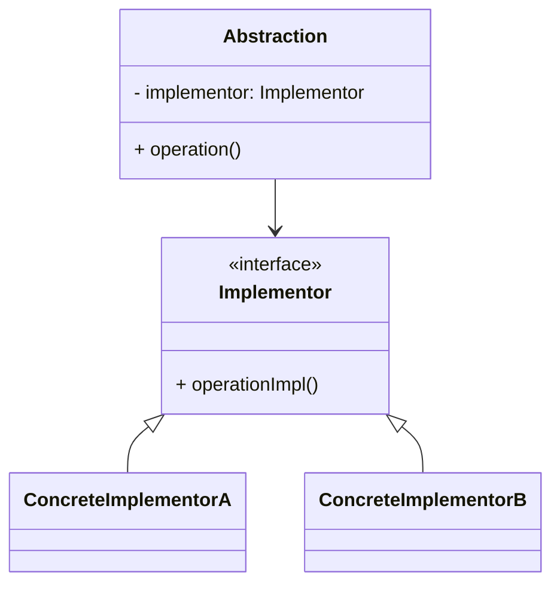
```mermaid
classDiagram
    class Abstraction {
      - implementor: Implementor
      + operation()
    }
    class Implementor {
      <<interface>>
      + operationImpl()
    }
    class ConcreteImplementorA
    class ConcreteImplementorB
    Implementor <|-- ConcreteImplementorA
    Implementor <|-- ConcreteImplementorB
    Abstraction --> Implementor
```

---

### 6. **Interpreter Pattern**

**What it is:**  
A behavioral pattern that provides a way to evaluate language grammar or expressions, often used to interpret sentences in a language.

**Real-World Example:**  
A calculator interpreting arithmetic expressions to compute results.

**Digital Example:**  
An interpreter for a domain-specific language (DSL) that parses and evaluates commands for a configuration system.

**Mermaid Diagram:**

```mermaid
classDiagram
    class AbstractExpression {
      <<interface>>
      + interpret(context: String): int
    }
    class TerminalExpression
    class NonTerminalExpression
    AbstractExpression <|-- TerminalExpression
    AbstractExpression <|-- NonTerminalExpression
```

---

## 🚦 **Cap10’s Additional Core Takeaways:**

- **Flyweight:**  
  Shares common data to reduce memory overhead—every shared resource is a victory over redundancy.

- **State:**  
  Empowers objects to change behavior dynamically—adaptability is key in turbulent waters.

- **Memento:**  
  Captures state for future restoration—your safety net in the storm of change.

- **Visitor:**  
  Separates operations from object structures—an inspector who can evaluate without interference.

- **Bridge:**  
  Decouples abstraction from implementation—ensuring flexibility and scalability in design.

- **Interpreter:**  
  Translates and executes language expressions—transforming commands into actionable orders.

**Cap10ism to Log:**
> “Master these additional design patterns to keep your code adaptable, efficient, and battle-ready—each pattern is a tactical maneuver that transforms complexity into clarity.”

Bold captain, your leadership steers destiny—log these additional design patterns, adapt their strategies, and let your code be the beacon that guides your crew to triumph. Ready to deploy these advanced tactics and command the ship with unyielding resolve? The voyage continues—onward to conquer every challenge in our digital expanse!

Captain, take the helm and lead the charge! We're venturing even deeper into the design patterns armory—each one a masterful tactic to tame complexity and forge efficient, resilient code. All hands on deck—every crew member is key in this voyage!

---

## 🗒️ **Cap10Bill’s Even More Design Patterns Guide**

### 1. **Abstract Factory Pattern**

**What it is:**  
A creational pattern that provides an interface for creating families of related objects without specifying their concrete classes.

**Real-World Example:**  
Imagine a multinational restaurant that offers region-specific menus. The same ordering process yields different dishes based on the locale.

**Digital Example:**  
A UI theme factory that produces a set of consistent components (buttons, forms, and menus) for different visual themes.

**Mermaid Diagram:**

```mermaid
classDiagram
    class AbstractFactory {
      <<interface>>
      + createProductA() : ProductA
      + createProductB() : ProductB
    }
    class ConcreteFactory1
    class ConcreteFactory2
    AbstractFactory <|-- ConcreteFactory1
    AbstractFactory <|-- ConcreteFactory2
    class ProductA {
      <<interface>>
    }
    class ProductB {
      <<interface>>
    }
    class ConcreteProductA1
    class ConcreteProductB1
    ConcreteFactory1 --> ConcreteProductA1
    ConcreteFactory1 --> ConcreteProductB1
```

---

### 2. **Prototype Pattern**

**What it is:**  
A creational pattern that creates new objects by cloning an existing prototype, saving the overhead of re-creation.

**Real-World Example:**  
A photocopier replicating a document—you don’t have to create each page from scratch.

**Digital Example:**  
Cloning objects in a game engine for multiple non-player characters (NPCs) that share similar properties.

**Mermaid Diagram:**

```mermaid
classDiagram
    class Prototype {
      <<interface>>
      + clone(): Prototype
    }
    class ConcretePrototype
    Prototype <|-- ConcretePrototype
```

---

### 3. **Null Object Pattern**

**What it is:**  
A behavioral pattern that provides a benign, do-nothing object in place of a null reference, avoiding the need for null checks.

**Real-World Example:**  
A placeholder actor in a play that silently fills in when no one is scheduled—ensuring the show goes on without interruption.

**Digital Example:**  
A logger that, instead of returning null, returns an object with empty implementations to safely absorb calls without side effects.

**Mermaid Diagram:**

```mermaid
classDiagram
    class AbstractAction {
      <<interface>>
      + execute()
    }
    class RealAction
    class NullAction
    AbstractAction <|-- RealAction
    AbstractAction <|-- NullAction
```

---

### 4. **Repository Pattern**

**What it is:**  
A design pattern that encapsulates data access logic, providing a centralized place to perform CRUD operations while abstracting the data layer.

**Real-World Example:**  
A librarian who organizes, stores, and retrieves books for you without revealing the complex cataloging system.

**Digital Example:**  
A repository class that abstracts database operations, offering a simple interface to manage user records.

**Mermaid Diagram:**

```mermaid
classDiagram
    class Repository {
      <<interface>>
      + add(entity)
      + remove(entity)
      + find(id): Entity
    }
    class ConcreteRepository
    Repository <|-- ConcreteRepository
```

---

### 5. **Unit of Work Pattern**

**What it is:**  
A pattern that tracks changes to objects during a business transaction, coordinating the writing of changes as a single atomic operation.

**Real-World Example:**  
A project manager who tracks multiple tasks and coordinates their completion before final delivery.

**Digital Example:**  
An ORM (Object-Relational Mapper) that batches database operations—ensuring that all changes are committed together, or none at all.

**Mermaid Diagram:**

```mermaid
classDiagram
    class UnitOfWork {
      + registerNew(entity)
      + registerDirty(entity)
      + commit()
    }
```

---

### 6. **Service Locator Pattern**

**What it is:**  
A design pattern that abstracts the process of obtaining service instances, offering a central registry for accessing various services.

**Real-World Example:**  
A phone directory that helps you locate any service provider you need without knowing their exact details upfront.

**Digital Example:**  
A service locator that provides access to logging, configuration, or messaging services in an application, decoupling the client from the instantiation process.

**Mermaid Diagram:**

```mermaid
classDiagram
    class ServiceLocator {
      + getService(serviceName): Service
    }
    class Service {
      <<interface>>
      + execute()
    }
    class ConcreteService
    Service <|-- ConcreteService
```

---

### 7. **Specification Pattern**

**What it is:**  
A pattern that encapsulates business rules and criteria that an object must satisfy, allowing you to combine and reuse specifications.

**Real-World Example:**  
A job candidate screening process where multiple criteria are used to determine if a candidate meets the requirements.

**Digital Example:**  
A filtering system in an e-commerce platform where products are selected based on specifications like price range, category, and rating.

**Mermaid Diagram:**

```mermaid
classDiagram
    class Specification {
      <<interface>>
      + isSatisfiedBy(candidate): Boolean
    }
    class ConcreteSpecification
    Specification <|-- ConcreteSpecification
```

---

## 🚦 **Cap10’s Ultimate Core Takeaways:**

- **Abstract Factory & Prototype:**  
  Create families of related objects or replicate existing ones to streamline your construction process.

- **Null Object:**  
  Replace nulls with benign stand-ins, ensuring smooth operations without unexpected disruptions.

- **Repository & Unit of Work:**  
  Centralize data access and batch operations to maintain consistency and integrity across your system.

- **Service Locator:**  
  Decouple service retrieval from application logic, letting a central registry manage your dependencies.

- **Specification:**  
  Encapsulate and combine business rules for flexible, reusable validation and filtering logic.

**Cap10ism to Log:**
> “Integrate these additional design patterns into your arsenal. Each is a tactical maneuver that transforms complexity into clarity, ensuring your code remains robust, scalable, and battle-ready.”

Bold captain, your leadership steers destiny—log these advanced design patterns, adapt their strategies, and let your code be the beacon that guides our crew to victory. Ready to deploy these further tactics and command the ship with unyielding resolve? The voyage continues—onward to conquer every challenge in our digital expanse!