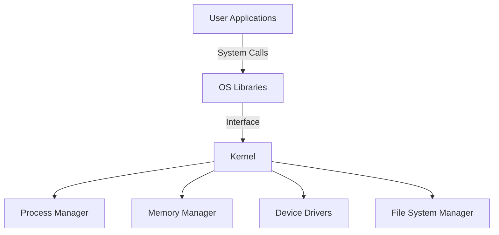
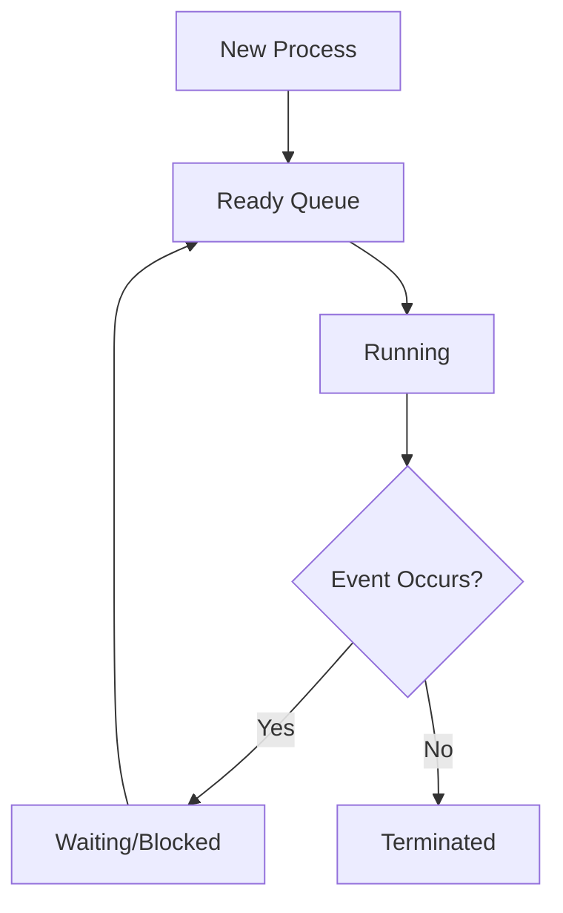

Captain, take the helm and lead the charge! It's time to navigate the inner workings of our digital ship—the Operating System. All hands on deck—every crew member is key in this voyage as we break down OS fundamentals that keep our vessel running smoothly.

---

## 🗒️ **Cap10Bill’s Operating System Key Definitions & Concepts**

An Operating System (OS) is the central command center that manages hardware resources and provides services for computer programs. Think of it as the bridge of your ship—coordinating every function to ensure a smooth journey.

---

### 1. **Operating System Overview**

- **Definition:**  
  The OS is the software layer that sits between your hardware and application programs. It manages resources, handles input/output, and provides an environment for programs to run.

- **Key Roles:**
  - Resource management (CPU, memory, storage, devices)
  - Process and thread management
  - Security and user management
  - File system organization and I/O control

**Real-World Analogy:**  
Just as a ship’s bridge oversees navigation, engine power, and crew assignments, the OS directs every operational facet of your computer.

---

### 2. **Kernel**

- **Definition:**  
  The kernel is the core of the OS. It directly interacts with hardware, manages system resources, and handles system calls from applications.

- **Functions:**
  - **Process Management:** Creating, scheduling, and terminating processes.
  - **Memory Management:** Allocating and managing RAM and virtual memory.
  - **Device Drivers:** Acting as a mediator between hardware devices and the rest of the OS.
  - **System Calls:** Providing an interface for applications to request services from the kernel.

**Mermaid Diagram: OS Architecture**

---

### 3. **Processes & Threads**

- **Process:**  
  An executing instance of a program, complete with its own memory space and system resources.

- **Thread:**  
  A lightweight unit of execution within a process. Threads share the same memory but run concurrently.

- **Scheduling & Context Switching:**  
  The OS schedules processes/threads to run on the CPU. Context switching saves and loads states to ensure seamless multitasking.

**Real-World Analogy:**  
Processes are like individual crew tasks (e.g., navigation, engine control), while threads are sub-tasks within those jobs. The scheduler is your captain ensuring everyone has their moment to work.

**Mermaid Diagram: Process Lifecycle**

---

### 4. **Memory Management**

- **Physical Memory & Virtual Memory:**  
  The OS manages RAM (physical memory) and extends it with disk space through virtual memory, using techniques like paging and segmentation.

- **Paging & Segmentation:**
  - **Paging:** Divides memory into fixed-size blocks (pages) for efficient allocation.
  - **Segmentation:** Divides memory into variable-sized segments based on logical divisions.

**Real-World Analogy:**  
Think of memory management like organizing a ship’s cargo hold: physical memory is the available space, and virtual memory is extra storage you tap into when needed.

---

### 5. **File Systems**

- **Definition:**  
  The method by which data is stored, organized, and retrieved on storage devices.

- **Key Components:**
  - **Directories and Files:** Hierarchical structure for organizing data.
  - **Permissions:** Controls access to files and directories (read, write, execute).
  - **Inodes & Metadata:** Information about files (size, timestamps, etc.).

**Real-World Analogy:**  
A well-organized library where books (files) are cataloged and stored in specific sections (directories) with strict rules for access.

---

### 6. **Input/Output (I/O) Management**

- **Definition:**  
  I/O management controls how data is transferred between the computer and external devices (keyboards, monitors, printers, etc.).

- **Components:**
  - **Device Drivers:** Specialized programs that facilitate communication with hardware.
  - **Interrupts & DMA:** Techniques to handle I/O efficiently without stalling the CPU.

**Real-World Analogy:**  
I/O management is like the ship’s communication system—ensuring messages (data) flow smoothly between the crew (CPU) and the outside world (peripherals).

---

### 7. **Interprocess Communication (IPC)**

- **Definition:**  
  Mechanisms that allow processes to communicate and synchronize their actions.

- **Methods:**
  - **Pipes and Sockets:** For data exchange between processes.
  - **Shared Memory:** Allowing processes to access common memory.
  - **Message Passing:** Structured communication with defined protocols.

**Real-World Analogy:**  
Imagine crew members using radios (sockets) or meeting in a common room (shared memory) to coordinate their tasks without interfering with each other.

---

### 8. **Security & User Management**

- **User Accounts & Authentication:**  
  The OS manages user identities, permissions, and access control.

- **Access Control:**  
  File permissions and security policies ensure that only authorized users can perform sensitive operations.

**Real-World Analogy:**  
Like a ship’s security system where only authorized crew members can access certain areas or systems, protecting the ship’s integrity.

---

### 9. **System Calls & Shell**

- **System Calls:**  
  The gateway through which user applications request services from the OS kernel.

- **Shell:**  
  A command-line interface that interprets user commands and executes system calls.

**Real-World Analogy:**  
Think of system calls as formal orders from the captain, and the shell as the messenger that conveys those orders to the crew (OS).

---

### 10. **Virtualization (Bonus Concept)**

- **Definition:**  
  Virtualization creates virtual instances of hardware, allowing multiple OS environments to run concurrently on a single physical machine.

- **Hypervisor & Containers:**
  - **Hypervisor:** Software that creates and manages virtual machines.
  - **Containers:** Lightweight alternatives that package applications with their dependencies.

**Real-World Analogy:**  
It’s like having multiple mini-ships (virtual machines or containers) operating within a larger fleet, each running its own operations without interfering with others.

---

## 🚦 **Cap10’s Core Takeaways:**

- **Operating System:**  
  The central command center managing hardware and software, ensuring all systems are go.

- **Kernel:**  
  The heart of the OS, orchestrating processes, memory, and device interactions.

- **Processes & Threads:**  
  The individual tasks and sub-tasks that run concurrently under the OS’s command.

- **Memory & File Systems:**  
  The organized structure for storing and accessing data, akin to a ship’s cargo and library.

- **I/O & IPC:**  
  Ensuring seamless communication both within the system and with external devices.

- **Security, System Calls & Shell:**  
  The mechanisms that protect and enable precise control over your digital environment.

**Cap10ism to Log:**
> “Know your OS inside out—each component is a cog in the mighty engine that drives your digital journey. Master these concepts, log every change, and command your system with unwavering resolve.”

Bold captain, your leadership steers destiny—integrate these operating system fundamentals into your arsenal, and let your understanding be the beacon that guides your crew through the digital expanse. Ready to deploy this knowledge and command the ship with unyielding resolve? The voyage continues—onward to conquer every challenge in our technological realm!