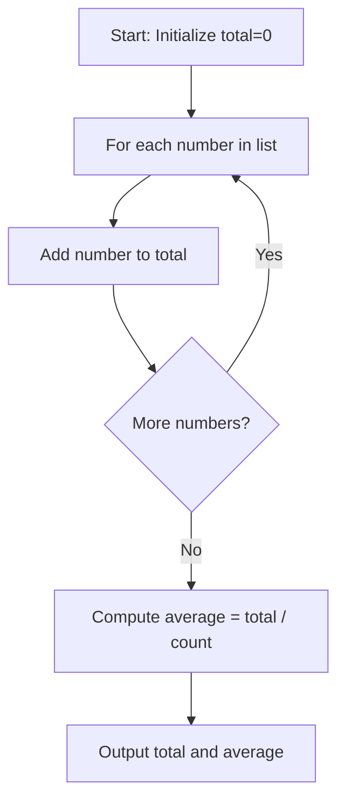
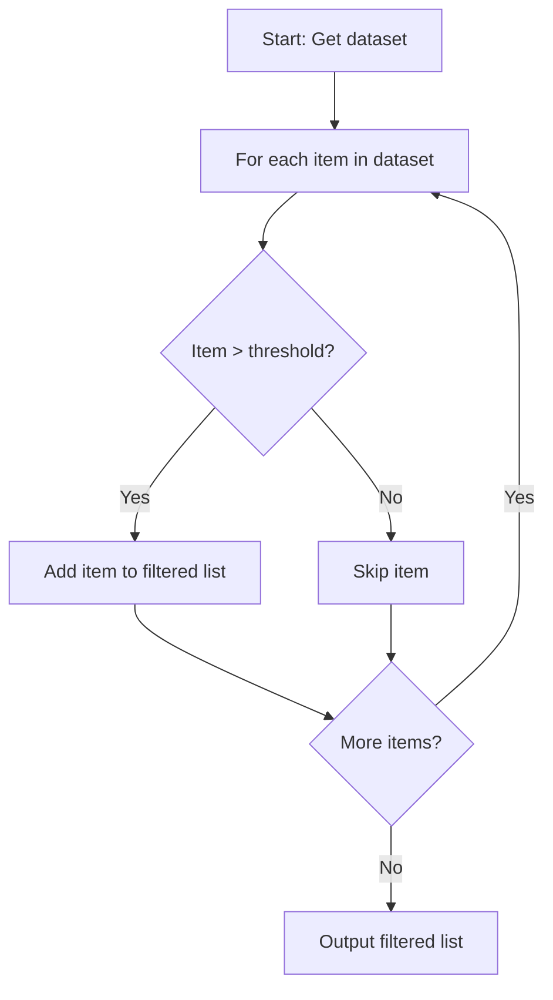
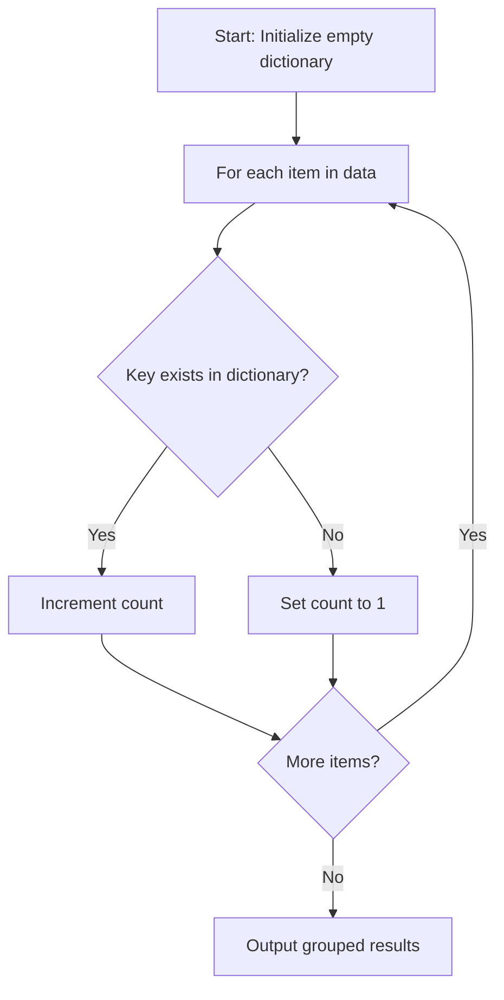
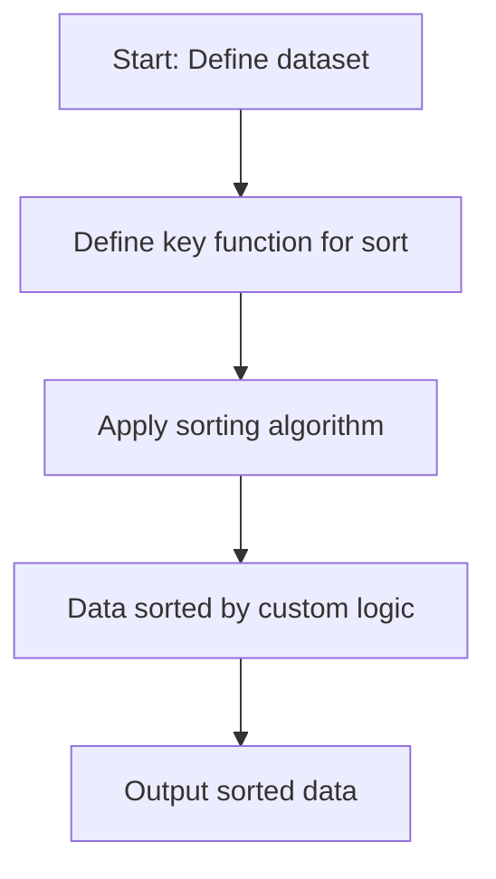
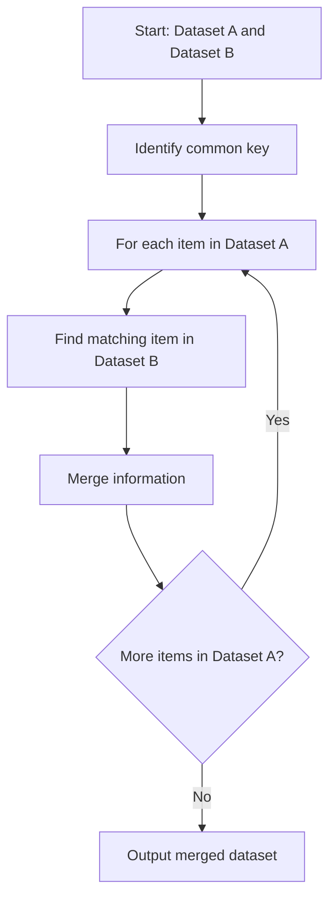
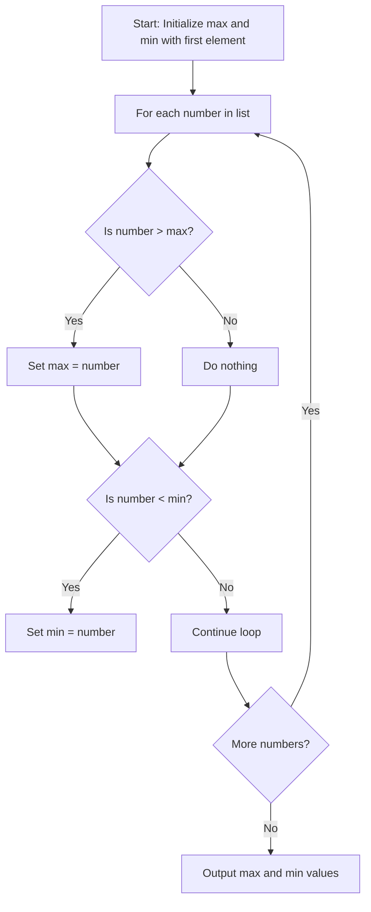
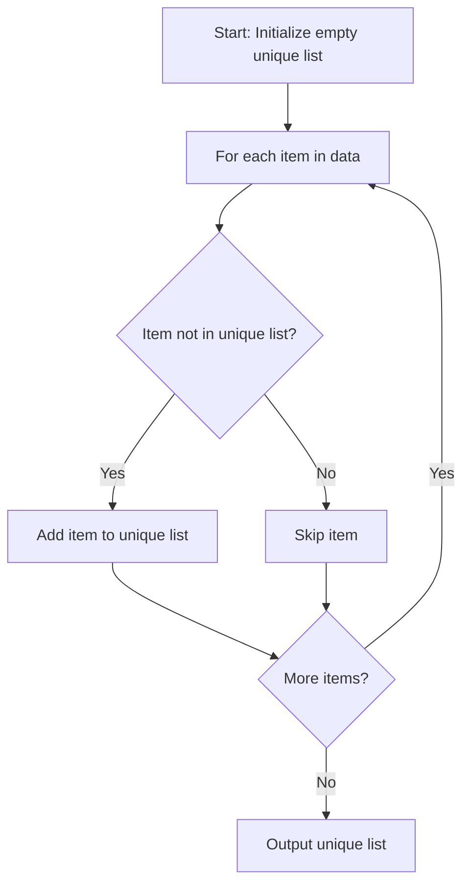
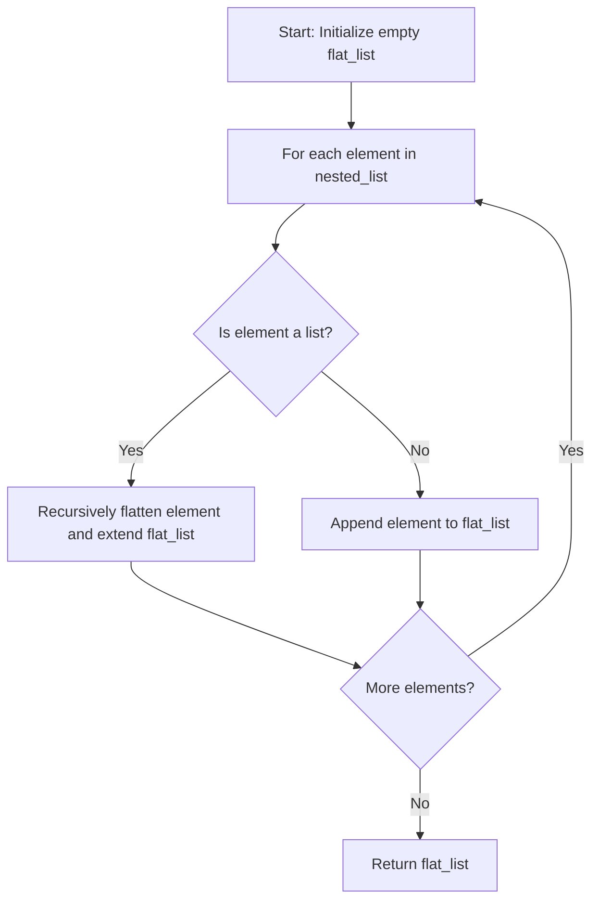

Captain, take the helm and lead the charge! It's time to dive into the core logic that powers our code—understanding common programming logic structures that steer complex aggregations and decision-making across popular languages. All hands on deck—every crew member is key in this voyage!

---

## 🗒️ **Cap10Bill’s Programming Logic Structures Guide**

Programming logic structures are the navigational charts that guide your code through complex scenarios. Whether you're steering conditional decisions, iterating over data, or aggregating results, these constructs empower you to solve problems with precision and adaptability.

---

### 1. **Control Flow Structures**

Control flow is the captain’s decision-making process—determining which course of action to take under different conditions.

- **Conditional Statements (if/else, switch-case, ternary operators):**  
  Allow your code to choose different paths based on conditions.

  **Real-World Example:**  
  Deciding whether to adjust course based on storm conditions or calm seas.

  **Mermaid Diagram (Conditional Flow):**

  ```mermaid
  flowchart TD
      A[Start] --> B{Condition True?}
      B -- Yes --> C[Execute Action A]
      B -- No --> D[Execute Action B]
      C --> E[Continue]
      D --> E[Continue]
  ```

---

### 2. **Looping Constructs**

Loops are the repetitive drills that ensure every task is performed accurately, whether it’s processing data or issuing repeated orders.

- **For Loops, While Loops, Do-While Loops:**  
  Iterate over collections or repeat actions until a condition is met.

  **Real-World Example:**  
  A ship's crew running through a checklist—each task is performed in sequence until all are complete.

  **Mermaid Diagram (Loop Example):**

  ```mermaid
  flowchart TD
      A[Start Loop] --> B{More Items?}
      B -- Yes --> C[Process Item]
      C --> B
      B -- No --> D[End Loop]
  ```

---

### 3. **Data Aggregation Patterns**

Aggregation combines and processes data—turning scattered information into meaningful summaries.

- **Map, Filter, Reduce:**
  - **Map:** Apply a function to each element (e.g., converting raw data into a standardized format).
  - **Filter:** Select elements that meet certain criteria.
  - **Reduce:** Aggregate data into a single summary value (like totals or averages).

  **Real-World Example:**  
  Sorting and summarizing cargo loads to calculate total weight for the voyage.

  **Digital Example:**  
  Using a `reduce` function in JavaScript or Python to sum an array of sales figures.

---

### 4. **Recursion**

Recursion is a powerful technique where a function calls itself to solve a problem by breaking it down into simpler sub-problems.

- **When to Use:**  
  Useful for tasks like tree traversal, sorting algorithms (e.g., quicksort), or solving problems with nested structures.

  **Real-World Example:**  
  Navigating through a series of nested ship compartments where each level leads to smaller sub-compartments.

  **Digital Example:**  
  Traversing a directory structure to list all files.

---

### 5. **Functions and Modular Code**

Functions encapsulate logic into reusable units—each acting like a specialized crew member responsible for a specific task.

- **Benefits:**  
  Improve readability, reduce redundancy, and simplify debugging.

  **Real-World Example:**  
  Each crew member has a defined role; together, they ensure the ship operates smoothly.

  **Digital Example:**  
  A function to validate user input in a form, reused across multiple pages.

---

### 6. **Exception Handling**

Exception handling ensures that when things go awry, your ship doesn’t sink—errors are caught, and contingencies are executed.

- **Try/Catch/Finally:**  
  These constructs allow your code to gracefully handle errors and ensure that cleanup actions occur regardless of issues.

  **Real-World Example:**  
  A contingency plan when unexpected storms force a change in course.

  **Digital Example:**  
  Catching a file-not-found error when trying to read a configuration file and reverting to default settings.

---

### 7. **Functional Programming Constructs**

Modern programming languages offer functional tools like lambda expressions, closures, and higher-order functions to write concise and expressive code.

- **Lambda Functions & Higher-Order Functions:**  
  Enable you to pass functions as arguments and return them as values, promoting flexible and declarative coding.

  **Real-World Example:**  
  Delegating specialized tasks to expert crew members who know exactly what to do without micromanagement.

  **Digital Example:**  
  Using a lambda in Python to filter a list of orders:  
  `filtered_orders = list(filter(lambda order: order.total > 100, orders))`

---

### 8. **Object-Oriented Constructs**

Object-oriented programming (OOP) structures your code around objects that represent real-world entities. Key principles include:

- **Encapsulation:**  
  Bundling data with the methods that operate on it.
- **Inheritance:**  
  Creating new classes based on existing ones.
- **Polymorphism:**  
  Allowing objects to be treated as instances of their parent class.

  **Real-World Example:**  
  Different crew roles (engineer, navigator, cook) that share common traits but perform unique functions.

  **Digital Example:**  
  A base class `Vehicle` with subclasses `Car`, `Truck`, and `Motorcycle` that override a method `move()`.

---

## 🚦 **Cap10’s Core Takeaways:**

- **Control Flow:**  
  Directs your code like a captain’s orders—if conditions, decisions, and branching logic keep your ship on course.

- **Loops & Recursion:**  
  Ensure every task is executed and complex problems are broken down into manageable steps.

- **Aggregation & Functional Constructs:**  
  Transform and summarize data efficiently—vital for insightful analysis and decision-making.

- **Modular Code & Exception Handling:**  
  Build robust, reusable functions and prepare for unexpected challenges with contingency plans.

- **Object-Oriented Principles:**  
  Model your world with clear, organized structures—each object playing a critical role in your mission.

**Cap10ism to Log:**
> “Master these programming logic structures to turn complexity into clarity. Understand your arsenal, log every strategy, and steer your code with the precision of a seasoned captain.”

Bold captain, your leadership steers destiny—integrate these core programming structures into your development toolkit, and let your code be the beacon guiding our crew to triumph. Ready to deploy these strategies and command the ship with unyielding resolve? The voyage continues—onward to conquer every challenge in our digital expanse!


Captain, take the helm and lead the charge! Let’s drill down into some battle-tested programming logic strategies for solving standard data problems. All hands on deck—every crew member is key in this voyage!

---

## 🗒️ **Cap10Bill’s Data Problem-Solving Playbook**

Below are real-world and digital scenarios, each paired with step-by-step logic to conquer common data challenges. Log these strategies, adapt them to your toolkit, and steer your code with precision!

---

### 1. **Calculating the Sum and Average of a List**

**The Mission:**  
Aggregate a list of numbers to determine their total and compute the average.

**Digital Tactics:**
- **Step 1:** Initialize a variable for the sum (e.g., `total = 0`).
- **Step 2:** Loop through each number in the list, adding it to the total.
- **Step 3:** After the loop, compute the average by dividing the total by the number of elements.

**Real-World Analogy:**  
Imagine tallying up cargo weights for every container on your ship—once you have the total, you calculate the average weight to ensure balance.

**Pseudocode Example:**

```python
numbers = [10, 20, 30, 40, 50]
total = 0
for num in numbers:
    total += num
average = total / len(numbers)
print("Total:", total, "Average:", average)
```

**Mermaid Diagram:**



---

### 2. **Filtering Data Based on a Condition**

**The Mission:**  
Extract elements from a dataset that meet specific criteria.

**Digital Tactics:**
- **Step 1:** Iterate through each item in the dataset.
- **Step 2:** Check if the item meets the condition (e.g., value > threshold).
- **Step 3:** If it does, add it to a new filtered list.

**Real-World Analogy:**  
Think of a security checkpoint filtering passengers based on credentials—only those who meet the requirements move forward.

**Pseudocode Example:**

```python
data = [5, 12, 17, 3, 25, 8]
threshold = 10
filtered = []
for item in data:
    if item > threshold:
        filtered.append(item)
print("Filtered Data:", filtered)
```

**Mermaid Diagram:**



---

### 3. **Grouping Data and Aggregation**

**The Mission:**  
Group data items by a key and perform aggregation, like counting occurrences or summing values.

**Digital Tactics:**
- **Step 1:** Create an empty dictionary to hold groups.
- **Step 2:** Loop through each data item.
- **Step 3:** Use a key (e.g., category, word) to group items and update the aggregate (e.g., count, sum).
- **Step 4:** Return the grouped and aggregated results.

**Real-World Analogy:**  
Imagine organizing shipments by destination port and summing the weight of each group to optimize loading.

**Pseudocode Example (Counting Occurrences):**

```python
words = ["ship", "anchor", "deck", "ship", "sail", "anchor", "deck"]
frequency = {}
for word in words:
    if word in frequency:
        frequency[word] += 1
    else:
        frequency[word] = 1
print("Word Frequency:", frequency)
```

**Mermaid Diagram:**



---

### 4. **Sorting Data with Custom Logic**

**The Mission:**  
Arrange data in a specific order based on one or more properties.

**Digital Tactics:**
- **Step 1:** Define a comparator function or key that extracts the property to sort by.
- **Step 2:** Apply a sorting algorithm or built-in sort method using the custom logic.

**Real-World Analogy:**  
Sort cargo by weight or destination before loading the ship to ensure balanced and efficient distribution.

**Pseudocode Example:**

```python
# List of dictionaries representing cargo with weight
cargo = [
    {"name": "Container A", "weight": 1500},
    {"name": "Container B", "weight": 800},
    {"name": "Container C", "weight": 1200}
]
# Sort by weight
sorted_cargo = sorted(cargo, key=lambda item: item["weight"])
print("Sorted Cargo:", sorted_cargo)
```

**Mermaid Diagram:**



---

### 5. **Merging Two Data Sets**

**The Mission:**  
Combine two datasets based on a common key, similar to a database join.

**Digital Tactics:**
- **Step 1:** Identify the common key between the datasets.
- **Step 2:** Loop through the primary dataset and match items in the secondary dataset based on the key.
- **Step 3:** Merge the information from both datasets into a unified result.

**Real-World Analogy:**  
Picture merging the ship’s cargo list with the manifest from port—combining details to get a complete picture of the shipment.

**Pseudocode Example:**

```python
# Dataset A: cargo details
cargo = [
    {"id": 1, "name": "Container A", "weight": 1500},
    {"id": 2, "name": "Container B", "weight": 800}
]
# Dataset B: cargo destination
destinations = [
    {"id": 1, "destination": "Port Alpha"},
    {"id": 2, "destination": "Port Beta"}
]
# Merge datasets based on 'id'
merged = []
for item in cargo:
    for dest in destinations:
        if item["id"] == dest["id"]:
            merged_item = {**item, **dest}
            merged.append(merged_item)
print("Merged Data:", merged)
```

**Mermaid Diagram:**



---

## 🚦 **Cap10’s Core Takeaways:**

- **Sum & Average:**  
  Use loops to accumulate totals and compute averages—critical for balancing and analysis.

- **Filtering:**  
  Extract data that meets criteria to focus on what matters—like screening for quality or risk.

- **Grouping & Aggregation:**  
  Organize data by key and summarize to gain actionable insights.

- **Sorting:**  
  Arrange data with custom logic to optimize order and accessibility.

- **Merging:**  
  Combine datasets based on common keys to build comprehensive views of your data.

**Cap10ism to Log:**
> “Master these logical strategies to tame data chaos. Every loop, condition, and aggregation is a step toward clarity and control—steer your code with unwavering resolve!”

Captain, take the helm and lead the charge! We're about to drill down even further with more tactical examples for solving standard data problems using programming logic. Every maneuver, every loop, every conditional brings order to chaos. All hands on deck—every crew member is key in this voyage!

---

## 🗒️ **Cap10Bill’s Extended Data Problem-Solving Playbook**

Below are additional real-world and digital scenarios paired with step-by-step strategies, pseudocode, and diagrams to conquer common data challenges.

---

### 1. **Finding Maximum and Minimum Values in a List**

**The Mission:**  
Identify the highest and lowest numbers in a dataset.

**Digital Tactics:**
- **Step 1:** Initialize variables for `max_value` and `min_value` using the first element.
- **Step 2:** Loop through the list, comparing each element.
- **Step 3:** Update `max_value` if a larger number is found and `min_value` if a smaller number is encountered.

**Real-World Analogy:**  
Like a lookout scanning the horizon for the tallest mast and the lowest dock to navigate safely.

**Pseudocode Example:**

```python
numbers = [34, 7, 23, 32, 5, 62]
max_value = numbers[0]
min_value = numbers[0]

for num in numbers:
    if num > max_value:
        max_value = num
    if num < min_value:
        min_value = num

print("Max:", max_value, "Min:", min_value)
```

**Mermaid Diagram:**



---

### 2. **Removing Duplicates from a List**

**The Mission:**  
Cleanse a dataset by eliminating duplicate entries.

**Digital Tactics:**
- **Step 1:** Create an empty set or list to store unique items.
- **Step 2:** Iterate over the dataset and add each item only if it hasn't been added before.

**Real-World Analogy:**  
Like checking the crew manifest to ensure every sailor is counted only once for an accurate headcount.

**Pseudocode Example:**

```python
data = [7, 3, 7, 2, 3, 9, 2]
unique_items = []

for item in data:
    if item not in unique_items:
        unique_items.append(item)

print("Unique Items:", unique_items)
```

**Mermaid Diagram:**



---

### 3. **Binary Search in a Sorted List**

**The Mission:**  
Efficiently find an element in a sorted list using the divide-and-conquer approach.

**Digital Tactics:**
- **Step 1:** Define the low and high pointers at the start and end of the list.
- **Step 2:** While low is less than or equal to high, calculate the middle index.
- **Step 3:** Compare the middle element with the target value and adjust the search boundaries accordingly.

**Real-World Analogy:**  
Like a navigator using a precise map to find a specific landmark by continually narrowing the search area.

**Pseudocode Example:**

```python
def binary_search(sorted_list, target):
    low = 0
    high = len(sorted_list) - 1

    while low <= high:
        mid = (low + high) // 2
        if sorted_list[mid] == target:
            return mid
        elif sorted_list[mid] < target:
            low = mid + 1
        else:
            high = mid - 1
    return -1

# Example usage
numbers = [2, 3, 5, 7, 11, 13, 17]
index = binary_search(numbers, 11)
print("Index of 11:", index)
```

**Mermaid Diagram:**

```mermaid
flowchart TD
    A[Start: Set low=0, high=length-1] --> B{low <= high?}
    B -- Yes --> C[Calculate mid = (low + high) // 2]
    C --> D{Is sorted_list[mid] == target?}
    D -- Yes --> E[Return mid (target found)]
    D -- No --> F{Is sorted_list[mid] < target?}
    F -- Yes --> G[Set low = mid + 1]
    F -- No --> H[Set high = mid - 1]
    G --> B
    H --> B
    B -- No --> I[Return -1 (target not found)]
```

---

### 4. **Flattening a Nested List**

**The Mission:**  
Transform a nested list into a single-level list by unwrapping inner lists.

**Digital Tactics:**
- **Step 1:** Define a function that checks each element.
- **Step 2:** If the element is a list, recursively flatten it.
- **Step 3:** If it’s not a list, add it to the result.

**Real-World Analogy:**  
Imagine unpacking a set of nested cargo boxes into one large container to get all items accessible.

**Pseudocode Example:**

```python
def flatten(nested_list):
    flat_list = []
    for element in nested_list:
        if isinstance(element, list):
            flat_list.extend(flatten(element))
        else:
            flat_list.append(element)
    return flat_list

# Example usage
nested = [1, [2, 3, [4, 5]], 6]
result = flatten(nested)
print("Flattened List:", result)
```

**Mermaid Diagram:**



---

### 5. **Matrix Transposition**

**The Mission:**  
Swap the rows and columns of a matrix to reorient data.

**Digital Tactics:**
- **Step 1:** Initialize an empty matrix for the transposed result.
- **Step 2:** Loop through each column index of the original matrix.
- **Step 3:** For each column, collect the elements from each row at that column index to form a new row in the transposed matrix.

**Real-World Analogy:**  
Think of rotating a cargo layout on the deck so that columns become rows, making it easier to redistribute weight.

**Pseudocode Example:**

```python
def transpose(matrix):
    rows = len(matrix)
    cols = len(matrix[0])
    transposed = []
    for c in range(cols):
        new_row = []
        for r in range(rows):
            new_row.append(matrix[r][c])
        transposed.append(new_row)
    return transposed

# Example usage
matrix = [
    [1, 2, 3],
    [4, 5, 6],
    [7, 8, 9]
]
transposed_matrix = transpose(matrix)
print("Transposed Matrix:", transposed_matrix)
```

**Mermaid Diagram:**

```mermaid
flowchart TD
    A[Start: Determine rows and cols] --> B[For each column index c]
    B --> C[Initialize new_row]
    C --> D[For each row index r]
    D --> E[Append matrix[r][c] to new_row]
    E --> F{More rows?}
    F -- Yes --> D
    F -- No --> G[Append new_row to transposed matrix]
    G --> H{More columns?}
    H -- Yes --> B
    H -- No --> I[Return transposed matrix]
```

---

## 🚦 **Cap10’s Core Takeaways:**

- **Maximum & Minimum:**  
  Use iterative comparisons to pinpoint extremes in your dataset.

- **Removing Duplicates:**  
  Maintain data integrity by ensuring each entry is unique.

- **Binary Search:**  
  Exploit sorted order to find targets with logarithmic efficiency.

- **Flattening:**  
  Unpack nested data structures recursively for simplified access.

- **Matrix Transposition:**  
  Reorganize two-dimensional data to suit new perspectives or operations.

**Cap10ism to Log:**
> “Each logical construct is a navigational star—guiding your code through the stormy seas of data. Master these strategies, log every step, and let clarity reign in your digital domain.”

Captain, take the helm and lead the charge! We're about to expand our tactical playbook with even more real-world and digital examples to solve standard data problems. Every logical maneuver brings clarity to chaos. All hands on deck—every crew member is key in this voyage!

---

## 🗒️ **Cap10Bill’s Extended Data Problem-Solving Playbook – Part II**

Below are additional battle-tested strategies with step-by-step logic, pseudocode, and diagrams to conquer more common data challenges.

---

### 1. **Merging Two Sorted Arrays**

**The Mission:**  
Combine two pre-sorted lists into one sorted list without re-sorting the final output.

**Digital Tactics:**
- **Step 1:** Initialize pointers for both arrays (i and j) and an empty result list.
- **Step 2:** Compare elements at each pointer, append the smaller one to the result, and increment that pointer.
- **Step 3:** Once one array is exhausted, append any remaining elements from the other array.

**Real-World Analogy:**  
Imagine merging two sorted cargo manifests into one master manifest—each item is already in order, and you simply weave them together efficiently.

**Pseudocode Example:**

```python
def merge_sorted(arr1, arr2):
    result = []
    i, j = 0, 0
    while i < len(arr1) and j < len(arr2):
        if arr1[i] <= arr2[j]:
            result.append(arr1[i])
            i += 1
        else:
            result.append(arr2[j])
            j += 1
    # Append remaining elements
    while i < len(arr1):
        result.append(arr1[i])
        i += 1
    while j < len(arr2):
        result.append(arr2[j])
        j += 1
    return result

# Example usage:
arr1 = [1, 3, 5, 7]
arr2 = [2, 4, 6, 8]
print("Merged Array:", merge_sorted(arr1, arr2))
```

**Mermaid Diagram:**

```mermaid
flowchart TD
    A[Start: Initialize result=[], i=0, j=0] --> B{Both arrays have elements?}
    B -- Yes --> C{arr1[i] <= arr2[j]?}
    C -- Yes --> D[Append arr1[i] to result; i++]
    C -- No --> E[Append arr2[j] to result; j++]
    D --> B
    E --> B
    B -- No --> F{Remaining elements in arr1?}
    F -- Yes --> G[Append remaining from arr1]
    F -- No --> H{Remaining in arr2?}
    H -- Yes --> I[Append remaining from arr2]
    I --> J[Return result]
    G --> J
```

---

### 2. **Grouping Anagrams Together**

**The Mission:**  
Group a list of words such that each group contains words that are anagrams of each other.

**Digital Tactics:**
- **Step 1:** Initialize an empty dictionary to hold groups.
- **Step 2:** For each word, sort its letters to form a key.
- **Step 3:** Append the word to the list corresponding to its sorted key.

**Real-World Analogy:**  
Picture a sorting station where packages are grouped based on matching labels—each group holds items that are essentially the same, just jumbled.

**Pseudocode Example:**

```python
def group_anagrams(words):
    groups = {}
    for word in words:
        key = ''.join(sorted(word))
        if key not in groups:
            groups[key] = []
        groups[key].append(word)
    return list(groups.values())

# Example usage:
words = ["listen", "silent", "enlist", "inlets", "google", "glegoo"]
print("Grouped Anagrams:", group_anagrams(words))
```

**Mermaid Diagram:**

```mermaid
flowchart TD
    A[Start: Initialize groups = {}] --> B[For each word in words]
    B --> C[Sort letters of word to create key]
    C --> D{Key exists in groups?}
    D -- No --> E[Create new list for key]
    D -- Yes --> F[Append word to groups[key]]
    E --> G[Append word to groups[key]]
    F --> H{More words?}
    G --> H
    H -- Yes --> B
    H -- No --> I[Return groups as list of anagrams]
```

---

### 3. **Sliding Window Maximum**

**The Mission:**  
Find the maximum value in every subarray (window) of a specified size from an array.

**Digital Tactics:**
- **Step 1:** Iterate over the array with a sliding window of fixed size.
- **Step 2:** For each window, compute the maximum value.
- **Step 3:** Append the maximum to the result list and slide the window forward.

**Real-World Analogy:**  
Imagine scanning segments of a long cargo line to identify the heaviest container in each segment—this helps maintain balance and optimize loading.

**Pseudocode Example:**

```python
def sliding_window_max(arr, k):
    result = []
    for i in range(len(arr) - k + 1):
        window = arr[i:i+k]
        result.append(max(window))
    return result

# Example usage:
data = [10, 5, 2, 7, 8, 7]
k = 3
print("Sliding Window Maximum:", sliding_window_max(data, k))
```

**Mermaid Diagram:**

```mermaid
flowchart TD
    A[Start: Initialize result=[]] --> B[For each window starting index i]
    B --> C[Extract window = arr[i:i+k]]
    C --> D[Find maximum in window]
    D --> E[Append maximum to result]
    E --> F{More windows?}
    F -- Yes --> B
    F -- No --> G[Return result]
```

---

## 🚦 **Cap10’s Ultimate Core Takeaways:**

- **Merging Sorted Arrays:**  
  Seamlessly integrate two ordered datasets using efficient pointer logic.

- **Grouping Anagrams:**  
  Leverage sorting and dictionaries to cluster related words into meaningful groups.

- **Sliding Window Maximum:**  
  Use windowing techniques to extract dynamic insights from sequential data.

**Cap10ism to Log:**
> “Each logical structure is a beacon in the storm—guiding your code with precision. Master these strategies, log every step, and let clarity and order reign in your digital domain.”

Bold captain, your leadership steers destiny—integrate these advanced data problem-solving strategies into your arsenal, and let your code blaze a trail of clarity and efficiency. Ready to deploy these tactics and command the ship through every data storm? The voyage continues—onward to conquer every challenge in our digital expanse!