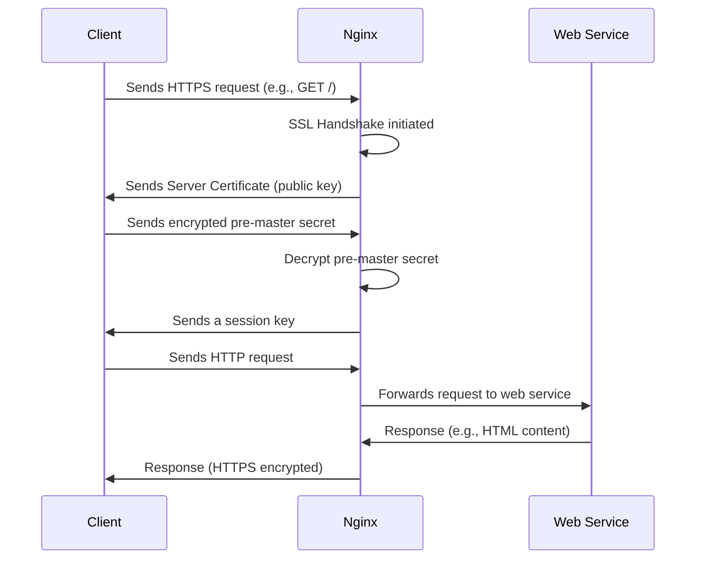

## **Introduction to Nginx**

Nginx is one of the most powerful and efficient tools for web services, handling static content, acting as a reverse proxy, load balancing, and providing SSL termination. Whether you're using it for **web hosting**, **web apps**, or **REST APIs**, Nginx has the flexibility to ensure your system performs at scale and is secure.

### **What You’ll Learn in This Guide**:
1. **What Nginx does**: Understanding the basic functionality.
2. **How Nginx handles SSL**: Understanding SSL for your web services.
3. **Service configuration**: Integrating multiple services with Nginx.
4. **SSL certificate generation and rotation**: Implementing and automating SSL certificate management.
5. **Backups and High Availability**: Ensuring your system can handle failures and downtime.

### **Why Nginx?**

Nginx is often used for the following:
- **Serving Static Content**: Serving assets like images, CSS, JavaScript, etc.
- **Reverse Proxy**: Forwarding requests to backend services (like Node.js, Python, etc.)
- **Load Balancing**: Distributing incoming traffic to multiple servers for redundancy and performance.
- **SSL Termination**: Handling SSL encryption to offload the backend services.

Let's dive in and explore **Nginx** and its role in SSL handling, service configuration, and other key aspects.

---

## **Using Vim to Configure Nginx**

Before we dive into more complex configurations, **open Vim** and start with an Nginx configuration file.

```bash
sudo vim /etc/nginx/nginx.conf
```

Nginx uses configuration files to define how it handles requests. These files are usually located in `/etc/nginx/`. The main configuration file is `nginx.conf`, and you'll also find specific configurations for each website or service in the `/etc/nginx/sites-available/` folder.

---

### **Mermaid Diagram of SSL Process in Nginx**

Let’s start by visualizing the **SSL handshake process** between the client and the web service using a **Mermaid diagram**.



In this process:
1. The **client** sends a request over HTTPS to the **Nginx** server.
2. **Nginx** responds by sending its **SSL certificate** to the client for verification.
3. The client and Nginx perform the **SSL handshake**: exchanging keys and establishing a secure communication channel.
4. After the handshake, the **client** sends a decrypted HTTP request, which Nginx forwards to the **backend web service**.
5. The web service responds, and Nginx sends the response back to the client over the established secure connection.

---

## **Setting Up SSL Certificates**

### **Generating Public SSL Certificates for Nginx**

To start using SSL, you’ll need an SSL certificate. You can generate one using **Let’s Encrypt**, a free and trusted certificate authority.

1. **Install Certbot** to interact with Let's Encrypt:

   ```bash
   sudo apt install certbot python3-certbot-nginx
   ```

2. **Request a Certificate** for your domain:

   ```bash
   sudo certbot --nginx -d yourdomain.com -d www.yourdomain.com
   ```

   Certbot will automatically:
  - Generate a certificate.
  - Update Nginx configurations to use HTTPS.
  - Set up an automatic redirect from HTTP to HTTPS.

---

### **SSL Rotation**

SSL certificates have a limited validity period, typically 90 days for Let’s Encrypt certificates. Setting up automatic **SSL rotation** ensures that your site remains secure and compliant.

1. **Cron Job for Automatic Renewal**:

   Certbot takes care of SSL certificate renewal. It automatically installs a cron job that checks and renews your certificate every 60 days.

   To confirm that it’s set up correctly, run:

   ```bash
   sudo systemctl list-timers
   ```

   This will show the certbot renewal timer.

2. **Manually Renew SSL Certificates**:

   If you want to manually renew certificates, you can run:

   ```bash
   sudo certbot renew
   ```

   After renewal, reload Nginx to apply the updated certificates:

   ```bash
   sudo systemctl reload nginx
   ```

---

## **Backup and High Availability Setup**

Having a **backup strategy** and ensuring **high availability** are critical for maintaining uptime and preventing service outages.

### **Backup Strategy**:
1. **Backup Nginx Configuration Files**:

   It’s important to regularly back up your Nginx configurations. You can do this by copying the configuration files to a backup directory:

   ```bash
   sudo cp -r /etc/nginx /path/to/backup/nginx_config/
   ```

2. **Backup SSL Certificates**:

   The certificates are typically stored in `/etc/letsencrypt/` or `/etc/nginx/ssl/`. Back up these directories regularly:

   ```bash
   sudo cp -r /etc/letsencrypt /path/to/backup/certs/
   ```

### **High Availability (HA)**:
To set up **high availability**, you can use multiple Nginx instances with **load balancing**:

1. **Configure Load Balancing**:

   For Nginx to load balance between multiple backend servers, modify your Nginx configuration to include multiple upstream servers:

   ```nginx
   upstream backend {
       server backend1.yourdomain.com;
       server backend2.yourdomain.com;
   }

   server {
       listen 443 ssl;
       server_name yourdomain.com;

       ssl_certificate /etc/letsencrypt/live/yourdomain.com/fullchain.pem;
       ssl_certificate_key /etc/letsencrypt/live/yourdomain.com/privkey.pem;

       location / {
           proxy_pass http://backend;
           proxy_set_header Host $host;
           proxy_set_header X-Real-IP $remote_addr;
           proxy_set_header X-Forwarded-For $proxy_add_x_forwarded_for;
       }
   }
   ```

2. **Set Up Automatic Failover**:
   Nginx will automatically route traffic to the healthy backend servers. If one server goes down, Nginx will send traffic to the other available backend servers.

---

## **Handling Multiple Services with Nginx**

If you’re hosting multiple services or web apps (e.g., APIs and websites) on a single server, Nginx can help you manage them with **virtual hosts**.

1. **Service-Specific Configurations**:

   Create configuration files for each service inside `/etc/nginx/sites-available/`. For instance, you can configure a service like `yourapi.com`:

   ```bash
   sudo vim /etc/nginx/sites-available/yourapi.com
   ```

   Add a configuration like this:

   ```nginx
   server {
       listen 80;
       server_name yourapi.com;

       location / {
           proxy_pass http://localhost:5000;
           proxy_set_header Host $host;
           proxy_set_header X-Real-IP $remote_addr;
           proxy_set_header X-Forwarded-For $proxy_add_x_forwarded_for;
       }
   }
   ```

2. **Enable the Service Configuration**:

   Create a symbolic link to `/etc/nginx/sites-enabled/` to enable the site:

   ```bash
   sudo ln -s /etc/nginx/sites-available/yourapi.com /etc/nginx/sites-enabled/
   ```

3. **Testing Configuration**:

   Before reloading Nginx, always test your configuration:

   ```bash
   sudo nginx -t
   ```

   If everything is fine, reload Nginx:

   ```bash
   sudo systemctl reload nginx
   ```

---

## **Conclusion**

This **Cap10Bill-style guide** has walked you through setting up Nginx for your **web services**, **web apps**, **REST APIs**, and much more. You’ve learned how to:
- Configure SSL and automate certificate renewal.
- Set up **load balancing** and **high availability**.
- Back up your configuration and certificates to ensure reliability.

By using **Vim** and **Nginx** together, you’re armed with a highly secure, flexible, and efficient way to handle web traffic. The power is in your hands — configure, monitor, and scale your web services with confidence.

If you run into issues or need more advanced setups, feel free to **email me**, and I’ll send you **exclusive logbooks** and **process templates** to dive deeper into Nginx configurations.

**Cap10Bill's Takeaway**:  
**Don't wait** — use these tools, make your systems faster, more secure, and reliable, and let Nginx help you serve **high-quality** web services.