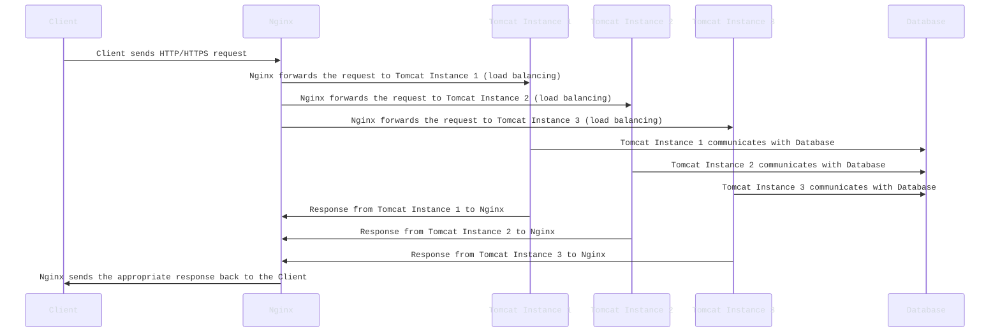
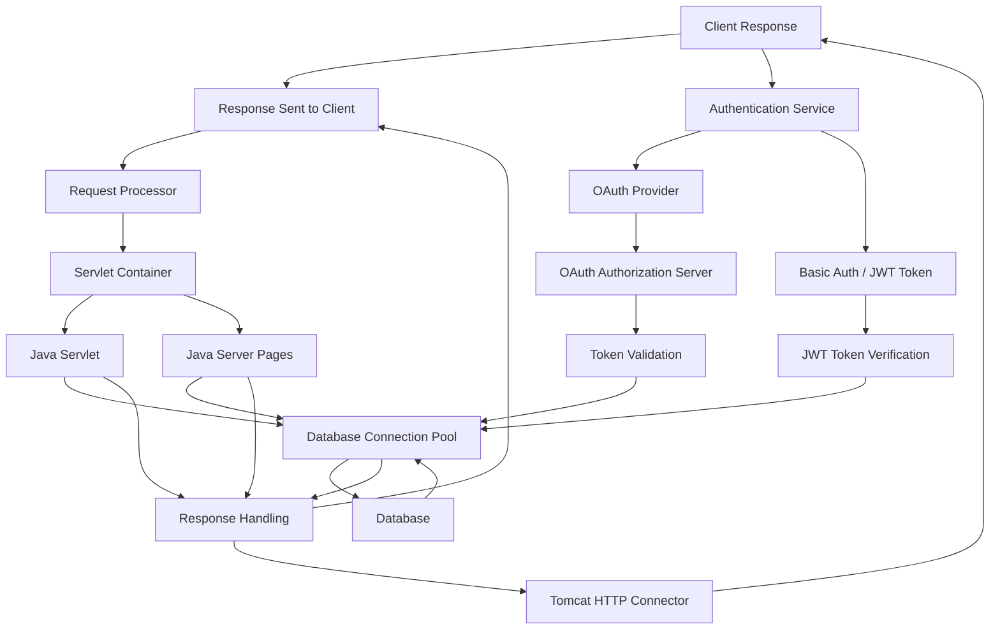

# **Cap10Bill’s Advanced Guide to Scaling Apache Tomcat with Nginx**

---

## **Introduction: Load Balancing Tomcat with Nginx**


In a high-traffic environment, **scaling** your **Tomcat** server is crucial to handle **large numbers of concurrent requests** efficiently. Using a **load balancer** like **Nginx** in front of multiple **Tomcat instances** allows you to distribute traffic, increase **fault tolerance**, and ensure your application stays **responsive**.


---

### **Understanding the Load Balancing Setup with Tomcat and Nginx**

#### **Mermaid Diagram: Detailed Load Balancing with Nginx and Tomcat**

Below is a **Mermaid diagram** that shows how **Nginx** sits in front of **multiple Tomcat instances** to handle incoming requests. Nginx acts as the **reverse proxy** and **load balancer** for distributing traffic.



#### **Explanation of the Diagram**

- **Client (C)**: The user or application that sends the request to the server.
- **Nginx (N)**: The **reverse proxy** and **load balancer** that receives all incoming requests. Nginx will handle the routing of requests to the available **Tomcat instances** (T1, T2, T3) in a **round-robin** fashion or based on specific load-balancing strategies (like least connections, IP hash, etc.).
- **Tomcat Instances (T1, T2, T3)**: These are **multiple instances of Apache Tomcat** running on different ports or even on different machines, allowing the web application to scale horizontally.
- **Database (DB)**: The backend database that all Tomcat instances might interact with. This could be a **single database** or a **clustered database** to provide redundancy and high availability.

### **Why Use Nginx as the Load Balancer?**

- **Performance**: Nginx is designed to handle a high volume of concurrent connections and distribute requests efficiently.
- **SSL Termination**: Nginx can handle SSL encryption, offloading the SSL handshake from Tomcat to reduce overhead.
- **Failover**: Nginx can reroute traffic to healthy Tomcat instances if one becomes unavailable, increasing **fault tolerance**.

### **How Load Balancing Works in Nginx**

- **Round Robin**: This is the default method where Nginx distributes requests evenly among the Tomcat instances.
- **Least Connections**: Nginx forwards traffic to the Tomcat instance with the least number of active connections.
- **IP Hash**: Nginx uses the client’s IP address to determine which Tomcat instance should handle the request.

The general flow of data is as follows:
1. **Client** sends an HTTP request to the **Nginx server**.
2. **Nginx** evaluates the request and decides which **Tomcat instance** should handle it based on the chosen load balancing algorithm.
3. **Tomcat instance** processes the request, potentially interacting with the **database**.
4. **Tomcat instance** sends the response back to **Nginx**.
5. **Nginx** sends the final response to the **client**.

By distributing the load between multiple instances of Tomcat, Nginx ensures that no single server becomes overwhelmed, and the entire system remains **scalable and fault-tolerant**.

---

## **Tomcat's Architecture and How It Interfaces with Java**

Now that we've covered the load balancing setup, let’s dive into **how Tomcat works** internally and how it interfaces with **Java** applications.

---

### **Tomcat’s Internal Model for Java Web Applications**

Tomcat implements the **Java EE (Enterprise Edition)** specifications, such as **Servlets** and **JSPs**, which are the core components for running dynamic Java-based web applications. Let’s break down the architecture and how Tomcat interacts with Java web applications.

Sure! Let's expand on this by integrating **Auth** and **OAuth** support into the diagram. I'll also break down the interfaces and parameters involved in each of these authentication mechanisms.

### **Expanded Mermaid Diagram with Auth and OAuth Support**




### **Explanation of the Expanded Diagram**

1. **Client Request (A)**: The client sends an HTTP or HTTPS request. If authentication is required, it first interacts with the **Authentication Service (K)**.

2. **Authentication Service (K)**: This component handles various authentication mechanisms such as **OAuth**, **Basic Authentication**, or **JWT Tokens**. Depending on the request, the service will route to the appropriate authentication system:
  - **OAuth Provider (L)** for OAuth flows.
  - **Basic Auth / JWT Token (M)** for basic authentication or token-based authentication.

3. **OAuth Provider (L)**: When OAuth authentication is used, the client will interact with the **OAuth Authorization Server (N)** for authentication and token generation.

  - **OAuth Authorization Server (N)**: This is responsible for verifying the user's identity and issuing authorization tokens (such as **access tokens** or **refresh tokens**).
  - **Token Validation (O)**: After receiving the token, the **OAuth Authorization Server** or a token validation mechanism validates the token to ensure its authenticity and validity.

4. **Basic Auth / JWT Token (M)**: If **Basic Authentication** or **JWT Tokens** are used, the service will verify the credentials or the JWT token passed by the client to authenticate the user.

  - **JWT Token Verification (P)**: For JWT-based authentication, the system verifies the JWT token against a secret key or public key to ensure it's valid and not expired.

5. **Servlet Container (D)**: After successful authentication, the request proceeds to the **Servlet Container**, where the request is routed to the appropriate **Java Servlet (E)** or **JSP (F)**.

6. **Database Interaction (G, H)**: Both the **Servlet** and **JSP** may interact with a **database connection pool (G)**, which communicates with the **database (H)** to fetch or store data.

7. **Response Handling (I)**: After processing the request, the **Servlet** or **JSP** prepares the response to be sent back to the client.

8. **Tomcat HTTP Connector (J)**: The **Tomcat HTTP Connector** sends the final response back to the client.

### **Interfaces and Parameters in Authentication and OAuth**

#### **OAuth Integration**

- **OAuth Authorization Server (N)**:
  - **Endpoints**:
    - **Authorization Endpoint**: `/oauth/authorize` (Redirects the client to authenticate with the OAuth provider).
    - **Token Endpoint**: `/oauth/token` (Issues the access token after authentication).
  - **Parameters**:
    - `client_id`: The identifier of the application requesting the token.
    - `redirect_uri`: The URI where the authorization code will be sent.
    - `response_type`: The type of response, typically `code` (authorization code flow).
    - `scope`: The access scope requested (e.g., `read`, `write`).
    - `state`: A unique session identifier to prevent CSRF attacks.
    - `code`: The authorization code received after user authentication (in the authorization code flow).

- **Token Validation (O)**:
  - **Parameters**:
    - `access_token`: The token that the client sends to access protected resources.
    - `client_secret`: (Optional) A secret key to validate the client’s authenticity.
    - `grant_type`: The method used to obtain the token, such as `authorization_code`, `client_credentials`, or `refresh_token`.

#### **JWT Authentication Integration**

- **JWT Token Verification (P)**:
  - **Parameters**:
    - `Authorization`: The HTTP header that contains the JWT token, typically `Bearer <token>`.
  - **Process**:
    - The token is decoded and verified using a **secret key** or **public key**.
    - It checks the **signature** to ensure the token hasn’t been tampered with.
    - It verifies the **expiration time** (`exp`) and any other claims, such as **issuer (`iss`)** and **audience (`aud`)**.

#### **Basic Authentication Integration**

- **Basic Auth / JWT Token (M)**:
  - **Parameters**:
    - `Authorization`: The HTTP header with `Basic <base64_encoded_credentials>` for Basic Auth or `Bearer <jwt_token>` for JWT-based authentication.
  - **Process**:
    - For Basic Auth, the server decodes the base64-encoded credentials and checks the username and password.
    - For JWT, the server verifies the token using a secret or public key.

### **Tomcat’s Extended Authentication Flow**

- **Request Handling with Auth**: When a request arrives at Tomcat, the **Tomcat Connector** checks if authentication is needed by verifying the presence of a valid token or credentials.
  - If **OAuth** is used, the **OAuth Authorization Server** issues a token that is validated before processing the request.
  - If **Basic Auth** or **JWT** is used, the system checks the credentials or token, allowing the request to proceed to the **Servlet Container** only if authentication is successful.

This extended flow introduces secure access control into the Tomcat processing pipeline, allowing only authenticated users to interact with the application.
---

### **How Tomcat Interfaces with Java**

Tomcat serves as the **runtime environment** for Java web applications by providing the necessary infrastructure for **servlets** and **JSPs** to execute. Here's how it works under the hood:

1. **Servlets**: A **Java Servlet** is a class that extends `HttpServlet`. It handles incoming HTTP requests, processes them, and generates HTTP responses. Tomcat manages the lifecycle of these servlets (initialization, service, and destruction).

2. **JSPs**: A **Java Server Page (JSP)** is a type of servlet designed to simplify the creation of dynamic web content. Tomcat **compiles JSPs into servlets** at runtime, making them Java-compatible.

3. **Tomcat’s Thread Pooling**: Tomcat uses a **multi-threaded model** to handle requests. Each request is processed in a separate thread, allowing Tomcat to handle a large number of concurrent requests without blocking.

4. **Database Access**: Tomcat interfaces with **databases** using **JDBC (Java Database Connectivity)**, and most applications use **connection pools** to handle database connections efficiently. Tomcat’s **Database Connection Pooling** improves application performance by reusing database connections instead of opening new ones for every request.

---

### **Cap10Bill’s Takeaway on Tomcat's Java Interface**

Understanding how **Tomcat works** in a load-balanced environment and how it processes Java web apps allows you to optimize performance, scale horizontally, and troubleshoot more effectively.

The key points:
- **Load balancing with Nginx** ensures that traffic is distributed evenly across multiple Tomcat instances.
- **Tomcat’s architecture** enables it to manage requests efficiently, acting as a **Java web container**.
- The interaction between **servlets**, **JSPs**, and **databases** is what powers dynamic web applications in Tomcat.

Let’s pause here, and we’ll continue with a deeper dive into **advanced configuration** (including backups, SSL, and scaling strategies) in the next parts.

---

## **Pause**: Next Steps

We’ll continue this deep dive in **three parts**:
1. **Part 2**: Tomcat Advanced Configuration (SSL, security hardening, performance optimization).
2. **Part 3**: Backup Strategies and Fault Tolerance for Tomcat with Diagrams and Best Practices.

---
# **Cap10Bill’s Deep Dive into Apache Tomcat: Part 2 - Advanced Configuration**

---

## **Introduction**

Now that we have the foundation set with **Tomcat's architecture**, **scaling** with **Nginx**, and how Tomcat interacts with **Java applications**, it's time to dive deeper into **advanced Tomcat configurations**. In this section, we’ll explore:

- **SSL Configuration** for securing Tomcat.
- **Security Hardening** to make sure your Tomcat instance is robust.
- **Performance Optimization** to get the most out of your Tomcat server.

This will be a crucial part of scaling your web applications and ensuring they perform well under load.

---

## **SSL Configuration in Tomcat**

For production environments, securing your web applications with **SSL/TLS** is essential. In this section, we'll go over how to configure **SSL** in Tomcat.

### **Step 1: Generating SSL Certificates**

For **SSL** to work in Tomcat, you need a **keystore** with an SSL certificate. You can either use a self-signed certificate (not recommended for production) or get a certificate from a trusted **Certificate Authority (CA)**.

1. **Create a Self-Signed Certificate**:

You can generate a self-signed certificate using the `keytool` command that comes with Java.

```bash
keytool -genkey -keyalg RSA -alias tomcat -keystore /opt/tomcat/.keystore -validity 3650
```

This will create a keystore file at `/opt/tomcat/.keystore` that stores the private key and self-signed certificate.

2. **Obtain a Certificate from a Trusted CA**:

If you’re using a **Certificate Authority (CA)** (like Let’s Encrypt, Comodo, or GlobalSign), they’ll provide you with:
- The **certificate** itself.
- The **private key**.
- A **CA chain** (intermediate certificates).

Make sure to place these files in a location on your server, such as `/opt/tomcat/ssl/`.

### **Step 2: Configuring SSL in Tomcat**

Once the certificate is ready, you need to modify the `server.xml` configuration file to enable SSL.

1. Open `server.xml` in the Tomcat `conf/` directory:

```bash
sudo vim /opt/tomcat/conf/server.xml
```

2. Find the `<Connector>` tag for SSL (it’s usually commented out) and configure it like this:

```xml
<Connector port="8443" protocol="HTTP/1.1"
    SSLEnabled="true"
    maxThreads="150" scheme="https" secure="true"
    clientAuth="false" sslProtocol="TLS"
    keystoreFile="/opt/tomcat/ssl/yourdomain.com.keystore"
    keystorePass="yourpassword"
    keyAlias="tomcat"
    truststoreFile="/opt/tomcat/ssl/yourdomain.com.truststore"
    truststorePass="yourtruststorepassword" />
```

Explanation:
- `keystoreFile`: Path to your keystore file.
- `keystorePass`: Password for the keystore.
- `sslProtocol`: The SSL/TLS protocol you want to use (`TLS` is preferred).
- `truststoreFile`: Path to your **truststore** file (optional, used for CA certificates).
- `truststorePass`: Password for the truststore.

3. **Restart Tomcat**:

```bash
/opt/tomcat/bin/shutdown.sh
/opt/tomcat/bin/startup.sh
```

Now, Tomcat will serve content over HTTPS on port 8443.

---

## **Security Hardening in Tomcat**

To ensure your Tomcat instance is secure, you need to implement various hardening measures. Let’s go through some of the most important ones.

### **Step 1: Disabling Unnecessary Services**

Tomcat comes with several features that may not be needed for all applications. For example, the **manager app** and **host-manager app** should be disabled in production environments because they expose sensitive information.

1. **Disable the Manager and Host Manager Apps**:

To disable these apps, open the `conf/context.xml` file:

```bash
sudo vim /opt/tomcat/conf/context.xml
```

Add the following line inside the `<Context>` tag:

```xml
<Context AntiResourceLocking="true" >
    <Valve className="org.apache.catalina.valves.RemoteAddrValve"
           allow="127\.\d+\.\d+\.\d+|::1|0:0:0:0:0:0:0:1|localhost"/>
</Context>
```

This restricts access to the Tomcat manager interface to localhost only.

### **Step 2: Secure the Tomcat Configuration Files**

Ensure that the `server.xml`, `context.xml`, and other configuration files are **not accessible publicly**. You can modify the `web.xml` file to restrict access:

```bash
sudo vim /opt/tomcat/webapps/ROOT/WEB-INF/web.xml
```

Add the following lines to **block access** to sensitive files:

```xml
<security-constraint>
    <web-resource-collection>
        <web-resource-name>Admin Panel</web-resource-name>
        <url-pattern>/manager/*</url-pattern>
        <url-pattern>/host-manager/*</url-pattern>
    </web-resource-collection>
    <auth-constraint>
        <role-name>manager-gui</role-name>
    </auth-constraint>
</security-constraint>
```

### **Step 3: Prevent Clickjacking**

To prevent **clickjacking** attacks, add the following HTTP headers in the `web.xml` configuration:

```xml
<filter>
    <filter-name>clickjackingFilter</filter-name>
    <filter-class>org.apache.catalina.filters.SetHeaderFilter</filter-class>
    <init-param>
        <param-name>SetHeader.X-Frame-Options</param-value>DENY</param-name>
    </init-param>
</filter>

<filter-mapping>
    <filter-name>clickjackingFilter</filter-name>
    <url-pattern>/*</url-pattern>
</filter-mapping>
```

### **Step 4: Secure Tomcat with Firewalls**

Using a **firewall** to restrict access to your Tomcat instance is an essential measure. For example, you should only allow traffic to **port 443** (for HTTPS) and **port 80** (for HTTP) and block everything else.

```bash
sudo ufw allow 80,443/tcp
sudo ufw deny 8080/tcp  # Disable Tomcat's default HTTP port
sudo ufw enable
```

---

## **Performance Optimization in Tomcat**

Once Tomcat is secure, you should focus on optimizing its performance for handling more traffic and serving requests faster.

### **Step 1: Adjust Tomcat’s Thread Pool**

Tomcat can be **configured to handle more threads** to process multiple requests concurrently. You can modify the `server.xml` file to **increase the maximum number of threads**.

1. Open the `server.xml` file:

```bash
sudo vim /opt/tomcat/conf/server.xml
```

2. Locate the `<Connector>` tag for HTTP and modify it:

```xml
<Connector port="8080" protocol="HTTP/1.1"
    maxThreads="200" minSpareThreads="25" maxConnections="10000"
    connectionTimeout="20000" redirectPort="8443" />
```

This will increase the number of threads and optimize performance under high traffic.

### **Step 2: Enable GZIP Compression**

**GZIP compression** can significantly reduce the size of data sent from the server to the client, improving load times. Enable GZIP compression in the `web.xml` file:

```xml
<filter>
    <filter-name>compressionFilter</filter-name>
    <filter-class>org.apache.catalina.filters.CompressionFilter</filter-class>
    <init-param>
        <param-name>minCompressableSize</param-name>
        <param-value>1000</param-value>
    </init-param>
</filter>

<filter-mapping>
    <filter-name>compressionFilter</filter-name>
    <url-pattern>/*</url-pattern>
</filter-mapping>
```

### **Step 3: Optimize JVM Settings**

In high-traffic environments, Java’s **JVM settings** (Heap size, Garbage Collection, etc.) need to be configured for optimal performance. Here’s how you can set them:

1. Open the `setenv.sh` file (create it if it doesn’t exist):

```bash
sudo vim /opt/tomcat/bin/setenv.sh
```

2. Add the following lines for **heap memory** and **garbage collection tuning**:

```bash
export CATALINA_OPTS="-Xms1024m -Xmx2048m -XX:+UseG1GC -XX:+UseConcMarkSweepGC -XX:MaxPermSize=256m"
```

This will allocate **1 GB minimum** and **2 GB maximum** heap memory for Tomcat, and enable **G1GC** and **ConcMarkSweepGC** for better garbage collection performance.

---

## **Cap10Bill’s Takeaway: Advanced Tomcat Configurations**

In this section, you’ve learned how to:
- Configure **SSL** for secure communication.
- Harden **Tomcat’s security** to protect against common vulnerabilities.
- Optimize **Tomcat’s performance** to handle large-scale applications.

You’re now ready to run **Tomcat** in a **secure, high-performance** environment. But the work doesn’t stop here — **backups**, **fault tolerance**, and **scaling** are next on the agenda.

---

### **Pause**: Next Steps

We’ll continue our journey with a **three-part series**

focusing on:
1. **Part 3**: Backup Strategies for Tomcat (with diagrams) — Learn how to protect your configuration and data.
2. **Part 4**: Advanced Tomcat Scaling Techniques (Including Docker-based Scaling) — Learn how to scale your Tomcat infrastructure.
3. **Part 5**: High Availability for Tomcat (including failover configurations) — Ensure that your Tomcat instances stay online even during failures.

Stay tuned, and we’ll continue optimizing your Tomcat-based applications.

---

# **Cap10Bill’s Deep Dive into Apache Tomcat: Part 3 - Backup Strategies and Fault Tolerance**

---

## **Introduction**

Backups and fault tolerance are crucial for ensuring that your **Tomcat servers** stay up and running smoothly in production environments. If something goes wrong, you want to make sure that you can **recover quickly** and avoid **downtime**. In this section, we’ll go through:

- **Backup Strategies** for Tomcat configurations, data, and logs.
- **Fault Tolerance** and how to ensure your Tomcat setup can handle failures.
- **Disaster Recovery**: How to get back online quickly when things go south.

Let’s dive into **advanced backup configurations**, along with **high availability** to ensure your Tomcat environment remains **robust and fault-tolerant**.

---

## **Backup Strategies for Tomcat**

It’s crucial to set up **automatic backups** to protect your **Tomcat configuration** and **application data**. Without backups, any failure or mistake could result in **data loss** or **configuration breakdown**. Here’s how to back up your Tomcat environment effectively.

### **Step 1: Backing Up Tomcat Configurations**

Tomcat configuration files (like `server.xml`, `web.xml`, and `context.xml`) are **critical** to the operation of your server. If you lose these configurations, your Tomcat instance may become **unresponsive**.

#### **Manual Backup of Tomcat Configuration**

1. **Backup Configuration Files**:

To back up the entire Tomcat configuration directory:

```bash
sudo cp -r /opt/tomcat/conf /path/to/backup/tomcat-conf/
```

This will save all your key configurations, including `server.xml`, `web.xml`, `context.xml`, and any SSL configurations you’ve applied.

2. **Backup Log Files**:

Tomcat logs are essential for troubleshooting and auditing. You can back up the logs regularly to keep a copy of all the activities.

```bash
sudo cp -r /opt/tomcat/logs /path/to/backup/tomcat-logs/
```

Make sure to backup any custom logging configuration you’ve set up, such as changes to `logging.properties`.

### **Step 2: Backing Up Web Applications (WAR files and Data)**

Web application files (WAR files) and data stored in the `webapps/` folder are important to back up because they contain your business logic, front-end assets, and configurations.

#### **Backup WAR Files**

1. **Backup Application Files**:

If you're deploying WAR files, ensure that you back up the **entire `webapps/` directory**.

```bash
sudo cp -r /opt/tomcat/webapps /path/to/backup/tomcat-webapps/
```

#### **Backup Application Data (Database)**

If your Tomcat application interacts with a database, make sure to back up the database as well, because **Tomcat** can’t work without the database.

1. **Backup the Database**:

Use **mysqldump** for MySQL or **pg_dump** for PostgreSQL:

```bash
# MySQL
mysqldump -u root -p your_database > /path/to/backup/your_database_backup.sql

# PostgreSQL
pg_dump -U postgres your_database > /path/to/backup/your_database_backup.sql
```

You can also automate this backup process using cron jobs for daily backups.

### **Step 3: Automating Backups with Cron Jobs**

Setting up cron jobs allows you to **automatically backup** your Tomcat configuration and application data at regular intervals, minimizing the risk of losing data.

#### **Setting Up Cron Jobs for Tomcat Backups**

1. **Edit the Crontab**:

```bash
sudo crontab -e
```

2. **Add Backup Jobs**:

Add the following lines to back up your Tomcat configuration and web apps every day at **midnight**:

```bash
# Backup Tomcat Configurations
0 0 * * * cp -r /opt/tomcat/conf /path/to/backup/tomcat-conf/

# Backup Web Applications (WAR files)
0 0 * * * cp -r /opt/tomcat/webapps /path/to/backup/tomcat-webapps/

# Backup Logs
0 0 * * * cp -r /opt/tomcat/logs /path/to/backup/tomcat-logs/
```

You can also set up **database backups** in a similar manner using cron jobs for **MySQL** or **PostgreSQL**.

---

## **Fault Tolerance and High Availability**

Fault tolerance and **high availability (HA)** are vital for maintaining **uptime** and **resilience** in your Tomcat environment. Let’s explore how to set up **load balancing**, **failover**, and **redundant configurations** for Tomcat.

### **Step 1: Configuring Load Balancing with Nginx**

As mentioned in earlier sections, using a **load balancer** like **Nginx** in front of multiple Tomcat instances will allow you to scale horizontally, distribute traffic, and provide **high availability**.

1. **Nginx Load Balancing Configuration**:

You should have multiple Tomcat instances running on different machines or different ports. Nginx will distribute incoming requests across these instances using **round-robin** or another load balancing algorithm.

Example `nginx.conf` for load balancing:

```nginx
http {
    upstream tomcat {
        server tomcat1.example.com:8080;
        server tomcat2.example.com:8080;
        server tomcat3.example.com:8080;
    }

    server {
        listen 80;

        location / {
            proxy_pass http://tomcat;
            proxy_set_header Host $host;
            proxy_set_header X-Real-IP $remote_addr;
            proxy_set_header X-Forwarded-For $proxy_add_x_forwarded_for;
            proxy_set_header X-Forwarded-Proto $scheme;
        }
    }
}
```

This configuration tells Nginx to forward requests to one of the Tomcat instances in the **upstream** block.

2. **Ensure Tomcat Failover with Nginx**:

To handle **failover** effectively, configure Nginx to detect and reroute traffic to **healthy Tomcat instances**. Nginx can monitor the health of your Tomcat instances using **health checks** and remove any instance that is down from the pool.

```nginx
upstream tomcat {
    server tomcat1.example.com:8080;
    server tomcat2.example.com:8080;
    server tomcat3.example.com:8080;
    
    # Health checks
    health_check;
}
```

This ensures that if one of your Tomcat instances goes down, Nginx will redirect traffic to the available instances.

### **Step 2: Database Replication for High Availability**

When you scale Tomcat, it’s important that your **database** can handle the increased load and can **failover** in case of database issues.

1. **Set Up MySQL Replication**:

If you’re using **MySQL**, you can set up **master-slave replication** to ensure your database is fault-tolerant. The master database handles all writes, while the slave replicates the data for redundancy.

To set up **master-slave replication**, follow these steps:
- Set up **master** and **slave** databases.
- Configure **replication** in MySQL’s `my.cnf` file on the slave:
  ```bash
  server-id=2
  replicate-do-db=your_database
  ```

2. **Failover with MySQL**:

Use a tool like **MHA (Master High Availability)** or **Orchestrator** to manage automatic **failover** in case the master MySQL database fails.

### **Step 3: Backup and Restore for High Availability**

Having a backup strategy is **non-negotiable** for high availability. If one instance fails, you need to ensure that you can restore from a backup as quickly as possible.

Here’s how to set up **backup and restore** for both **Tomcat** and the **database**:

1. **Tomcat Backup**:

As covered earlier, use **cron jobs** to automate **daily backups** of your Tomcat configurations, web apps, and logs.

2. **Database Backup**:

For the database, use **`mysqldump`** (for MySQL) or **`pg_dump`** (for PostgreSQL) to back up the database. Store these backups in a **distributed file system** or **cloud storage** to ensure they are **secure** and **accessible** during a failover.

---

## **Cap10Bill’s Takeaway on Backups and High Availability**

**Tomcat** is the backbone of your **Java web applications**, but without a **solid backup strategy** and **high availability** setup, your web services will be vulnerable to failure. Here's what we've covered in this section:
- **Automated backups** for **Tomcat configurations**, **web apps**, and **database data** to ensure you're always prepared for the worst.
- **Fault tolerance and high availability** with **load balancing** using **Nginx** and **database replication** to keep your services online.
- **Disaster recovery** strategies to get back up and running as fast as possible if a failure occurs.

With these strategies in place, you can be sure that your **Tomcat environment** is **resilient**, **scalable**, and **ready for production**.

---

### **Pause**: Next Steps

We’ve covered **backup strategies**, **high availability**, and **fault tolerance** for your **Tomcat environment**. The next part of our journey will focus on:

1. **Part 4**: **Scaling Tomcat with Docker** and **Advanced Tomcat Performance Tuning**. Learn how to deploy multiple Tomcat containers, optimize JVM settings, and further enhance performance.
2. **Part 5**: **High Availability and Disaster Recovery** with Tomcat and **Docker Swarm**. Learn how to set up a failover strategy and replicate data across multiple nodes for maximum uptime.

Stay tuned for the final parts, and we’ll continue to **optimize**, **scale**, and **harden** your Tomcat-based infrastructure.


# **Cap10Bill’s Deep Dive into Apache Tomcat: Part 4 - Scaling Tomcat with Docker and Performance Tuning**

---

## **Introduction**

Welcome back to the **deep dive** into **Tomcat**! We’ve already covered how to set up **backups**, **high availability**, and **fault tolerance**. In this part, we will focus on **scaling Tomcat with Docker** and diving into **advanced performance tuning** to ensure your Tomcat instances can handle the **increased load** as your application grows.

By the end of this section, you’ll have the tools to:
- **Deploy Tomcat** using **Docker** for easy scaling.
- **Optimize JVM settings** for performance.
- **Tune Tomcat’s configuration** for high-traffic applications.

Let’s get started!

---

## **Scaling Tomcat with Docker**

Docker has revolutionized how we manage and deploy applications, and **Tomcat** is no exception. **Containerization** with Docker makes it easy to **scale** Tomcat instances, manage configurations, and ensure high availability across multiple environments.

### **Step 1: Running Tomcat in Docker**

Tomcat is available on **Docker Hub**, and you can quickly spin up a Tomcat container. Here's how you can get started with **Tomcat in Docker**:

1. **Pull the Official Tomcat Docker Image**:

```bash
docker pull tomcat:9
```

This pulls the latest **Tomcat 9** image from Docker Hub. Tomcat’s Docker image is pre-configured and ready to go.

2. **Run Tomcat in Docker**:

Once the image is downloaded, you can run a Tomcat container:

```bash
docker run -d -p 8080:8080 --name tomcat-container tomcat:9
```

This command will:
- **Run Tomcat in detached mode** (`-d`).
- Map **port 8080** on your local machine to **port 8080** in the container.
- Name the container `tomcat-container`.

3. **Access Tomcat**:

You should now be able to access Tomcat at `http://localhost:8080`.

---

### **Step 2: Running Multiple Tomcat Containers**

Now that you have a **single container running**, let’s scale Tomcat horizontally by running multiple containers.

1. **Scale Tomcat Using Docker Compose**:

Docker Compose is a great tool to manage multi-container applications. Let’s use it to spin up multiple Tomcat instances.

Here’s a simple `docker-compose.yml` file to run **three Tomcat containers**:

```yaml
version: '3'
services:
  tomcat1:
    image: tomcat:9
    container_name: tomcat1
    ports:
      - "8081:8080"
    networks:
      - tomcat_net

  tomcat2:
    image: tomcat:9
    container_name: tomcat2
    ports:
      - "8082:8080"
    networks:
      - tomcat_net

  tomcat3:
    image: tomcat:9
    container_name: tomcat3
    ports:
      - "8083:8080"
    networks:
      - tomcat_net

networks:
  tomcat_net:
    driver: bridge
```

To launch the containers, use:

```bash
docker-compose up -d
```

This will bring up **three Tomcat instances** running on ports **8081**, **8082**, and **8083**.

2. **Scaling with Nginx Load Balancer**:

Next, we’ll configure **Nginx** to load balance between the three Tomcat containers. Here’s an example of how to configure Nginx to balance the traffic:

```nginx
http {
    upstream tomcat_backend {
        server tomcat1:8080;
        server tomcat2:8080;
        server tomcat3:8080;
    }

    server {
        listen 80;

        location / {
            proxy_pass http://tomcat_backend;
            proxy_set_header Host $host;
            proxy_set_header X-Real-IP $remote_addr;
            proxy_set_header X-Forwarded-For $proxy_add_x_forwarded_for;
            proxy_set_header X-Forwarded-Proto $scheme;
        }
    }
}
```

Now, Nginx will load balance incoming requests between the three Tomcat instances.

---

### **Step 3: Scaling Tomcat with Docker Swarm**

If you need to scale beyond what Docker Compose can handle, **Docker Swarm** is the next step. Swarm mode allows you to run **distributed applications** across a cluster of Docker nodes.

To enable **Docker Swarm**:

1. **Initialize Docker Swarm** on the manager node:

```bash
docker swarm init
```

2. **Deploy Services in Swarm Mode**:

You can deploy a **service** in Docker Swarm, which will run a Tomcat container on each node in the Swarm:

```bash
docker service create --name tomcat --replicas 5 -p 8080:8080 tomcat:9
```

This command will:
- Create a service named **tomcat**.
- Scale it to **5 replicas**.
- Map **port 8080** on each node to port **8080** inside the containers.

---

## **Performance Tuning for Tomcat**

Now that we have Tomcat running at scale, let’s talk about **performance tuning** to ensure your Tomcat instances handle high loads efficiently.

### **Step 1: Adjusting the Thread Pool for Better Performance**

Tomcat uses a **multi-threaded model** to process requests. By default, Tomcat is configured with **150 threads**. For applications expecting high traffic, increasing the number of threads can improve throughput.

1. **Increase the Number of Threads**:

Edit the `server.xml` file located in `/opt/tomcat/conf/`:

```bash
sudo vim /opt/tomcat/conf/server.xml
```

Find the `<Connector>` tag and adjust the `maxThreads` parameter:

```xml
<Connector port="8080" protocol="HTTP/1.1"
    maxThreads="500" minSpareThreads="25" maxConnections="10000"
    connectionTimeout="20000" redirectPort="8443" />
```

This will increase the **maximum number of threads** Tomcat can handle concurrently to **500**. Be mindful of your server's available memory and CPU resources when tuning this value.

### **Step 2: Enabling GZIP Compression**

To improve **response times**, you can enable **GZIP compression** to reduce the size of HTTP responses.

1. **Enable GZIP in the `web.xml`** file:

```xml
<filter>
    <filter-name>compressionFilter</filter-name>
    <filter-class>org.apache.catalina.filters.CompressionFilter</filter-class>
    <init-param>
        <param-name>minCompressableSize</param-name>
        <param-value>1000</param-value>
    </init-param>
</filter>

<filter-mapping>
    <filter-name>compressionFilter</filter-name>
    <url-pattern>/*</url-pattern>
</filter-mapping>
```

This will ensure that responses larger than **1KB** will be **compressed** using GZIP.

### **Step 3: Tuning JVM Settings**

To optimize performance, you need to configure the **JVM settings** to allocate sufficient memory and optimize garbage collection.

1. **Configure JVM Memory Settings**:

Edit the `setenv.sh` file in `/opt/tomcat/bin/`:

```bash
sudo vim /opt/tomcat/bin/setenv.sh
```

Add the following lines to allocate more heap memory and use an optimized garbage collection strategy:

```bash
export CATALINA_OPTS="-Xms1024m -Xmx2048m -XX:+UseG1GC -XX:+UseConcMarkSweepGC -XX:MaxPermSize=256m"
```

This sets the **minimum** heap memory to **1GB** and the **maximum** to **2GB**. It also enables **G1GC** and **CMS** garbage collection for better performance in multi-threaded environments.

### **Step 4: Using Tomcat’s Connection Pooling**

Tomcat comes with a built-in **connection pool** for managing database connections. You can configure the connection pool to improve database access speed.

1. **Configure Database Connection Pool**:

In `context.xml`, add a connection pool resource:

```xml
<Resource name="jdbc/yourdb"
          auth="Container"
          type="javax.sql.DataSource"
          driverClassName="com.mysql.cj.jdbc.Driver"
          url="jdbc:mysql://localhost:3306/yourdb"
          username="dbuser"
          password="dbpassword"
          maxActive="100"
          maxIdle="30"
          minIdle="10"
          maxWaitMillis="10000"/>
```

This configuration sets the **maximum number of active connections** to **100** and allows for **30 idle connections**.

---

## **Cap10Bill’s Takeaway: Scaling and Performance Tuning**

In this part, we’ve covered how to **scale Tomcat** using **Docker**, **Docker Compose**, and **Docker Swarm** to handle more traffic, and we’ve optimized Tomcat for performance by:
- **Increasing threads** to handle more requests concurrently.
- **Enabling GZIP compression** to reduce response size.
- **Tuning JVM settings** to ensure your application runs with enough memory.
- **Using Tomcat’s connection pool** for efficient database management.

With these optimizations, your **Tomcat-based environment** should be well-equipped to **scale effectively** and **perform efficiently** under load.

---

### **Pause**: Next Steps

We’ll continue our journey with **Part 5**, focusing on:
1. **High Availability with Tomcat**: Configuring failover, load balancing, and **disaster recovery** techniques.
2. **Docker Swarm**: Setting up and managing a **Docker Swarm** cluster for Tomcat containers with **auto-healing** and **scalability**.
3. **Backup Strategies for Dockerized Tomcat**: Learn how to back up **Tomcat containers**, **volumes**, and **configurations** effectively for disaster recovery.

Stay tuned, and we’ll continue to **optimize**, **scale**, and **harden** your Tomcat-based infrastructure to perfection.


# **Cap10Bill’s Deep Dive into Apache Tomcat: Part 5 - High Availability, Docker Swarm, and Backup Strategies**

---

## **Introduction**

Welcome back to the **final part** of our **Tomcat Deep Dive**! In this section, we will focus on:
1. **High Availability (HA)** with **Tomcat**, ensuring **fault tolerance** and **failover**.
2. **Scaling Tomcat with Docker Swarm**, setting up a **cluster** of containers to manage load dynamically.
3. **Backup strategies** for **Dockerized Tomcat**, making sure your Tomcat containers and configurations are secure.

By the end of this part, you’ll have a **highly available**, **fault-tolerant** Tomcat setup that can scale dynamically based on traffic needs.

---

## **High Availability (HA) with Tomcat**

To ensure your Tomcat environment can handle failures, you need to implement **High Availability**. This will allow your application to remain **responsive and online** even when something goes wrong, whether it’s a server failure or an application error.

### **Step 1: Tomcat Failover with Nginx Load Balancing**

**Nginx** can be used to distribute traffic across multiple Tomcat instances. By configuring Nginx for **failover**, it will automatically reroute traffic to healthy Tomcat instances in case one goes down.

Here’s how to configure Nginx to handle **failover**:

1. **Update the Nginx Configuration for Load Balancing**:

In the `nginx.conf` file, define the backend Tomcat instances using the **`upstream`** directive and enable **health checks**.

```nginx
http {
    upstream tomcat_backend {
        server tomcat1.example.com:8080;
        server tomcat2.example.com:8080;
        server tomcat3.example.com:8080;
        
        # Enable health checks
        health_check;
    }

    server {
        listen 80;

        location / {
            proxy_pass http://tomcat_backend;
            proxy_set_header Host $host;
            proxy_set_header X-Real-IP $remote_addr;
            proxy_set_header X-Forwarded-For $proxy_add_x_forwarded_for;
            proxy_set_header X-Forwarded-Proto $scheme;
        }
    }
}
```

In this configuration:
- **Health checks** are enabled for Nginx to monitor the status of each Tomcat instance.
- If a Tomcat instance becomes unresponsive, Nginx will automatically remove it from the load balancer pool and stop routing traffic to it.

2. **Nginx and Session Stickiness**:

To ensure **sticky sessions**, you might want to use the **IP hash** method, which directs the same user’s requests to the same Tomcat instance.

```nginx
upstream tomcat_backend {
    ip_hash;
    server tomcat1.example.com:8080;
    server tomcat2.example.com:8080;
    server tomcat3.example.com:8080;
}
```

This will make sure that users are consistently routed to the same Tomcat instance, which is critical for applications that rely on session persistence.

---

### **Step 2: Tomcat Clustering for Session Replication**

In a highly available Tomcat environment, it’s critical to ensure that sessions are replicated across all Tomcat instances so that if one instance fails, the user’s session can continue seamlessly on another instance.

1. **Configure Tomcat Clustering**:

Tomcat uses **session replication** to synchronize sessions across multiple instances. To enable clustering, modify the `server.xml` file in each of your Tomcat instances:

```xml
<Cluster className="org.apache.catalina.ha.tcp.SimpleTcpCluster">
    <Manager className="org.apache.catalina.ha.session.DeltaManager"
             expireSessionsOnShutdown="false" />
    <Channel className="org.apache.catalina.tribes.group.GroupChannel">
        <Membership className="org.apache.catalina.tribes.membership.McastService"
                    address="228.0.0.4"
                    port="45564"
                    frequency="500" />
    </Channel>
</Cluster>
```

This configuration sets up **multicast-based communication** between Tomcat instances for **session replication**. This ensures that if one Tomcat node goes down, the user’s session information is still available on other nodes.

2. **Test Session Failover**:

Once clustering is configured, test the failover by:
- Starting multiple Tomcat instances.
- Deploying a session-based application.
- Stopping one of the Tomcat instances and checking if the session persists on the other instance.

---

## **Scaling Tomcat with Docker Swarm**

**Docker Swarm** is Docker’s native clustering and orchestration tool, which allows you to run multiple **Dockerized** Tomcat containers across a **cluster** of machines. Docker Swarm simplifies scaling, failover, and load balancing for Tomcat containers.

### **Step 1: Setting Up Docker Swarm**

If you’re running multiple servers or want to manage multiple Tomcat containers in a **cluster**, you can use **Docker Swarm**.

1. **Initialize Docker Swarm** on the manager node:

```bash
docker swarm init
```

This will initialize the Swarm mode and designate the current node as the **manager**.

2. **Add worker nodes** to the swarm:

On the worker node, run the following command (replace the `<join-token>` and `<manager-ip>` with the values from the `docker swarm init` command output):

```bash
docker swarm join --token <join-token> <manager-ip>:2377
```

Now your worker nodes will be part of the Swarm cluster, and you can deploy services across the entire cluster.

---

### **Step 2: Deploying Tomcat in Docker Swarm**

Now that Docker Swarm is set up, you can deploy Tomcat as a service.

1. **Deploy a Tomcat Service**:

To deploy a **Tomcat service** with **3 replicas**, run the following command:

```bash
docker service create --name tomcat --replicas 3 -p 8080:8080 tomcat:9
```

This will:
- Create a service called `tomcat`.
- Run **3 replicas** of the Tomcat container.
- Expose port **8080** on all nodes in the Swarm.

2. **Scaling the Service**:

If you need to scale Tomcat further, you can increase the number of replicas:

```bash
docker service scale tomcat=5
```

This will increase the number of Tomcat containers to 5, which will be distributed across the available nodes in the Swarm.

---

## **Step 3: Auto-Healing in Docker Swarm**

One of the key benefits of Docker Swarm is **self-healing**. If a Tomcat container fails or is removed, Docker Swarm will automatically launch a new instance of the container to replace it, ensuring that the service is always available.

1. **Monitoring and Logs**:

To view the status of your Tomcat service and ensure everything is running smoothly, you can use the following command:

```bash
docker service ps tomcat
```

This will show you the current state of the **Tomcat service** and its tasks (containers).

---

## **Backup Strategies for Dockerized Tomcat**

Now that your Tomcat instances are **scalable** and **highly available**, you need to ensure that the configuration and data inside your **Dockerized Tomcat containers** are **backed up** regularly.

### **Step 1: Backing Up Docker Volumes**

Tomcat containers often rely on **volumes** to store persistent data, like database connections, application data, or logs. To back up Docker volumes, follow these steps:

1. **Identify the Volume Name**:

List all Docker volumes with:

```bash
docker volume ls
```

2. **Backup the Volume**:

To back up a volume, you can run a temporary container that mounts the volume and copies it to your host system:

```bash
docker run --rm -v tomcat_data:/data -v $(pwd):/backup ubuntu tar cvf /backup/tomcat_backup.tar /data
```

This will create a **tarball backup** of the `tomcat_data` volume.

3. **Restore the Volume**:

To restore the volume, use:

```bash
docker run --rm -v tomcat_data:/data -v $(pwd):/backup ubuntu tar xvf /backup/tomcat_backup.tar -C /data
```

### **Step 2: Backing Up Dockerized Tomcat Configuration**

To back up the Tomcat configuration files (like `server.xml`), you can either:
1. **Manually Copy Configuration Files** from the Tomcat container.
2. **Use Docker Volumes** to persist configuration files, allowing you to back them up as part of the volume.

For example, to back up the Tomcat configuration:

```bash
docker cp tomcat-container:/opt/tomcat/conf /path/to/backup/tomcat-conf/
```

This will copy the configuration files from the running Tomcat container to a directory on your host.

---

## **Cap10Bill’s Takeaway: High Availability, Docker Swarm, and Backups**

In this section, we’ve gone over how to ensure **High Availability** for your Tomcat environment, using **Nginx for load balancing** and **session replication**. We’ve also explored how **Docker Swarm** can help you **scale Tomcat horizontally** while managing automatic failover, and how to implement **backup strategies** for Dockerized Tomcat instances.

Key Takeaways:
- **Nginx** can distribute traffic and provide **failover** when Tomcat instances go down.
- **Tomcat clustering** ensures **session persistence** across multiple instances.
- **Docker Swarm** allows for **dynamic scaling** of Tomcat containers and automatic failover.
- **Backups** ensure that your configurations, data, and containers are protected and easily recoverable.

With these strategies in place, your **Tomcat environment** is now **robust**, **scalable**, and **fault-tolerant**.

---

### **Pause**: Next Steps

We’ve covered **high availability**, **scaling**, and **backups** for Tomcat, and now it’s time to fine-tune your infrastructure. The next step will be:
- **Part 6**: Advanced Disaster Recovery for Tomcat and Docker, including **automated failover** and **cloud-native strategies** for even greater resiliency.

Stay tuned, and we’ll continue to **optimize**, **scale**, and **harden** your Tomcat-based infrastructure.

---

# **Cap10Bill’s Deep Dive into Apache Tomcat: Part 6 - Advanced Disaster Recovery for Tomcat and Docker**

---

## **Introduction**

We’ve covered a lot of ground with **Tomcat scaling**, **performance tuning**, **high availability**, and **backups**. Now, we’re entering the final frontier: **Disaster Recovery** (DR). It’s essential to have a **reliable plan** in place for when things go wrong. A solid **disaster recovery strategy** will ensure that you can **recover quickly** and **minimize downtime**.

In this section, we will explore:
- **Automated failover** using **Docker Swarm** and **Tomcat**.
- **Cloud-native disaster recovery strategies** for Tomcat in Docker containers.
- How to implement **multi-region failover** for **high availability** and **resilience**.
- Best practices for ensuring your **Tomcat infrastructure** remains **resilient** to failures.

Let’s dive in!

---

## **Automated Failover in Docker Swarm for Tomcat**

With **Docker Swarm**, you get **self-healing** capabilities, meaning that if one of your **Tomcat containers** fails, Swarm will automatically launch a new container to replace it. But let’s go a step further and configure **automated failover** in case a whole node fails.

### **Step 1: Docker Swarm Auto-Healing for Tomcat**

In Docker Swarm, services are distributed across multiple nodes. If a container goes down, **Docker Swarm will automatically restart it**. However, for this to be truly **automated**, we need to configure the **Swarm** service to manage **task failures** and ensure that **healthy containers** are running.

1. **Deploying a Resilient Tomcat Service**:

To deploy a **resilient Tomcat service** with **3 replicas**, you can run the following:

```bash
docker service create --name tomcat --replicas 3 -p 8080:8080 --update-parallelism 1 --restart-condition any tomcat:9
```

- `--replicas 3`: Deploy 3 replicas of the Tomcat container.
- `--restart-condition any`: Restart containers **on failure** (this includes node failure, application crash, etc.).
- `--update-parallelism 1`: Apply updates **one at a time** to avoid downtime during rolling updates.

2. **Verify Swarm Auto-Healing**:

To ensure auto-healing is active, use this command to monitor the service status:

```bash
docker service ps tomcat
```

If a Tomcat container fails, Docker will automatically restart it, ensuring your service remains **available**.

### **Step 2: Multi-Node Swarm with Automatic Failover**

To make sure Docker Swarm **handles failover** properly across **multiple nodes**, ensure that you have multiple worker nodes and a manager node.

1. **Set up multiple worker nodes**:
  - **Initialize Swarm** on the first node as the manager:
    ```bash
    docker swarm init
    ```
  - On additional nodes, use the **join token** to connect them to the manager node:
    ```bash
    docker swarm join --token <join-token> <manager-ip>:2377
    ```

2. **Ensure services are distributed across nodes**:
  - When you deploy the **Tomcat service** with **3 replicas**, Docker Swarm will distribute the containers across the available worker nodes.
  - If one worker node goes down, Docker Swarm will **redistribute the service** to a healthy node.

---

## **Cloud-Native Disaster Recovery for Tomcat and Docker**

When running **Tomcat** on **Docker containers** in a **cloud environment**, you should take advantage of **cloud-native disaster recovery strategies**. The cloud offers **advanced features** like **multi-region deployments**, **automated failover**, and **managed backups** to make disaster recovery smoother.

### **Step 1: Multi-Region Deployment**

Deploying **Tomcat** across multiple cloud regions increases **availability** and **resilience**. By spreading your application across **regions**, you ensure that if one region goes down, traffic will automatically route to the other region.

1. **Multi-Region Setup**:

For example, let’s deploy **Tomcat** containers in both **us-east-1** and **us-west-2** (AWS regions). You can use **AWS Elastic Load Balancing (ELB)** to balance traffic between regions.

- In **us-east-1**, deploy a **Tomcat container** running on **EC2** instances or **ECS**.
- In **us-west-2**, deploy the same **Tomcat container** setup.

2. **DNS Failover**:

Use **Amazon Route 53** or **Cloudflare** to configure **DNS failover**. This will route traffic to the available region. If **us-east-1** goes down, Route 53 will automatically reroute traffic to **us-west-2**.

Example:
- Configure a **health check** in Route 53 to monitor the health of your Tomcat instances. If Route 53 detects that the Tomcat container in **us-east-1** is down, it will **redirect traffic** to **us-west-2**.

### **Step 2: Cloud-Managed Backups for Tomcat Containers**

Cloud platforms like AWS and Azure provide **managed backup solutions** that can help ensure your **Dockerized Tomcat instances** and their configurations are backed up regularly.

1. **Backup Tomcat Containers**:
  - Use **Amazon EBS** (Elastic Block Store) or **Azure Managed Disks** to persist data for **Docker containers**.
  - **Backup volumes** regularly using **cloud snapshots**. In AWS, you can create **snapshots** of your volumes and restore them in a different region if necessary.

Example:

```bash
aws ec2 create-snapshot --volume-id vol-xxxxxxxx --description "Tomcat Backup"
```

2. **Automate Backups**:
  - Set up **scheduled snapshots** or use **AWS Backup** to automate the backup of your containers' **volumes** and **configuration data**.

---

## **Step 3: Leveraging Cloud-Managed Databases for Disaster Recovery**

When scaling Tomcat with **Docker containers**, the database should also be **highly available**. Cloud providers offer **managed database solutions** with built-in **replication** and **failover**.

1. **Cloud Databases with Built-in Failover**:
  - **Amazon RDS**, **Google Cloud SQL**, and **Azure SQL Database** all offer **multi-AZ (Availability Zone) replication** for fault tolerance.
  - These services automatically failover to a **secondary database instance** if the primary database becomes unavailable.

2. **Data Backup and Recovery**:
  - **AWS RDS** offers **automated backups** and **point-in-time recovery** (PITR), which allows you to restore a database to any point in time within the **retention period**.

### **Disaster Recovery Example with RDS and Docker Tomcat**:
- **Database Replication**: Set up **multi-AZ replication** in RDS.
- **Automatic Failover**: If the **primary RDS instance** goes down, RDS will automatically promote the **standby** instance.
- **Docker Container Recovery**: Your **Dockerized Tomcat instances** will continue to interact with the new database instance, with minimal downtime.

---

## **Backup and Disaster Recovery Strategies for Tomcat Containers**

To protect your **Dockerized Tomcat infrastructure**, you need a strong **backup strategy** that covers **containers**, **volumes**, and **configuration files**.

### **Step 1: Backup Tomcat Containers and Volumes**

1. **Backup Docker Volumes**:

As discussed in Part 5, you can back up **Docker volumes** using the `docker run` command with a temporary container to create backups:

```bash
docker run --rm -v tomcat_data:/data -v $(pwd):/backup ubuntu tar cvf /backup/tomcat_backup.tar /data
```

2. **Backup Docker Container Configuration**:

If your **Tomcat containers** have specific configurations (e.g., `server.xml`, `webapps/`), you should back up those files regularly. Use the `docker cp` command to copy configuration files:

```bash
docker cp tomcat-container:/opt/tomcat/conf /path/to/backup/tomcat-conf/
```

3. **Restore from Backup**:

In case of a disaster, use `docker run` to restore backups to the appropriate volumes and containers.

---

### **Step 2: Automating Disaster Recovery with Docker and Cloud**

Automating disaster recovery ensures that your infrastructure can recover **automatically** without manual intervention.

1. **Automated Recovery with Docker Compose**:

In the event of a container failure, you can set up **Docker Compose** to automatically pull a fresh copy of your Tomcat containers and restart them.

```bash
docker-compose up -d
```

2. **Automated Disaster Recovery in Cloud**:

For **cloud-native applications**, combine **cloud automation** (such as **AWS Lambda**, **Google Cloud Functions**, or **Azure Automation**) to trigger **recovery workflows** when an instance or service goes down.

For example:
- **CloudWatch** (AWS) can trigger a **Lambda function** that automatically restores a **failed Tomcat container** or switches to a **secondary region**.

---

## **Cap10Bill’s Takeaway: Disaster Recovery for Tomcat and Docker**

In this final part, we’ve covered:
- **Automated failover** and **self-healing** with **Docker Swarm** for Tomcat.
- **Cloud-native disaster recovery** strategies, including **multi-region failover** and **cloud-managed backups** for both Tomcat containers and databases.
- **Backup strategies** for **Dockerized Tomcat** and how to ensure your application can **recover** from disasters with **minimal downtime**.

### **Key Takeaways**:
- Ensure **Tomcat containers** and **data volumes** are backed up regularly.
- Use **Docker Swarm** to automatically **replace failed containers** and ensure your service remains online.
- Implement **multi-region disaster recovery** and leverage **cloud-managed databases** for **high availability**.

Now your **Tomcat infrastructure** is ready for **scalability**, **fault tolerance**, and **disaster recovery**. You’ve covered everything from **performance tuning** to **multi-region failover**, making sure your application is **robust**, **resilient**, and **always available**.

---

## **Final Pause: The Road Ahead**

This concludes our **Tomcat Deep Dive** series. You are now equipped with:
- **Scaling Tomcat with Docker**.
- **Performance tuning and high availability**.
- **Automated disaster recovery** and **cloud-native strategies** for Tomcat and Docker.

Take this knowledge and implement it to **optimize**, **scale**, and **harden** your Tomcat infrastructure, ensuring that your web applications run **smoothly**, even under high traffic or during disasters.

Feel free to reach out for any further **Cap10.tech resources** or **advanced configurations** — I’m always here to help you level up your infrastructure!

**Cap10Bill’s Takeaway**:  
You’ve got this! Now that you’ve mastered **Tomcat scaling** and **disaster recovery**, your infrastructure will be resilient, fast, and ready for anything.