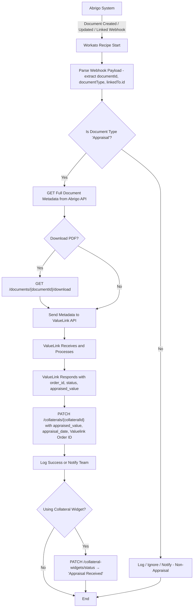

# Abrigo Webhook Configuration (Manual Trigger for Collaterals)

([Webhooks](https://developer.abrigo.com/docs/webhooks#:~:text=To%20manage%20webhooks%20within%20the,will%20need%20to%20navigate%20to))Abrigo’s Sageworks platform supports webhooks that can be tied to specific events in the loan lifecycle. To set up a manual trigger, first enable webhooks in Abrigo (via **Third-Party Connections → Abrigo APIs → Manage Webhooks**) ([Webhooks](https://developer.abrigo.com/docs/webhooks)). Then click **Create New Webhook** and provide the details: a name, the target URL (which will be the Workato webhook URL), an optional description, and a secret key for security (if desired) ([Webhooks](https://developer.abrigo.com/docs/webhooks#:~:text=Once%20the%20user%20clicks%20,which%20will%20require%20several%20fields)). Next, select the **Webhook type** – for example, you might choose a **Loan Stage Changed Event** and specify a particular stage (status) as the sub-type to serve as your manual trigger ([Webhooks](https://developer.abrigo.com/docs/webhooks#:~:text=Image%3A%20For%20Loan%20Status%20Changed,es)). This means when a user moves a loan into that stage (e.g. “Appraisal Order Requested”), the webhook will fire. Alternatively, Abrigo’s **Collateral Widget** integration can be used: you would create a custom widget (button) on the collateral page that, when clicked by a user, generates a **Collateral Widget Event** and sends the collateral data to your webhook ([Collateral Widget](https://developer.abrigo.com/docs/collateral-widget#:~:text=Once%20the%20user%20clicks%20,their%20order%20on%20the%20collateral)). In either case, once the configured event is triggered in Sageworks, Abrigo will **send an HTTP POST** to the given webhook URL with a payload of the event data ([Webhooks](https://developer.abrigo.com/docs/webhooks#:~:text=Sageworks%20webhooks%20are%20an%20extension,to%20poll%20the%20event%20system)).

**Example Abrigo Payload:** If a proposed loan has multiple collaterals and the user triggers the webhook (via the chosen event), Abrigo can send a JSON payload containing the loan and collateral information. For instance, a payload might include the proposed loan ID and an array of collateral objects with their details (using guessed field names for illustration):

```json
{
  "proposedLoanId": "LN-001234",
  "loanName": "Commercial Loan 1234",
  "collaterals": [
    {
      "collateralId": "COL-1001",
      "collateralType": "Real Estate",
      "description": "123 Main St Property",
      "currentValue": 500000,
      "propertyAddress": "123 Main St",
      "propertyCity": "Anytown",
      "propertyState": "CA",
      "propertyZip": "92801"
    },
    {
      "collateralId": "COL-1002",
      "collateralType": "Equipment",
      "description": "Construction Crane",
      "currentValue": 200000,
      "serialNumber": "CRANE-XYZ-100",
      "manufacturer": "ACME Corp",
      "year": 2015
    }
  ]
}
```

*Implementation notes:* In practice, if the Abrigo event payload does not include full collateral details, you can use Abrigo’s API to retrieve them (e.g. call `GET /v1/collaterals/{id}` for each collateral to get all fields ([Retrieving Customer Entered Info](https://developer.abrigo.com/docs/retrieving-widget-info#:~:text=Get%20collateral%20information))). However, using a Collateral Widget event allows you to define which fields are sent so that the webhook payload contains the necessary collateral data upfront ([Collateral Widget](https://developer.abrigo.com/docs/collateral-widget#:~:text=The%20collateral%20partner%20will%20develop,insurance%2C%20and%20other%20collateral%20services)).

# Workato Webhook Trigger Setup

On the Workato side, create a recipe with a **Webhook trigger** to catch the incoming data from Abrigo. In the recipe editor, choose **Workato’s Webhooks** connector and select the **“New event via HTTP Webhook”** trigger. You’ll be prompted to enter an **Event name** – this can be a descriptive name like “Abrigo Collateral Event”. Workato uses this name to generate a unique webhook URL for your recipe ([Workato connectors - Webhooks - New event via HTTP webhook trigger | Workato Docs](https://docs.workato.com/connectors/workato-webhooks/config.html#:~:text=Event%20name%20Enter%20the%20name,you%20must%20add%20each%20field)). For example, your trigger might be identified as `abrigo_collateral_event`, resulting in a URL like:

```
https://apim.workato.com/recipes/your-recipe-id/webhooks/abrigo_collateral_event
``` 

*(The exact format may vary, but Workato will display the URL once the trigger is configured.)*

Next, configure the **Payload schema** for the webhook trigger. You can either use Workato’s wizard by providing a **sample payload** (such as the JSON from Abrigo) or manually define the expected fields ([Workato connectors - Webhooks - New event via HTTP webhook trigger | Workato Docs](https://docs.workato.com/connectors/workato-webhooks/config.html#:~:text=Payload%20configuration%20Expand%20this%20field,JSON%20payload%2C%20PUT%2FPOST%20with%20XML)). In this case, you would define a schema that includes fields for the loan (e.g. `proposedLoanId`, `loanName`) and a list of `collaterals` (each collateral having fields like `collateralId`, `collateralType`, `description`, etc.). Workato will then parse incoming requests according to this schema. Be sure to include the array structure for collaterals in the schema so that Workato recognizes it as a list of objects.

Once the trigger is set up, copy the **Webhook URL** from Workato and paste it into the Abrigo webhook configuration as the **Webhook URL**. If you set a secret in Abrigo, note you can capture or validate that in Workato by checking the header (Workato can expose headers like `X-Workato-Secret` or you can include it in the payload). With this in place, when Abrigo sends the collateral data, Workato will receive it and start the recipe.

**Handling the incoming data:** The Workato trigger output will contain the data payload (e.g. `proposedLoanId` and an array of `collaterals`). You can verify the setup by manually triggering the event in Abrigo (for example, moving a loan to the designated stage or clicking the widget) and checking that a job is created in Workato with the expected data.

# Workato Recipe – Processing Collaterals in Parallel

Once Workato receives the webhook payload, the recipe needs to process each collateral and integrate with ValueLink. We can design the recipe to loop through each collateral and perform the necessary API calls. In Workato, a **Repeat for each** loop is used to iterate over a list of items ([Repeat while loop | Workato Docs](https://docs.workato.com/recipes/loops.html#:~:text=5)). Add a **Repeat for each** step in the recipe and set its input list to the array of collaterals from the trigger (Workato will allow you to pick the `collaterals` list datapill as the source). Workato will then execute the steps inside this loop for each collateral in the list ([Repeat while loop | Workato Docs](https://docs.workato.com/recipes/loops.html#:~:text=5)).

By default, the **Repeat for each** processes items sequentially (one after the other). However, the question asks to process each collateral *in parallel*. To achieve parallelism, consider one of two approaches:

- **Increase Recipe Concurrency:** In the recipe settings, you can raise the concurrency level so multiple jobs can run at the same time ([Recipe settings | Workato Docs](https://docs.workato.com/recipes/settings.html#:~:text=)). With concurrency > 1, if you split collaterals into separate recipe jobs, they can execute simultaneously. For example, instead of looping entirely in one job, the recipe could trigger a **sub-recipe** or a callable recipe for each collateral. Each sub-job would handle one collateral, and with concurrency set (Workato allows up to 5 concurrent jobs per recipe) they would run in parallel ([Recipe settings | Workato Docs](https://docs.workato.com/recipes/settings.html#:~:text=The%20concurrency%20of%20a%20recipe,that%20require%20high%20volume%20transactions)). This can be done by using a **Call Recipe** action inside the loop (configured to run asynchronously), or by designing the trigger to create one job per collateral (e.g. if the webhook could be set to deliver one collateral at a time or by using Workato’s batch triggers).

- **Parallel API requests within a job:** Workato’s standard UI does not run loop iterations truly concurrently within a single job. If true multi-threading is needed, another approach is using the Workato Connector SDK to create a custom **bulk action** that sends multiple requests in parallel ([Multi-threaded actions | Workato Docs](https://docs.workato.com/developing-connectors/sdk/guides/building-actions/multi-threaded-actions.html#:~:text=In%20this%20segment%2C%20we%20will,requests%20are%20simply%20too%20low)) ([Multi-threaded actions | Workato Docs](https://docs.workato.com/developing-connectors/sdk/guides/building-actions/multi-threaded-actions.html#:~:text=Rather%20than%20looping%20over%20thousands,throughput%20and%20reduce%20execution%20time)). However, for most cases, the simpler method is the concurrent jobs approach above.

For clarity, we will implement the straightforward loop in the recipe and assume it effectively processes the collaterals one by one. (If performance is a concern, you can implement the parallelization as noted.) The recipe’s main steps will be as follows (mapped to the requirements):

### Recipe Steps Overview

1. **Trigger – Abrigo Webhook:** The recipe is triggered by the incoming webhook from Abrigo. It receives the payload containing the loan ID and the list of collaterals. *(Workato will show these as trigger data pills, e.g. `proposedLoanId` and a list `collaterals[]`.)*

2. **Loop Through Collaterals:** The recipe enters a **Repeat for each** loop over the `collaterals` list ([Repeat while loop | Workato Docs](https://docs.workato.com/recipes/loops.html#:~:text=5)). This ensures each collateral is handled in turn (or concurrently if using the advanced approach). Within this loop, use the data pills like `current collateral → collateralId`, `current collateral → value`, etc., to refer to each collateral's fields.

3. **Send Collateral to ValueLink (POST/PATCH):** For each collateral, the recipe calls the ValueLink API to send the collateral data. This can be done using a Workato HTTP action (or a pre-built ValueLink connector if one exists, but assume HTTP since ValueLink is a custom system). Configure an **HTTP POST** (if creating a new appraisal order) or **HTTP PATCH** (if updating an existing record in ValueLink) to the appropriate ValueLink endpoint. For example, ValueLink might expose an endpoint like:

   `POST https://api.valuelink.com/v1/appraisals`

   with a JSON body containing the collateral details. The body would map fields from Abrigo to ValueLink’s expected format. For instance, you might send something like:

   ```json
   {
     "loan_id": "LN-001234",
     "collateral_id": "COL-1001",
     "address": "123 Main St, Anytown, CA 92801",
     "type": "Real Estate",
     "value": 500000,
     "description": "123 Main St Property"
   }
   ``` 

   In Workato, you’ll map the current collateral’s fields into this HTTP request body. (If credentials or an API key are required by ValueLink, set up the HTTP connection or headers accordingly – e.g. include an `Authorization: Bearer <token>` header or Basic Auth as per ValueLink’s API requirements.)

4. **Retrieve Updated Collateral Data from ValueLink:** After sending the data, the recipe needs to get the updated collateral information from ValueLink’s response. In many cases, the POST response itself may contain the newly created appraisal record or an ID/reference to it. ValueLink might respond immediately with some calculated fields or status. For example, ValueLink could return a response like:

   ```json
   {
     "order_id": "VL-20250323-789",
     "collateral_id": "COL-1001",
     "status": "Appraisal Completed",
     "appraised_value": 520000,
     "appraisal_date": "2025-03-23",
     "appraiser": "John Doe"
   }
   ``` 

   The Workato HTTP action will output this JSON which you can capture in the recipe. If the ValueLink API doesn’t return all needed info immediately (for instance, if it only returns an order ID and processes the appraisal asynchronously), the recipe could follow up with a **GET** request. For example, it might do `GET https://api.valuelink.com/v1/appraisals/{order_id}` to poll for completion or retrieve detailed results. In our example, we’ll assume the response contains the updated value and relevant fields. The recipe should map the relevant fields from ValueLink’s response (like `appraised_value`, `appraisal_date`, etc.) for use in the next step.

5. **Send Updated Collateral Data back to Abrigo:** Finally, update the collateral record in Abrigo with the new values from ValueLink. Abrigo provides collateral endpoints to update collateral or appraisal info. For instance, you can call `PATCH /v1/collaterals/{collateralId}` with a JSON body of the fields to update (using the Abrigo API token for authentication in headers). This API would target the specific collateral on the proposed loan. You should include any fields that changed or were newly obtained. For example, to update the **most recent appraisal value** and **date** in Abrigo, as well as record the external order ID, you might send:

   ```json
   {
     "mostRecentAppraisalValue": 520000,
     "mostRecentAppraisalDate": "2025-03-23",
     "userDefinedField_ValuelinkOrderID": "VL-20250323-789"
   }
   ``` 

   Here we assume `mostRecentAppraisalValue` and `mostRecentAppraisalDate` are standard fields on the collateral (Abrigo’s collateral data model includes these fields for appraisals ([Retrieving Customer Entered Info](https://developer.abrigo.com/docs/retrieving-widget-info#:~:text=%7B%20,85477283))), and we use a user-defined field (e.g., a custom field labeled “ValuelinkOrderID”) to store the ValueLink order reference since that field is not native to Abrigo. In Workato’s recipe, configure an **HTTP PATCH** (or PUT) action to Abrigo’s API. Map the output from the ValueLink step to the JSON body (e.g., the `appraised_value` from ValueLink maps to `mostRecentAppraisalValue` in Abrigo). The Abrigo API will then update the loan’s collateral record with the new appraisal data.

   After the update call, Abrigo should have the latest collateral values. It’s good practice to check the response from Abrigo to ensure the update succeeded (the API might return the updated collateral object or a success status).

6. **Post-Processing (Optional):** Once all collaterals are processed, you may perform any cleanup. If you are leveraging Abrigo’s event system, you can mark the event as completed via `PATCH /v1/events/{eventId}/complete` ([Retrieving Customer Entered Info](https://developer.abrigo.com/docs/retrieving-widget-info#:~:text=Complete%20the%20event)) so that it is not reprocessed. If using a Collateral Widget, you might also update the widget’s status to reflect that the appraisal data has been received (using `PATCH /v1/collateral-widgets/status/{widgetId}/{collateralId}` to set a status message like “Appraisal Complete” visible to the user in Abrigo ([Retrieving Customer Entered Info](https://developer.abrigo.com/docs/retrieving-widget-info#:~:text=Once%20all%20relevant%20information%20is,status%20the%20order%20is%20in))). These steps ensure Abrigo’s UI clearly shows the outcome of the integration.

# Integration with ValueLink – Endpoints and Payloads

Because ValueLink is a third-party appraisal management system, you will use its API to exchange data. While the exact API specification for ValueLink might not be publicly available, the general pattern (based on similar integrations) is as follows:

- **Authentication:** Obtain an API key or token from ValueLink. This could involve a login API to get a token, or a static token provided by ValueLink. Configure the Workato connection or HTTP headers to include this (e.g., an `Authorization` header).

- **Sending Collateral Data (ValueLink API):** Use an endpoint provided by ValueLink to create or update an appraisal order. This is typically a REST endpoint like `/v1/orders` or `/v1/appraisals`. We used a hypothetical `POST /v1/appraisals` in the example above. The JSON payload should include all details ValueLink needs to initiate or update an appraisal order, such as property address, loan number, borrower info, etc., in the format that ValueLink expects. You may need to transform Abrigo’s field names to ValueLink’s API field names. For example, Abrigo’s `propertyAddress`, `propertyCity`, etc., might need to be concatenated or mapped to ValueLink’s single address field format. Use Workato’s data transformation (formula mode or mapping UI) as needed to construct the JSON.

- **Receiving Response and Mapping:** ValueLink’s response (either from the initial POST or a subsequent GET) will have the results of the appraisal or the current status. Map these fields back to Abrigo’s schema. For instance, if ValueLink returns an updated value in a field `appraised_value`, ensure you map that to Abrigo’s `mostRecentAppraisalValue`. If there are fields that don’t directly exist in Abrigo, decide where to store them (perhaps in user-defined fields or as part of the widget status message). The Workato recipe mapping interface will let you drag-and-drop the ValueLink response fields into the request body for the Abrigo update action.

- **Example ValueLink Interaction:** To illustrate, suppose ValueLink’s API has an endpoint to **update an order**. You might do:

  **Request:** `PATCH https://api.valuelink.com/v1/orders/VL-20250323-789` (assuming `VL-20250323-789` is the order ID from a previous step) with body:
  ```json
  {
    "status": "Completed",
    "appraised_value": 520000,
    "completed_date": "2025-03-23T18:30:00Z"
  }
  ```
  **Response:**
  ```json
  {
    "order_id": "VL-20250323-789",
    "status": "Completed",
    "appraised_value": 520000,
    "completed_date": "2025-03-23T18:30:00Z",
    "collateral_id": "COL-1001",
    "remarks": "Appraisal completed successfully"
  }
  ```
  In this case, the ValueLink response confirms the order is completed and provides the appraised value. The Workato recipe would take `appraised_value` and `completed_date` from this response and include those in the next step’s PATCH to Abrigo.

# Updating Abrigo with ValueLink Data (Webhook Response Mapping)

After each collateral is processed and you have the updated data, the critical part is sending that data back into Abrigo correctly. Abrigo’s API expects certain field names and formats; ensure your Workato recipe maps the data accordingly:

- **Field Mapping:** Map ValueLink fields to Abrigo fields one-to-one where possible. For example, *ValueLink* `appraised_value` → *Abrigo* `mostRecentAppraisalValue`, *ValueLink* `completed_date` (or appraisal date) → *Abrigo* `mostRecentAppraisalDate`. If ValueLink provides a new unique ID for the appraisal (order ID), you might map that to an Abrigo user-defined text field (since Abrigo doesn’t have a native field for an external order ID). In Abrigo’s data model, user-defined fields can be referenced by their labels or IDs (for example, a field labeled “Valuelink Order ID” could be updated via the API if you know its field key or by using the `userDefinedFields` structure).

- **API Endpoint (Abrigo):** Use the appropriate endpoint to update the collateral or loan. Likely, `PATCH /v1/collaterals/{collateralId}` is used to update collateral fields (since collaterals are objects associated with loans). Include only the fields that need updating in the JSON. Abrigo will ignore fields not included, so this is a partial update. For example, from the earlier payload, we send `mostRecentAppraisalValue` and `mostRecentAppraisalDate`. These fields are part of the collateral object as shown in Abrigo’s documentation (initially 0 or null, to be updated with real values) ([Retrieving Customer Entered Info](https://developer.abrigo.com/docs/retrieving-widget-info#:~:text=%7B%20,85477283)). The Abrigo API should respond with the updated collateral JSON or a success message which you can log or use to confirm the update.

- **Multiple Collaterals Handling:** Since the recipe processes each collateral, it will perform one update call per collateral. Abrigo will receive, for example, two separate PATCH calls if there are two collaterals, each updating the respective record. Ensure that the `collateralId` used in the endpoint corresponds to the correct collateral (the one provided in the webhook payload or event). This ties the update to the exact collateral that was sent to ValueLink.

- **Error Handling:** It’s wise to include error monitoring in the Workato recipe. For instance, if ValueLink’s API returns an error (like a 400 bad request or timeout) for a particular collateral, you might use a Workato **Error Monitor** step to handle it (e.g., log the error and continue with other collaterals, or stop and mark the job as failed depending on requirements). Similarly, handle any errors from Abrigo’s API (like if the token expired or the collateral ID was not found). For a robust integration, you might implement retries or notifications on failure.

- **Testing:** Use a sample loan in Abrigo with known collateral data and step through the process. Trigger the webhook, let Workato send to a sandbox/test instance of ValueLink (or a mock endpoint if ValueLink sandbox is not available), and ensure the data flows back to Abrigo. Check Abrigo’s UI or via GET calls that `mostRecentAppraisalValue` etc., are updated after the recipe runs.

# Example Configuration Summary

- **Abrigo Webhook:** Created via UI to trigger on a manual event (e.g., loan stage change to "Appraisal Requested" or a collateral widget button click). It sends the loan’s collateral data to the Workato-provided URL ([Webhooks](https://developer.abrigo.com/docs/webhooks#:~:text=Sageworks%20webhooks%20are%20an%20extension,to%20poll%20the%20event%20system)). For example, a "Loan Status Changed Event" webhook can be configured for the status "Appraisal Requested" ([Webhooks](https://developer.abrigo.com/docs/webhooks#:~:text=Image%3A%20For%20Loan%20Status%20Changed,es)), so when a user sets that status on a loan, Abrigo will send out the collaterals payload.

- **Workato Recipe Trigger:** “**HTTP Webhook Trigger**” in Workato listens at a unique URL for incoming POST requests. The schema is defined to parse multiple collaterals in the JSON ([Workato connectors - Webhooks - New event via HTTP webhook trigger | Workato Docs](https://docs.workato.com/connectors/workato-webhooks/config.html#:~:text=Event%20name%20Enter%20the%20name,you%20must%20add%20each%20field)). For instance, the trigger might expect a JSON structure with a `collaterals` list. This trigger kicks off the recipe for each incoming webhook call.

- **Workato Recipe Actions:** Within the recipe, a **Repeat for each** loop iterates through the collaterals array ([Repeat while loop | Workato Docs](https://docs.workato.com/recipes/loops.html#:~:text=5)). For each collateral, the recipe performs:
  - **HTTP POST to ValueLink** with the collateral data (mapped to ValueLink’s API format).
  - **HTTP GET (or use response)** from ValueLink to obtain updated appraisal values (e.g., appraised value, status).
  - **HTTP PATCH to Abrigo** to update that collateral’s record with the new values (mapped into Abrigo’s fields like appraisal value/date) ([Retrieving Customer Entered Info](https://developer.abrigo.com/docs/retrieving-widget-info#:~:text=%7B%20,85477283)).
    These steps are done for each collateral. (If using a parallel execution strategy, each iteration might call an async sub-recipe to do the same in parallel.)

- **Parallel Processing:** To satisfy the “process in parallel” requirement, the recipe can be adjusted for concurrency. By increasing the recipe concurrency or offloading each collateral to a separate job, multiple collaterals will be processed at the same time ([Recipe settings | Workato Docs](https://docs.workato.com/recipes/settings.html#:~:text=)). In practice, this means if Abrigo sends, say, 5 collaterals, Workato could handle up to 5 simultaneous API call sequences to ValueLink and back to Abrigo (subject to system load and the 5 concurrent jobs limit). This speeds up the overall process significantly for batch updates.

- **Response Mapping and Updates:** The integration ensures that any new fields from ValueLink are properly captured and mapped back to Abrigo. For example, if ValueLink provides an updated market value or risk rating for the collateral, those should be assigned to either a standard field in Abrigo or a user-defined field created to hold that info. Abrigo’s APIs allow updating user-defined fields as part of the collateral object (they appear under `userDefinedFields` in the payload). You might need the field ID or key, which you’d get when setting up the UDF in Abrigo. Then include it in the PATCH JSON as shown in the earlier example (e.g., `"userDefinedFields": { "Valuelink Order ID": "VL-20250323-789" }` if the API supports identifying by field name, or using the numeric ID).

- **Documentation and References:** Abrigo’s API documentation confirms that webhooks can send event payloads and that collateral data can be retrieved/updated via API ([Collateral Widget](https://developer.abrigo.com/docs/collateral-widget#:~:text=Once%20the%20user%20clicks%20,their%20order%20on%20the%20collateral)) ([Retrieving Customer Entered Info](https://developer.abrigo.com/docs/retrieving-widget-info#:~:text=Get%20collateral%20information)). Workato’s documentation provides guidance on setting up webhook triggers and looping through list data ([Workato connectors - Webhooks - New event via HTTP webhook trigger | Workato Docs](https://docs.workato.com/connectors/workato-webhooks/config.html#:~:text=Event%20name%20Enter%20the%20name,you%20must%20add%20each%20field)) ([Repeat while loop | Workato Docs](https://docs.workato.com/recipes/loops.html#:~:text=5)). While ValueLink’s specific API docs aren’t public, the integration approach follows a standard pattern for appraisal systems. Always consult the official docs or API guide provided by ValueLink for the exact endpoints and field names to use.

By following these steps, you establish a workflow where a user-triggered event in Abrigo sends out all relevant collateral data, Workato orchestrates calls to the ValueLink API for each collateral (in parallel if configured), and the enriched collateral information is returned to Abrigo. This ensures your proposed loan in Abrigo is updated with the latest collateral valuations and details without manual data entry, fulfilling the end-to-end integration requirements.

([Webhooks](https://developer.abrigo.com/docs/webhooks#:~:text=Sageworks%20webhooks%20are%20an%20extension,to%20poll%20the%20event%20system)) ([Collateral Widget](https://developer.abrigo.com/docs/collateral-widget#:~:text=Once%20the%20user%20clicks%20,their%20order%20on%20the%20collateral))

---

If you're aiming for a more robust, real-time system, adding a webhook for **document changes in Abrigo** will help ensure Workato reacts to new or modified documents tied to a loan or collateral.

Here's how we can chart that course:

---

### ⚙️ **Webhook Type: Document Event (Abrigo → Workato)**
Abrigo supports **Document Events** as webhook triggers. These can fire automatically when a document is:
- **Created**
- **Updated**
- **Deleted**
- **Linked to a Loan or Collateral**

📌 You can configure this via:
> **Third-Party Connections → Abrigo APIs → Manage Webhooks → Create New Webhook**

Set it to:
- **Webhook Type:** `Document Event`
- **Sub-Type:** Choose one or more of:
  - `Document Created`
  - `Document Updated`
  - `Document Linked`
- **Target URL:** Your Workato webhook trigger endpoint
- **Filter (optional):** Limit to certain document types (e.g., “Appraisal”, “Environmental”, “Title Report”)

---

### 🧾 **Example Payload (Guessing for Now):**
```json
{
  "documentId": "DOC-9843",
  "documentName": "Appraisal Report - 123 Main St",
  "documentType": "Appraisal",
  "linkedTo": {
    "type": "Collateral",
    "id": "COL-1001"
  },
  "uploadedBy": "jane.doe@bank.com",
  "uploadedDate": "2025-03-23T18:52:00Z"
}
```

---

### 🛠️ **Workato Recipe (Triggered Automatically):**
- **Trigger:** HTTP Webhook
- **Parse document metadata:** Use data pills for `documentId`, `documentType`, and `linkedTo → id`
- **Branching Logic (optional):**
  - If `documentType == "Appraisal"` → fetch full document from Abrigo
  - Send for review or automate next steps (e.g., update loan, notify team, archive to SharePoint)
- **Call downstream systems (e.g., ValueLink, Box, S3)**
- **Log or audit changes into your data store or observability tool**

---

### 🧩 Use Cases You Can Plug In:
- Trigger auto-validation of uploaded documents
- Match documents to pending ValueLink orders
- Push appraisals to underwriter queues
- Flag missing docs before closing

---





---

