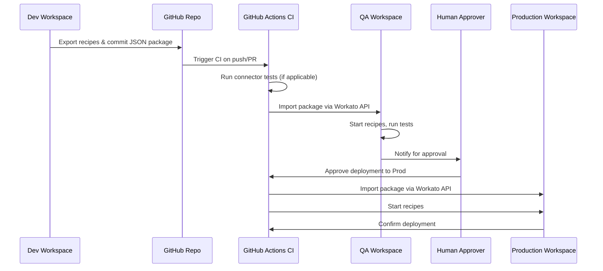
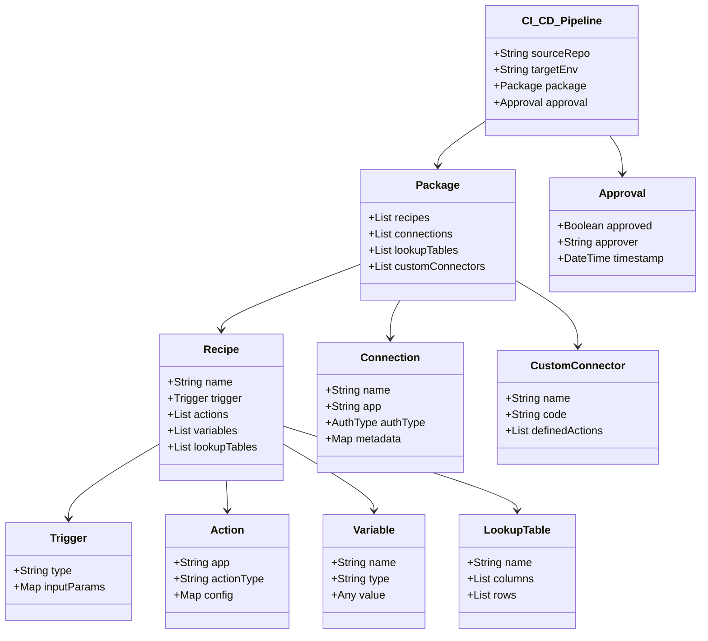

### ✅ **Sequence Diagram** — CI/CD Pipeline Across Workspaces

```mermaid
sequenceDiagram
    participant Dev as Dev Workspace
    participant GitHub as GitHub Repo
    participant CI as GitHub Actions CI
    participant QA as QA Workspace
    participant Approver as Human Approver
    participant Prod as Production Workspace

    Dev->>GitHub: Export recipes & commit JSON package
    GitHub->>CI: Trigger CI on push/PR
    CI->>CI: Run connector tests (if applicable)
    CI->>QA: Import package via Workato API
    QA->>QA: Start recipes, run tests
    QA->>Approver: Notify for approval
    Approver->>CI: Approve deployment to Prod
    CI->>Prod: Import package via Workato API
    CI->>Prod: Start recipes
    Prod->>CI: Confirm deployment
```

---

### ✅ **Class Diagram** — Workato Asset Models in CI/CD

```mermaid
classDiagram
    class Recipe {
        +String name
        +Trigger trigger
        +List<Action> actions
        +List<Variable> variables
        +List<LookupTable> lookupTables
    }

    class Trigger {
        +String type
        +Map<String, String> inputParams
    }

    class Action {
        +String app
        +String actionType
        +Map<String, String> config
    }

    class Connection {
        +String name
        +String app
        +AuthType authType
        +Map<String, String> metadata
    }

    class LookupTable {
        +String name
        +List<String> columns
        +List<Row> rows
    }

    class Variable {
        +String name
        +String type
        +Any value
    }

    class Package {
        +List<Recipe> recipes
        +List<Connection> connections
        +List<LookupTable> lookupTables
        +List<CustomConnector> customConnectors
    }

    class CI_CD_Pipeline {
        +String sourceRepo
        +String targetEnv
        +Package package
        +Approval approval
    }

    class CustomConnector {
        +String name
        +String code
        +List<Action> definedActions
    }

    class Approval {
        +Boolean approved
        +String approver
        +DateTime timestamp
    }

    Package --> Recipe
    Recipe --> Trigger
    Recipe --> Action
    Recipe --> Variable
    Recipe --> LookupTable
    Package --> Connection
    Package --> CustomConnector
    CI_CD_Pipeline --> Package
    CI_CD_Pipeline --> Approval
```

